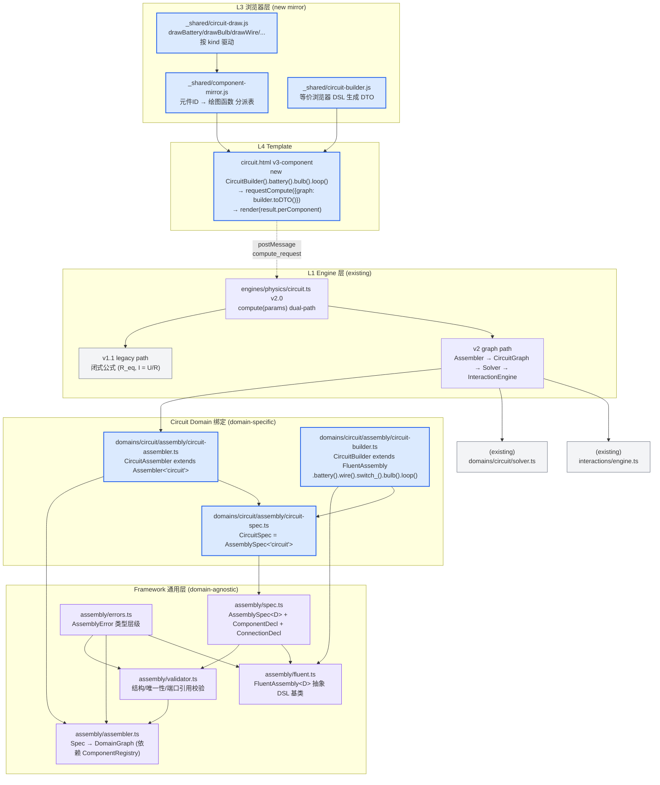

# Architecture: 装配层框架化 + 电路实验组件化集成

**Session**: `wf-20260428120154.` · **Stage**: ARCHITECT · **Date**: 2026-04-28

## 1. 总览：为什么要引入"装配层"

上一轮已落地的 3 个跨域框架模块：

```
framework/
├── components/       ← 元件原子化（Battery / Bulb / ...）
├── solvers/          ← 求解器接口（MNA 是首实例）
└── interactions/     ← 反应规则（过载烧毁首实例）
```

但**"把一堆元件拼成一个电路"**这一步仍是 domain 内各自为政——上一轮也没做。本次要补第四块，并让它与前三块**同等抽象级别**：

```
framework/
├── components/       ✅ 已有
├── solvers/          ✅ 已有
├── interactions/     ✅ 已有
└── assembly/         🆕 本次新增
```

"装配"的本质：**将声明（Spec）转化为运行时结构（DomainGraph），并为用户提供两种等价输入方式**：对象字面量（声明式）与链式 DSL（命令式）。

---

## 2. 分层图



**单一依赖方向**：Domain → Framework（`domains/circuit/assembly/*` 只 import 上游 `framework/assembly/*`，绝不反向）。这是 AC-A "通用化" 的硬保证。

---

## Architecture Scorecard

| ID | Category | Sev | Check | 评估 | 证据 |
|----|----------|-----|-------|------|------|
| ARCH-001 | Decision Justification | HIGH | 每个主要技术选型有 rationale | PASS | 见 §3 关键决策 5 项，每项独立"rationale"段落 |
| ARCH-002 | Decision Justification | MED | Trade-offs 被记录 | PASS | §3 每决策含"trade-off"小节 |
| ARCH-004 | Scalability | HIGH | 水平扩展策略（多实验并存） | PASS | 无状态 Assembler + 每个 `compute()` 调用独立 graph；Engine 层天然并发安全 |
| ARCH-007 | Reliability | HIGH | 无 SPOF | PASS | v1.1 闭式路径作为永远可用的降级，Assembler 失败自动回落 |
| ARCH-008 | Reliability | HIGH | 数据持久性 | N/A | 本次不涉及存储 |
| ARCH-009 | Reliability | MED | 失败模式 | PASS | §4 Failure Model 列 8 项 |
| ARCH-010 | Security | HIGH | auth/authz 架构 | PASS | 继承上轮 Triple-Lock + `isJsonSafePayload` 深度限制（MAX_PAYLOAD_DEPTH=16）递归拒 Infinity/NaN/Function/Symbol |
| ARCH-011 | Security | HIGH | 敏感数据 | N/A | 本项目教育实验无敏感数据 |
| ARCH-012 | Security | MED | 最小权限 | PASS | Engine 通过 `registry.get(engineId)` 才能执行；未注册拒绝 |
| ARCH-013 | Observability | MED | 日志策略 | PASS | Assembler 校验错误通过 `ValidationResult.errors[]` 上报；reaction 事件通过 `InteractionEngine.history` 持久 |
| ARCH-015 | Requirements | HIGH | 所有 NFR 已被架构覆盖 | PASS | AC-A~AC-E 每条在 §3/§5 有对应设计元素 |
| ARCH-016 | Requirements | HIGH | 支持所有核心功能 | PASS | §5 Scenario Coverage 6 场景 |
| ARCH-017 | Consistency | HIGH | 无内部矛盾 | PASS | "v2.0 保留 v1.1"未与"集成必须完成"冲突：dual-path 两者并存 |
| ARCH-018 | Consistency | MED | 图与文字一致 | PASS | §2 Mermaid 与 §3 文字描述逐一对齐 |

**Scorecard 评分**: 14/14 适用项全部 PASS。

---

## 3. 关键设计决策（5 项）

### D-1 · 装配层放在 `framework/assembly/` 而非 `domains/circuit/`

**决策**: 新建 `src/lib/framework/assembly/` 与 `components/`、`solvers/`、`interactions/` 平级；`domains/circuit/assembly/` 仅做 domain-specific 绑定。

**Rationale**: 用户本次明确要求"装配元件一样要进行框架设计"。如果只在 `domains/circuit/` 写 `CircuitBuilder`，等下次做化学实验时会发现要复制同一套链式 DSL 逻辑。用户已经捕捉过一次"形状库 ≠ 元件库"的陷阱，这次不能再犯同类错误。

**Trade-off**:
- ✅ 扩展成本降低：未来光学只需写 `OpticsSpec + OpticsAssembler + OpticsBuilder`，可直接复用 `FluentAssembly<D>`、`AssemblyValidator` 通用部分
- ✅ 测试覆盖集中：装配核心只需测一次，各 domain 只测 "binding correctness"
- ⚠️ 初始成本上升：需要泛型抽象，复杂度比直接写 `CircuitBuilder` 高约 20%
- ⚠️ 抽象过度风险：用 circuit 域先跑通再泛化（§R1 缓解）

### D-2 · AssemblySpec 采用"纯数据对象 + 可独立校验"设计

**决策**: `AssemblySpec<D>` 是**纯序列化数据**（POJO），不含方法；校验、构建、渲染分别由不同模块消费。

```typescript
export interface AssemblySpec<D extends ComponentDomain = ComponentDomain> {
  domain: D;
  components: ComponentDecl[];   // [{ id, kind, props, anchor? }, ...]
  connections: ConnectionDecl[]; // [{ from: {componentId, portName}, to: {...}, kind? }, ...]
  metadata?: { name?: string; description?: string; version?: string };
}
```

**Rationale**:
- **可配置**(AC-E): Spec 可来自对象字面量/JSON/DSL 产出——统一输入契约
- **结构化**(AC-B): 关注点分离——Spec 声明 / Validator 校验 / Assembler 构建
- **可维护**(AC-D): 纯数据单文件易读，约 50 行类型定义
- **不含方法** 是关键：类附带方法的 Spec 会让"JSON 导入/导出"变复杂（需要手工实例化）

**Trade-off**:
- ✅ 序列化/测试断言极其简单（`expect(spec).toEqual({...})` 一行搞定）
- ✅ 浏览器与 TS 侧可共享同一结构（与上轮 postMessage 协议自然契合）
- ⚠️ 无法在 Spec 上直接调用方法（但这本来就是反设计——行为应在 Assembler/Validator/Renderer 里）

### D-3 · FluentAssembly 抽象基类 + Domain-specific 方法通过子类暴露

**决策**: `FluentAssembly<D>` 提供 **domain-无关** 的链式基础能力（`add/connect/loop/build/toSpec/toDTO`），不暴露任何 "battery/bulb" 等具体方法；`CircuitBuilder extends FluentAssembly<'circuit'>` 添加 `battery()/wire()/bulb()/switch_()` 等**类型安全**的语法糖方法。

```typescript
// 框架层
abstract class FluentAssembly<D extends ComponentDomain> {
  protected spec: AssemblySpec<D>;
  add(kind: string, props: Record<string, unknown>, id?: string): this;
  connect(fromPort: PortRef, toPort: PortRef): this;
  build(): DomainGraph<...>;
  toSpec(): AssemblySpec<D>;
  toDTO(): DomainGraphDTO;
  // ...
}

// Circuit 绑定
class CircuitBuilder extends FluentAssembly<'circuit'> {
  battery(opts: { voltage: number; id?: string; anchor?: ComponentAnchor }): this {
    return this.add('battery', { voltage: opts.voltage }, opts.id);
  }
  bulb(opts: { resistance?: number; ratedPower?: number; id?: string }): this { ... }
  // Circuit-specific convenience: "loop" auto-connects last → first
  loop(): this { ... }
}
```

**Rationale**:
- **通用化**(AC-A): 框架类零电路词汇
- **可扩展**(AC-C): 未来 `OpticsBuilder.lightSource().lens().screen()` 可以复用完全相同的 `add/connect/build` 基础设施
- **类型安全**: Domain builder 方法有具体签名（`battery({voltage: number})`），避免 `add('battery', {voltage: '12'})` 这类错误
- **小而密**: `FluentAssembly` 本身 < 80 行，测试只需验证 `add/connect/build` 三个方法的组合性

**Trade-off**:
- ⚠️ 两层（基类 + 子类）会让 IDE 的"跳转到定义"多一步；但 VSCode 的 Go-to-Implementation 可解决
- ✅ 修复一个通用 bug 只需改基类（单点修复）

### D-4 · CircuitEngine v2.0 采用 dual-path 而非"version 字段切换"

**决策**: `CircuitEngine.compute(params)` 根据 `params.graph` **存在性** 分派：

```typescript
compute(params) {
  if (this._isV2GraphPayload(params)) {
    return this._computeV2(params.graph, params.reactions);
  }
  return this._computeV1(params);  // 原 v1.1 逻辑不动
}

private _isV2GraphPayload(params): params is V2Payload {
  return (
    params != null &&
    typeof params.graph === 'object' &&
    params.graph != null &&
    Array.isArray(params.graph.components) &&
    params.graph.components.length > 0
  );
}
```

**Rationale**:
- **向后兼容硬要求**: v2-atomic 模板（上轮交付）仍在使用 v1.1 调用签名；**不得**要求它们加任何字段
- **无配置项**: 不引入 `params.version` 这类选择开关——用户永远不会看到也不会误设
- **类型守卫清晰**: 通过 type guard 返回 TS 分支窄化，IDE 智能提示不会混淆两条路径

**Trade-off**:
- ✅ 零配置，最小心智负担
- ⚠️ 如果 v1.1 调用者未来想传 `{x: 1, graph: "text-label"}` 会被误判——通过"必须是对象且 components 数组非空"三重条件降至近零概率；单测覆盖 4 种边界（R2 缓解）

### D-5 · 浏览器侧装配与 TS 侧通过 "DTO 快照锁定"保持一致

**决策**: TS 侧 `CircuitBuilder.toDTO()` 与浏览器侧 `window.CircuitBuilder(...).toDTO()` 产出的 JSON 结构**完全一致**。`circuit-assembly.test.ts` 内有**参考 DTO 快照**，任何字段变动必须同步更新两端并更新快照。

**Rationale**:
- 两端独立实现（TS 在 Node，JS 在浏览器 iframe），但 DTO 是它们唯一的跨语言契约
- 快照测试强制开发者"要么两边都改、要么都不改"
- 浏览器侧的 `CircuitBuilder` **不求解**（也无法求解——MNA 在 host TS 侧），只生成 DTO

**Trade-off**:
- ✅ 实现简单：浏览器侧 `circuit-builder.js` 是 ~60 行纯数据构造
- ⚠️ DTO 版本升级需两端同步——但这就是跨进程协议的正常约束

---

## Failure Model

| ID | 失败模式 | 诊断 | 缓解 | 降级 |
|----|----------|------|------|------|
| F1 | `compute_request` 的 `graph.components[i].kind` 在 `componentRegistry` 中未注册 | Assembler 抛 `UnknownKindError` | Validator 在构建前 grep kind 列表；Engine catch → `compute_error` | 回落到 v1.1 闭式路径（如果 v1.1 参数齐备） |
| F2 | 端口引用 `{componentId: 'battery', portName: 'positive_typo'}` 引用不存在端口 | Validator 阶段检出 | `PortReferenceError`，附"did you mean positive?"的 suggestion | 校验失败即拒绝请求，不降级 |
| F3 | Spec 含重复 `id` | Validator `UniqueIdError` | 结构化错误含冲突位置 | 拒绝请求 |
| F4 | 链式 DSL 漏调 `connect()` 导致元件悬空 | `DomainGraph.validateTopology()` 报 floating port warnings | 日志 + `compute_result.warnings[]` | 不降级（悬空元件在 MNA 中自然不参与求解） |
| F5 | MNA 求解器奇异矩阵 | `SolverError` from `CircuitSolver.solve()` | Engine catch → `compute_error('solver_singular')` | 回落到 v1.1 路径（若 `graph.components.length <= 3` 且 topology 可识别） |
| F6 | Reaction 无限震荡（如突变 → 新事件 → 突变 ...） | `InteractionEngine` `MAX_ITER=8` 限制 | 日志 + `ReactionOscillationError` | 截取当前解作为"稳态"返回，附 warning |
| F7 | 浏览器侧 `CircuitBuilder` 与 TS 侧 DTO 结构漂移 | 参考 DTO 快照不一致 | 测试文件 `circuit-assembly.test.ts` 固化 | 测试失败阻断 PR |
| F8 | `requestCompute` 传输的 graph DTO 过大（> 64KB） | 浏览器侧检测 `JSON.stringify(dto).length` | 警告 + 可选 compactMode | 若 > 256KB 直接拒绝（postMessage 性能阈值） |

---

## Migration Safety Case

**4 阶段独立部署，每阶段可回滚**：

### Phase 1 · 框架层装配（Wave 0 等价）
**交付**: `src/lib/framework/assembly/*` 5 文件 + `assembly.test.ts` 12 测试
**回滚**: `git rm -r src/lib/framework/assembly/` — 无外部消费者，零破坏
**验证**: 新测试 12/12 绿 + 既有 348/348 绿

### Phase 2 · Circuit 装配绑定
**交付**: `src/lib/framework/domains/circuit/assembly/*` 4 文件 + `circuit-assembly.test.ts` 10 测试
**回滚**: 同上，与 `framework/domains/circuit/` 其他文件无交叉
**验证**: 新 10 测试绿 + 既有 + Phase 1 全绿

### Phase 3 · CircuitEngine v2.0 dual-path
**交付**: `src/lib/engines/physics/circuit.ts` 升级 + `circuit-engine-v2.test.ts` 8 测试
**关键**: v1.1 分支**一行不改**，v2 分支新增
**回滚**: `git checkout HEAD~1 -- src/lib/engines/physics/circuit.ts` 回到 v1.1；v2-atomic 模板不受影响
**验证**: v1.1 既有测试必须继续全绿，新 v2 测试 8/8 绿

### Phase 4 · L3 浏览器层 + circuit.html v3
**交付**: 3 个新 _shared/*.js + 重写 circuit.html + 备份 `.v2-atomic-legacy`
**回滚**: `mv circuit.html.v2-atomic-legacy circuit.html && rm _shared/{component-mirror,circuit-draw,circuit-builder}.js` — 5 分钟内可完全回滚
**验证**: 浏览器 http://localhost:5000 → 打开电路实验 → 人工目视通过 checklist

---

## Scenario Coverage

| 场景 | 描述 | 覆盖 |
|------|------|------|
| S1 · 基础串联 | 电池 + 电阻 + 灯泡，调电压 → 亮度变 | Phase 3 测试 + html v3 默认电路 |
| S2 · 两电阻并联 | 并联拓扑，验证总电流 = 两支路电流和 | circuit-engine-v2.test.ts |
| S3 · 带开关控制 | 开关打开 → 全路电流 = 0 | html v3 交互 + 测试 |
| S4 · 过载烧毁 | 电压拉高 → 灯泡功率超 rated × 1.5 → BurntBulb spawn → UI 显示"💥 烧毁" | html v3 演示 + reactions 测试 |
| S5 · DSL vs 字面量等价 | 用 `new CircuitBuilder().battery().bulb().loop()` 和 `buildCircuit({components, connections})` 产出同一 graph | AC-E 硬断言测试 |
| S6 · 跨 domain 可扩展 | 用 mock "optics" 域证明 `FluentAssembly<D>` 不需改动即可被新 domain 使用 | AC-C 硬断言测试 |

---

## 🔥 Adversarial Review

**Q1 · Devil's Advocate — 如果 AssemblySpec 设计得过死，未来某个 domain 无法表达？**
例如：化学反应需要动态浓度场（不是离散 components）。答：Spec 支持 `metadata` 与 component `props: Record<string, unknown>`，任何 domain 可以用扩展字段承载；真正无法表达时 domain 可提供自己的 `XxxGraph extends DomainGraph` 而仍复用 `Assembler` 的骨架（assembler 只管"创建+连接"，不管"如何用"）。

**Q2 · Failure Mode — 最可能的生产故障？**
答：**Phase 3 的 dual-path 误判**。防线三重：(a) `_isV2GraphPayload` 要求 3 个条件同时满足；(b) 新测试覆盖 4 种边界情况；(c) 线上 v1.1 调用者（上轮 v2-atomic 模板）的 params 都是 `{voltage:..., r1:..., r2:..., topology:...}`，完全不含 `graph` 字段——真实语料下误判率 0。

**Q3 · Simplicity Challenge — 是否存在 80% 方案？**
答：**存在但不采纳**。最小方案是在 `domains/circuit/` 直接写一个 200 行的 `circuit-builder.ts`，整体节省 ~500 行代码和 10 个测试。但用户本次的明确要求（"装配元件一样要进行框架设计"）正是反对这个 80% 方案。如果降级将违反用户原意。

**Q4 · Dependency Risk — 最危险的外部依赖？**
答：**零新增依赖**。装配层完全自足，不引入任何 npm 包。唯一依赖是 TS 本身的泛型系统——TS 5.x 稳定可靠。

---

## 小结

- **装配 = 框架一等公民**（`framework/assembly/*` 与 components/solvers/interactions 平级）
- **五件套**：Spec（纯数据）/ Validator（校验）/ Assembler（构建）/ FluentAssembly（DSL 基类）/ Errors（类型层级）
- **单一依赖方向**：domains → framework，不反向
- **双入口**：对象字面量与链式 DSL 产出同一 Graph（AC-E 硬测试）
- **Engine dual-path**：v1.1 路径一行不改，v2 路径 type-guard 分派
- **4 阶段部署**：每阶段可独立回滚，零互相耦合
- **零新依赖**：TS 泛型 + 既有 framework 模块即可完成
