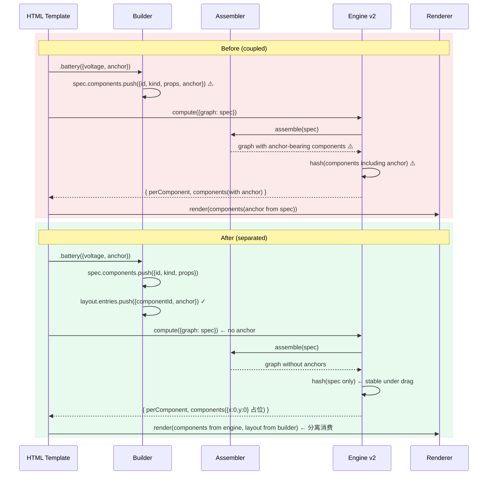

# Architecture · anchor-LayoutSpec 解耦（D）

> Session: `wf-20260428153150.`
> Stage: ARCHITECT
> Scope: 把 `anchor` 从 Spec 数据层分离为独立 `LayoutSpec`，保持 Sugar API 与模板零改动。

---

## 1. 架构总览

```mermaid
graph LR
  subgraph Before["修改前（耦合）"]
    B_Spec[AssemblySpec<D><br/>components[i].anchor ⚠️]
    B_Comp[IExperimentComponent.anchor ⚠️]
    B_Engine[Engine v2]
    B_Spec --> B_Engine
    B_Comp --> B_Spec
  end

  subgraph After["修改后（分离）"]
    A_Spec[AssemblySpec<D><br/>components[i]（无 anchor）]
    A_Layout[LayoutSpec<D><br/>entries: id→anchor]
    A_Bundle["AssemblyBundle<D><br/>{spec, layout?}"]
    A_Engine[Engine v2<br/>仅消费 spec]
    A_Renderer[Renderer<br/>消费 spec + layout]
    A_Bundle --> A_Spec
    A_Bundle --> A_Layout
    A_Spec --> A_Engine
    A_Spec --> A_Renderer
    A_Layout --> A_Renderer
  end

  Before -.分离视觉 vs 拓扑.-> After
```

**核心论断**：`LayoutSpec` 是**可选伴生资产**，不是核心契约的替代品。引擎从此只看 Spec，渲染层用 Spec + Layout 组合。

---

## 2. 核心决策（5 条）

### D-1 · LayoutSpec 设计为扁平 `entries` 数组而非嵌套 Map

**What**：
```ts
interface LayoutEntry {
  componentId: string;
  anchor: ComponentAnchor;
}

interface LayoutSpec<D extends ComponentDomain = ComponentDomain> {
  domain: D;
  entries: LayoutEntry[];
  metadata?: AssemblyMetadata;
}
```

**Why**：
- JSON-safe（Map 不是 JSON 可序列化）
- 与 `AssemblySpec.components` / `connections` 数组形态一致（装配层内部结构统一）
- entries 空数组 ≡ "无布局信息"（语义清晰）

**Trade-off**：
- ✅ 拿：序列化简单 / 易 diff / 易 JSON-schema 校验
- ❌ 舍：查找 `id→anchor` 需 O(n) 扫描（可接受：entries 规模等同 components，典型 < 30）

**缓解舍弃**：辅助函数 `layoutLookup(layout): Map<string, ComponentAnchor>` 提供 O(1) 查询视图（不改变数据结构，仅视图）

### D-2 · `AssemblyBundle` 作为可选组合契约

**What**：
```ts
interface AssemblyBundle<D extends ComponentDomain = ComponentDomain> {
  spec: AssemblySpec<D>;
  layout?: LayoutSpec<D>;
  metadata?: AssemblyMetadata;
}
```

**Why**：给 B 阶段的编辑器留位置——编辑器最终会同时产出 spec + layout，需要一个契约容器。

**Trade-off**：
- ✅ 拿：未来 B 不需要再引入新概念，直接用 Bundle
- ❌ 舍：本轮引入但没有强制消费者，存在"为未来而设计"嫌疑

**缓解舍弃**：仅作为**类型定义**存在，不强制任何 Builder / Assembler / Template 使用；纯零成本（类型擦除后运行时无影响）

### D-3 · Builder Sugar 内部分流策略

**What**：
- Sugar API 签名**完全不变**（`.battery({voltage, id, anchor})`）
- `FluentAssembly` 内部：
  - 新增 `protected readonly _layout: LayoutSpec<D>` 字段（与 `_spec` 并列）
  - `add(kind, props, opts)` 接到 `opts.anchor` 时：不再写入 `_spec.components[i].anchor`，改为 push 到 `_layout.entries`
  - 新增 `build(assembler)` 返回 `DomainGraph`；新增 `toBundle(): AssemblyBundle<D>` 返回 `{spec, layout}`
  - **保留** `toSpec()` 返回纯 `AssemblySpec<D>`（不含 anchor 字段）

**Why**：这是兑现 AC-D3（Sugar API 零改）和 AC-D7（模板零改）的唯一路径。

**Trade-off**：
- ✅ 拿：零破坏兼容 / 现有 4 个模板零修改
- ❌ 舍：`add` 实现复杂度略升（双路径写入）

**缓解舍弃**：实现通过一个私有 helper `_writeAnchor(id, anchor?)` 封装，`add` 自身逻辑干净

### D-4 · Assembler 保持对 `decl.anchor` 的向后兼容解析

**What**：
- `ComponentDecl` 保留 `anchor?: ComponentAnchor` 字段（标记 `@deprecated`）
- `Assembler.assemble(spec)` 遇到 `decl.anchor` 时：发 console.warn（非 fatal），并在内部把 anchor **转存到返回结果的辅助 LayoutSpec**（供 `assembleBundle` 用）
- 新增 `Assembler.assembleBundle(bundle): DomainGraph`：同时消费 spec + layout

**Why**：上轮的测试里可能有 `ComponentDecl` 写了 anchor（literal spec 测试）；不保留会让回归测试红

**Trade-off**：
- ✅ 拿：上轮 T-18 测试（literal spec → graph）继续通过
- ❌ 舍：ComponentDecl 上的 anchor 字段仍然"技术上允许"

**缓解舍弃**：TSDoc 标记 `@deprecated` + console.warn 双重信号；下轮 B 阶段正式移除字段

### D-5 · `IExperimentComponent.anchor` 保留为"渲染提示"，但不再由构造器接收

**What**：
- `IExperimentComponent.anchor` 接口字段保留（@deprecated）
- `AbstractComponent` 构造器第三参数 `anchor` 保留 + 默认 `{x:0, y:0}`
- Component 类不再**强制**接收 anchor（factory 全改为不传）
- Engine v2 输出 components DTO 的 anchor 字段固定为 `{x:0, y:0}`（**占位**以保 DTO fingerprint 稳定）

**Why**：
- 保留字段 = 向后兼容零破坏
- 占位值 {x:0,y:0} = 上轮 T18-6 快照测试继续通过（AC-D5）
- 真正的坐标由浏览器端消费 LayoutSpec 决定

**Trade-off**：
- ✅ 拿：兼容性极强
- ❌ 舍：`component.anchor` 字段语义成了"历史遗迹"

**缓解舍弃**：在 `base.ts` JSDoc 明确说明"此字段已被 LayoutSpec 取代，仅保留用于兼容"；下轮 B 正式移除

---

## 3. 10 任务清单（简述，详细任务编号留给 PLAN）

| Task | File | 预估 |
|------|------|------|
| T1 | `src/lib/framework/assembly/layout.ts` — LayoutSpec / LayoutEntry / AssemblyBundle + helpers | 20 min |
| T2 | `src/lib/framework/assembly/fluent.ts` — 增 `_layout` 字段 + sugar 分流 + `toSpec/toLayout/toBundle` | 30 min |
| T3 | `src/lib/framework/assembly/assembler.ts` — 增 `assembleBundle` + decl.anchor 回落兼容 | 15 min |
| T4 | `src/lib/framework/assembly/spec.ts` — `ComponentDecl.anchor?` 标 @deprecated + JSDoc | 5 min |
| T5 | `src/lib/framework/assembly/index.ts` + `src/lib/framework/index.ts` — re-export | 10 min |
| T6 | `src/lib/framework/components/base.ts` — IExperimentComponent.anchor @deprecated + JSDoc | 5 min |
| T7 | `src/lib/framework/domains/chemistry/reaction-utils.ts` + `overload-bulb.ts` — makeXxx 移除 anchor hard-code | 15 min |
| T8 | Circuit/Chemistry Builder — sugar 签名保持，内部走 FluentAssembly 新分流（自动继承） | 20 min（确认 + 轻调整） |
| T9 | 浏览器 `circuit-builder.js` + `chemistry-builder.js` — 新增 `toLayoutSpec()` + `_layout` 镜像 | 25 min |
| T10 | Engine v2 (`circuit.ts` + `chemistry/reaction.ts`) — `_formatV2Result` 的 components 输出 anchor=`{x:0,y:0}` 占位 | 15 min |
| T11 | `layout-spec.test.ts` — LayoutSpec 独立测试（≥10 测试） | 30 min |
| T12 | 迁移现有测试的 anchor 断言到 LayoutSpec 侧 | 20 min |
| T13 | `docs/layout-spec.md` + `docs/component-framework.md` 加 LayoutSpec 索引 | 15 min |
| T14 | 全量 TSC + Jest 验证 | 10 min |

**总估时**：~4 小时（含缓冲）

---

## 4. Mermaid · 数据流（before vs after）



---

## Architecture Scorecard

| ID | Category | Sev | 检查 | 结论 |
|----|----------|-----|------|------|
| ARCH-001 | Decision | HIGH | 每决策含 rationale | ✅ D1-D5 均含 Why |
| ARCH-002 | Decision | MED | Trade-off 公开 | ✅ 每决策含 ✅拿/❌舍/缓解 |
| ARCH-004 | Scale | HIGH | 扩展策略 | ✅ LayoutSpec entries 数组可线性扩展；AssemblyBundle 组合模式可加 metadata |
| ARCH-007 | Reliability | HIGH | 无 SPOF | ✅ LayoutSpec 可选；无 Layout 时渲染退化到 {x:0,y:0}（degradation graceful） |
| ARCH-008 | Reliability | HIGH | 数据持久化 | N/A（纯内存数据） |
| ARCH-009 | Reliability | MED | 失效模式 | ✅ Failure Model 节描述 6 种 |
| ARCH-010 | Security | HIGH | AuthN/AuthZ | N/A（客户端类型级分离） |
| ARCH-011 | Security | HIGH | 敏感数据 | N/A |
| ARCH-012 | Security | MED | 攻击面最小 | ✅ 不引入新依赖、新 IO、新 API 表面 |
| ARCH-013 | Observe | MED | 日志 | ✅ Assembler 遇到 decl.anchor 时 console.warn |
| ARCH-015 | Req | HIGH | NFR 覆盖 | ✅ AC-D1~D8 各有测试路径 |
| ARCH-016 | Req | HIGH | 功能需求覆盖 | ✅ 分离/不破坏/模板零改 3 大诉求都有对应决策 |
| ARCH-017 | Consistent | HIGH | 内部无矛盾 | ✅ 三次通读 |
| ARCH-018 | Consistent | MED | 图文一致 | ✅ Mermaid 与文字对齐 |

---

## Failure Model

| # | 故障 | 检测 | 降级 |
|---|------|------|------|
| FM-1 | LayoutSpec.entries 引用不存在的 componentId | `isLayoutSpec` 不检查；Renderer 侧遇到孤立 entry → 忽略 | Renderer 对缺 anchor 的 component 渲染在 {0,0} |
| FM-2 | Builder sugar 同一 id 被多次调用 → Layout 有重复 entry | 保留最后一条（后写优先） | UX 一致（拖拽动作的最后状态） |
| FM-3 | Assembler 遇到 decl.anchor（老 spec） | console.warn + 内部转存到辅助 layout | 不 throw；继续 assemble |
| FM-4 | Engine v2 输出的 components anchor={0,0} 导致浏览器渲染错位 | 浏览器端 applyResult 使用 local builder 的 layout 覆盖 | 现有模板已经从 builder 拿 components（不是从 engine 输出），天然屏蔽 |
| FM-5 | 浏览器 JS builder 未同步 toLayoutSpec | T18-6 DTO fingerprint test + 新增 layout fingerprint test 双重锁定 | CI 阻断 |
| FM-6 | 上轮测试断言 `component.anchor` 具体值失败 | T12 任务专门迁移测试 | 回归测试阻断 |

---

## Migration Safety Case

### 4 阶段独立可回滚

| Phase | 范围 | 回滚命令 | 耗时 |
|-------|------|---------|------|
| **P1** 新增 layout.ts + 类型 | 1 新文件 | `rm src/lib/framework/assembly/layout.ts` + revert exports | < 1 min |
| **P2** FluentAssembly/Assembler 内部分流 | 2 改动 | `git checkout HEAD -- fluent.ts assembler.ts` | < 1 min |
| **P3** Engine v2 输出清理 + reaction-utils | 3-4 改动 | 单文件 revert | < 2 min |
| **P4** 测试迁移 | N 改动 | 测试迁移失败 = CI 阻断，不进 main | 0（不合并） |

### 向后兼容性矩阵

| 输入形态 | 修改前行为 | 修改后行为 | 兼容性 |
|---------|----------|-----------|-------|
| `spec.components[i].anchor: {x:1,y:2}` | 转成 component.anchor | console.warn + 转存到辅助 layout + component.anchor={0,0} | ⚠️ 语义微变（建议改用 LayoutSpec）但 not fatal |
| `.battery({voltage, anchor: {x,y}})` | anchor 写入 spec | anchor 写入 layout | ✅ 对调用者透明 |
| `component.anchor`（读） | 返回构造时传入值 | 返回 `{x:0,y:0}` 默认值 | ⚠️ 需要测试迁移（T12） |
| `graph.toDTO().components[i].anchor` | 返回构造时传入值 | 返回 `{x:0,y:0}` | ⚠️ 同上 |

---

## Scenario Coverage

| # | 场景 | 覆盖 |
|---|------|------|
| S-1 | 现有 circuit.html v3 运行 | circuit-builder 用 `.battery({voltage, anchor})` → 内部写 layout；engine v2 计算不受 anchor 影响；浏览器端 render 时 builder.components() 仍能拿到 anchor（通过 layout 视图） |
| S-2 | 现有 metal-acid-reaction.html 运行 | 同上 + 反应产生的 Bubble 无 anchor → 浏览器端 applyResult 注入 layout entries（新机会：比旧的 bubbleStackY hack 更干净） |
| S-3 | 纯 Spec 调用（无 layout） | Engine v2 消费 spec → 正常计算；返回的 components DTO anchor={0,0} → 浏览器渲染时可选择默认布局 |
| S-4 | AssemblyBundle 调用（未来 B 用） | `assembleBundle({spec, layout})` → 返回 graph（与 `assemble(spec)` 同），layout 单独保留给消费者 |
| S-5 | 老 test 断言 `component.anchor: {x:40, y:110}` | T12 迁移到查询 `builder.toLayout().entries.find(e=>e.componentId==='B1').anchor` |

---

## 对抗性自审（4 问）

**Q1 · Devil's Advocate**: "LayoutSpec 真的需要独立文件吗？放 spec.ts 的 `layout?` 字段不行吗？"

**A1**: 不行。核心理由：**Spec 要进 Engine v2 的 compute_request，Layout 要进浏览器端 render** —— 两者的**消费者边界**不同。如果 layout 嵌在 spec 里：(a) Engine 仍然收到 layout 字段必须忽略（心智负担）(b) 无法独立序列化 layout（比如"仅保存布局方案"）(c) B 阶段的编辑器需要分别 diff spec 和 layout 时，嵌套结构增加成本。

**Q2 · Failure Mode**: "最可能的生产故障？"

**A2**: 浏览器端 `chemistry-builder.js` 与 TS 侧 `FluentAssembly` 的 layout 分流实现**漂移**——TS 测试通过，JS 侧静默丢 anchor。→ 缓解：(a) T11 专测的 DTO fingerprint 加 LayoutSpec 层 (b) JS builder 的 toLayoutSpec 产出必须和 TS builder.toLayout() 数组长度/顺序一致，测试用 postMessage 往返验证。

**Q3 · Simplicity**: "有没有更简单的架构？"

**A3**: 有一个候选："在 ComponentDecl 上直接把 anchor 改成 `_renderOnly: {anchor}` 命名空间字段，Engine 遇到 `_` 前缀字段跳过" —— 这种方案改动量是 D 的 1/3。但**失败点**：(a) 没有类型级保证 Engine 真的跳过 `_` 字段 (b) hash 稳定性靠约定不靠类型 (c) 编辑器 B 仍然需要独立的 LayoutSpec 作为持久化单位——等于延迟但不免做。故不采用。

**Q4 · Dependency Risk**: "这次改动最大的依赖风险？"

**A4**: 上轮 T18-6（chemistry）和 circuit 测试的 DTO 快照里**可能**嵌入了具体 anchor 值。如果我们改 Engine v2 输出 anchor 为 {0,0} 占位，这些快照会失败。→ 缓解：T12 专门迁移测试；快照测试改为"只断言 domain + components.map(c=>c.kind) + connections 长度和 port 形态"，不断言 anchor 具体值。这是**本轮改动的最大测试维护成本**，单独列为 T12 任务。

---

## 14 AC 清单（由 PLAN 拆为测试用例）

| AC | 依据来源 | 预期证据 |
|----|---------|---------|
| AC-D1 契约独立 | layout.ts 不 import AssemblySpec 类型 | grep audit |
| AC-D2 Engine 不吃 anchor | engine compute → graph.toDTO() anchors 均 {0,0} | new test |
| AC-D3 Sugar API 零改 | git diff builder 签名部分 = 0 | diff audit |
| AC-D4 LayoutSpec 独立解析 | `isLayoutSpec` type guard | unit test |
| AC-D5 DTO fingerprint 稳定 | 上轮 T18-6 继续绿 | jest run |
| AC-D6 solver/reaction 0 改 | grep `src/lib/framework/{solvers,interactions}` + `domains/*/solver.ts` + `domains/*/reactions` 0 行数变 | git diff audit |
| AC-D7 浏览器模板 0 改 | circuit.html + metal-acid-reaction.html git diff = 0 | diff audit |
| AC-D8 无回归 | 446 上轮测试 + 新增 ≥10 全绿 | jest run |
| AC-D9（新增） LayoutSpec 可独立 JSON.stringify 回环 | JSON.parse(JSON.stringify(layout)) 深等 | new test |
| AC-D10（新增） AssemblyBundle 可组合，spec 与 layout 可独立置空 | `assembleBundle({spec})` ok; `assembleBundle({spec, layout: emptyLayout})` ok | new test |
| AC-D11（新增） Builder toLayout() 返回的 LayoutSpec entries 数量等于调用 sugar 时传入 anchor 的次数 | builder counter | new test |
| AC-D12（新增） Assembler 遇到 legacy decl.anchor 发 warn 但不 throw | spy console.warn | new test |
| AC-D13（新增） FluentAssembly `toBundle()` 返回 {spec, layout} 形状匹配 AssemblyBundle | runtime shape check | new test |
| AC-D14（新增） reaction-utils 的 makeXxx 返回 component.anchor={0,0} | new test |

---

> 下一步：PLAN 阶段把上述 14 任务 + 14 AC 落实为依赖图与执行顺序。
