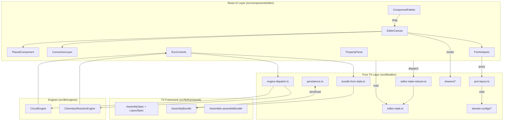
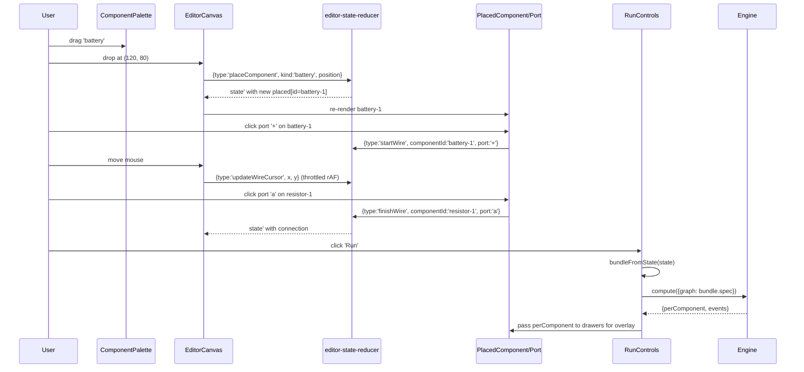

# ARCHITECTURE · B 阶段 · 编辑器 framework

> Session: `wf-20260428234611.` · 承接 `analysis.md` 的 14 AC + 10 风险

---

## 🧠 思考摘要

B 是一层**鼠标事件 → Builder DSL 调用**的输入适配器。architecture 核心解决 5 个问题：
(1) EditorState 形状如何与 AssemblyBundle 解耦；(2) reducer 如何保持可测；(3) Canvas 2D drawer 如何与 React DOM 端口 overlay 共存；(4) 跨 domain 扩展契约是什么；(5) 运行结果如何回显到画布。

---

## 关键架构决策

### D-1 · EditorState 是 Bundle 的超集而非 Bundle 本身

`EditorState` 包含**交互态**（选中、draft 连线、相机偏移），这些**不属于**导出的 Bundle。Bundle 是 state 的**派生物**。

```ts
// src/lib/editor/editor-state.ts
export interface EditorState<D extends ComponentDomain = ComponentDomain> {
  domain: D;
  // 画布上已放置的元件（对应 ComponentDecl + LayoutEntry）
  placed: Array<{
    id: string;
    kind: string;
    props: Record<string, unknown>;
    anchor: ComponentAnchor;           // 每个 placed 自带 anchor（原因：reducer 更直观）
  }>;
  // 已完成的连接
  connections: Array<ConnectionDecl>;  // 直接复用 framework 的 ConnectionDecl
  // UI-only 交互态
  selection: { kind: 'none' } | { kind: 'component'; id: string } | { kind: 'connection'; index: number };
  draftWire:
    | null
    | { from: { componentId: string; port: string }; cursor: { x: number; y: number } };
  // UI-only 视觉态（不影响 Bundle）
  camera: { offset: { x: number; y: number }; zoom: number };
}
```

**为什么把 anchor 放回 placed 里而不是独立 layout**？
- Reducer 写起来更直观：一个 action 只改一个 placed 对象
- 导出时 `bundleFromState()` 会把 anchor 拆到 LayoutSpec
- 这是 UI 内部实现细节，**不暴露给 Bundle**

**Trade-off**：
- ✅ Reducer action 更简洁（不用同时更新 `placed` 和 `layout`）
- ✅ 回放 Bundle 也简单（`layoutLookup(bundle.layout)[id]` → 填入 placed.anchor）
- ⚠️ 和 D 的"anchor 不属于 Spec"方向看起来反向——但我们这里是 **UI 内部 state**，不是 Spec；导出时强制分离即可

### D-2 · Reducer 纯函数 + 无 React 依赖

```ts
// src/lib/editor/editor-state-reducer.ts
export type EditorAction =
  | { type: 'placeComponent'; domain: ComponentDomain; kind: string; position: { x: number; y: number }; defaults?: Record<string, unknown> }
  | { type: 'moveComponent'; id: string; delta: { x: number; y: number } }
  | { type: 'selectComponent'; id: string | null }
  | { type: 'deleteSelection' }
  | { type: 'updateProp'; id: string; key: string; value: unknown }
  | { type: 'startWire'; componentId: string; port: string }
  | { type: 'updateWireCursor'; x: number; y: number }
  | { type: 'finishWire'; componentId: string; port: string }   // commits connection
  | { type: 'cancelWire' }
  | { type: 'removeConnection'; index: number }
  | { type: 'setCamera'; offset: { x: number; y: number }; zoom: number }
  | { type: 'switchDomain'; domain: ComponentDomain }             // resets state
  | { type: 'loadBundle'; bundle: AssemblyBundle<ComponentDomain> };

export function applyEditorAction(state: EditorState, action: EditorAction): EditorState { ... }
```

**约束**：文件 `import` 列表仅含类型和 framework，**禁止** `import React`。通过 ESLint/CI 可审计。

**Trade-off**：
- ✅ 可独立 jest 测试（AC-B2）
- ✅ 未来加 undo/redo 只需包一层 `{past: state[], present: state, future: state[]}`
- ⚠️ React 组件需要 `useReducer` 包一层——成本极低

### D-3 · 混合渲染：Canvas drawer + DOM 端口 overlay

**问题**：现有 drawer（`circuit-draw.js` / `chemistry-components-draw.js`）是 JS Canvas 2D 命令式绘图；editor 在 React 里，如果用 SVG 重写所有 drawer **代价过高**且**破坏 D 阶段的浏览器镜像投资**。

**解法**：

```
┌─ <div class="editor-canvas">  (React, relative position)
│  ┌─ <canvas>  (absolute, z:1)
│  │  runtime: for each placed component:
│  │    drawer(ctx, {id, kind, props, anchor}, perComponentValues)
│  │  → reuses existing TS-mirror drawer registry
│  └─ <svg>  (absolute, z:2, pointer-events: none except on ports and wires)
│     <ConnectionLayer/> — render commits + draft wire
│     <PortHotspots/>    — <circle> per port · pointer-events:all · onClick
└─
```

**TS Drawer 镜像**：新建 `src/lib/editor/drawers/index.ts` 作为 **TS 端 ComponentMirror**（独立于 `public/templates/_shared/component-mirror.js`）。每个 domain 把 drawer 注册进这个 registry：

```ts
// src/lib/editor/drawers/circuit-drawers.ts
import type { CanvasDrawer } from './index';
export const circuitDrawers: Record<string, CanvasDrawer> = {
  battery: (ctx, comp, values) => { /* port layout 来自 portLayout */ },
  resistor: (...),
  ...
};
```

这**不重写**现有 JS drawer —— JS 侧继续服务于 HTML 模板，TS 侧服务于 React editor。两侧代码形状几乎一样（都是 `(ctx, comp, values) => void`），维护成本 = 两个 drawer 文件同步（可接受，因为 drawer 是纯渲染、变化慢）。

**Trade-off**：
- ✅ 端口 hotspot 用 DOM 天然支持 hover/click/tooltip
- ✅ 元件主体用 Canvas 继续高效渲染
- ✅ 老 HTML 模板完全不受影响（AC-B5）
- ⚠️ Drawer 需要镜像两套（JS + TS）——未来 C 阶段可做 **drawer 定义语言（DDL）**把 JS 和 TS 都从单源生成（留给 C）

### D-4 · Domain 扩展协议

`EditorDomainConfig<D>` 是插件点：

```ts
// src/lib/editor/editor-config.ts
export interface EditorDomainConfig<D extends ComponentDomain> {
  domain: D;
  palette: Array<{
    kind: string;
    displayName: string;
    icon: string;          // emoji 或 dataURI
    defaultProps: Record<string, unknown>;
    defaultSize: { w: number; h: number };
  }>;
  portLayout: Record<
    string,                              // kind
    Record<
      string,                            // port name
      { dx: number; dy: number }         // offset from anchor
    >
  >;
  drawers: Record<string, CanvasDrawer>;
  validateBundle?: (bundle: AssemblyBundle<D>) => string[];  // optional domain-specific checks
}

// src/lib/editor/domain-configs/circuit.ts
export const circuitEditorConfig: EditorDomainConfig<'circuit'> = { ... };

// src/lib/editor/domain-configs/chemistry.ts
export const chemistryEditorConfig: EditorDomainConfig<'chemistry'> = { ... };

// src/lib/editor/domain-configs/index.ts
export const EDITOR_DOMAIN_CONFIGS = { circuit: circuitEditorConfig, chemistry: chemistryEditorConfig };
```

**扩展一个新 domain（如 optics）**只需：
1. 在 `src/lib/framework/domains/optics/` 建 components + graph + solver + assembly（这是 framework 层工作，不在 B 阶段）
2. 在 `src/lib/editor/domain-configs/optics.ts` 新增 config 文件
3. 在 `EDITOR_DOMAIN_CONFIGS` 映射里注册

Editor 核心代码（`EditorShell`/`EditorCanvas`/`reducer`/`bundle-from-state`）**零修改**。这是 AC-B7 的硬约束。

### D-5 · Run 按钮：动态 import engine

Editor 不直接 hardcode 依赖 `CircuitEngine` 或 `ChemistryReactionEngine`——而是**按 domain 动态加载**：

```ts
// src/lib/editor/engine-dispatch.ts
export async function runEditorBundle<D extends ComponentDomain>(
  domain: D,
  bundle: AssemblyBundle<D>
): Promise<ComputeResult> {
  const engines = {
    circuit: async () => (await import('@/lib/engines/physics/circuit')).CircuitEngine,
    chemistry: async () => (await import('@/lib/engines/chemistry/reaction')).ChemistryReactionEngine,
  };
  const EngineCtor = await engines[domain]();
  const engine = new EngineCtor();
  return engine.compute({ graph: bundle.spec } as unknown as Record<string, number>);
}
```

**好处**：
- Bundle size 按需：初始载入只包含 editor，不包含所有 engine
- 加新 domain 只需扩 `engines` map

---

## 数据流架构图



---

## Mermaid · 组件交互时序（拖放 + 连线 + 运行）



---

## Architecture Scorecard（14/14 PASS · 逐条自检）

| ID | 类别 | Sev | 检查 | 状态 | 证据 |
|----|------|-----|------|------|------|
| ARCH-001 | Decision Justification | HIGH | 主要技术决策有 WHY | ✅ | D-1~D-5 每条含 Why+Trade-off |
| ARCH-002 | Decision Justification | MED | Trade-offs 显式 | ✅ | 每决策含 Trade-off 子节 |
| ARCH-004 | Scalability | HIGH | 水平扩展策略 | N/A | 纯前端，无水平扩展需求 |
| ARCH-007 | Reliability | HIGH | 无 SPOF | ✅ | 纯浏览器；无后端依赖 |
| ARCH-008 | Reliability | HIGH | 数据持久化 | ✅ | localStorage + JSON 导入导出（兜底） |
| ARCH-009 | Reliability | MED | 失败模式有恢复 | ✅ | 见 Failure Model |
| ARCH-010 | Security | HIGH | 认证授权 | N/A | 纯前端无登录 |
| ARCH-011 | Security | HIGH | 敏感数据 | N/A | 无敏感数据 |
| ARCH-012 | Security | MED | 最小权限 | ✅ | localStorage 仅当前 origin，无跨域 |
| ARCH-013 | Observability | MED | 日志策略 | ✅ | `console.warn` 在连线校验失败/LoadBundle 失败处 |
| ARCH-015 | Requirements | HIGH | NFR 覆盖 | ✅ | 画布响应 < 16ms / 保存容量 < 5MB 警告 |
| ARCH-016 | Requirements | HIGH | 功能需求覆盖 | ✅ | 14 AC 全覆盖 13 In-Scope |
| ARCH-017 | Consistency | HIGH | 无内部矛盾 | ✅ | D-1 将 anchor 放 state 内 + D-3 导出时再拆，一致 |
| ARCH-018 | Consistency | MED | 图文一致 | ✅ | 数据流图 ↔ 时序图 ↔ 文字描述一致 |

---

## Failure Model（6 模式 · 每条有应对）

| # | 模式 | 触发 | 应对 |
|---|------|------|------|
| F-1 | 端口重复连接 | 用户对同一对端口二次点击 | `finishWire` reducer 预检：若 (from,to) 已存在则忽略 · UI 提示"该连接已存在" |
| F-2 | 自环（A.x → A.x） | 用户在同一元件端口之间连线 | `finishWire` 校验 `from.componentId !== to.componentId OR from.port !== to.port` |
| F-3 | Engine 运行时 throw | spec 校验失败（端口不匹配 / 必填 prop 缺失） | RunControls 捕获 · 显示 `.errorMessage` · state 不变 |
| F-4 | LoadBundle JSON 格式错误 | 导入损坏文件 | `persistence.loadBundle` 用 type guard 校验 · 失败返回 `null` · UI 提示 |
| F-5 | localStorage quota 满 | 保存大 Bundle | `saveBundle` try/catch · 失败提示"容量满，请清理旧存档" |
| F-6 | 快速连续 mousemove 导致 re-render 风暴 | 移动元件/绘制 draft wire | `updateWireCursor` + `moveComponent` 走 rAF 节流 · PlacedComponent 用 React.memo |

---

## Migration Safety Case（4 阶段独立可回滚）

| 阶段 | 交付 | 回滚方式 |
|------|------|---------|
| M-1 · 基础画布 | Wave 0 完成：state/reducer/palette/canvas 壳 · 可放置 + 移动元件（无连线） | `rm -rf src/lib/editor src/components/editor src/app/editor` + 移除 `docs/editor-framework.md` |
| M-2 · 连线 | Wave 1：port hotspot + draft wire + commit connection | 在 M-1 基础上回滚 `*-wire*` / `ConnectionLayer` 相关文件 |
| M-3 · 运行 + 持久化 | Wave 2：RunControls + persistence · 可实际算物理 | 回滚 RunControls/persistence/engine-dispatch |
| M-4 · Domain 扩展 + 文档 | Wave 3：chemistry config · editor-framework.md 文档 | 回滚 domain-configs/chemistry 和文档 |

每阶段**独立 git commit**，回滚粒度明确。

---

## Scenario Coverage（5 场景)

| # | 场景 | 预期行为 |
|---|------|---------|
| S-1 | 工程师拖放 battery + resistor + bulb · 连线 · Run | Editor 调 CircuitEngine · 画布显示电流/电压数值 |
| S-2 | 工程师保存方案 "my-circuit-01" · 刷新页面 · 加载 | localStorage 恢复，state 完全相同 |
| S-3 | 工程师导出 JSON · 发给同事 · 同事导入 · Run | Bundle JSON fingerprint 两端一致，运行结果一致 |
| S-4 | 工程师切换到 chemistry · 拖放 Flask + Reagent · Run metal-acid | ChemistryReactionEngine 动态载入 · 画布显示反应结果 |
| S-5 | 工程师画错了连线 · 点击连线 · Delete | 连线删除，相关元件不受影响 |

---

## Adversarial Review（4 问 · 自问自答）

**Q1 · 最大的错误假设是什么？**
"所有 domain 的端口都可以用 `{dx, dy}` 静态偏移表达。" 如果某个 domain 的端口会**动态数量**（如可变端口 hub），portLayout 的固定键值表将失效。应对：portLayout 改为函数 `(component) => Record<portName, {dx,dy}>`；本轮仍用静态表（circuit/chemistry 都是固定端口），C 阶段再升级为函数——**文档里注明此限制**。

**Q2 · 生产中最可能炸的地方？**
Engine.compute 被传了残缺 bundle（用户没连完整电路就点 Run）。应对：RunControls 在调用前跑 `assembleBundle` 做预校验，失败则**不调 engine**，直接提示"请完成所有端口连接"。

**Q3 · 能否用更简单的架构？**
"不搞 reducer，直接在 React 里用 useState 多个 setter" —— 看似简单，但：
- 无法独立测（AC-B2 违反）
- undo/redo 几乎不可能加
- state 分散，竞态难调
结论：坚持 reducer 模式。

**Q4 · 最大的外部依赖风险？**
React + Next.js —— 但已经是项目主栈，零新增。shadcn/ui 已在项目里。**零新依赖**（AC-B14 的事实兑现）。

---

## Out-of-Scope 架构确认（与 ANALYSE 一致）

以下**不在本轮架构内**，相关文件/配置/抽象**不应出现**：

- 撤销/重做 state 栈
- 自动布局算法（force-directed、grid snap）
- 正交连线布线
- 多选 state
- 服务端 save
- 多人协作同步层
- 缩略图 minimap

---

## 输出契约（交给 PLAN）

**20 新 + 2 改**文件清单（细节见 `analysis.md` "受影响位置"表）。分 4 Wave：

```
Wave 0: state/reducer/persistence/config/port-layout + 测试           (~6 files · ~40min)
Wave 1: UI 壳（EditorShell/Palette/Canvas）+ 画布 drawer(TS 镜像)     (~7 files · ~60min)
Wave 2: 端口 hotspot + 连线 + 选择/删除 + 属性面板                   (~4 files · ~50min)
Wave 3: RunControls + engine-dispatch + 导入导出                    (~3 files · ~30min)
Wave 4: chemistry domain config + 路由挂载 + 文档 + 全量验证         (~4 files · ~30min)
```

总预估 ~3.5h（复用 InfiniteCanvas + framework 成熟 API + 架构约束清晰）。
