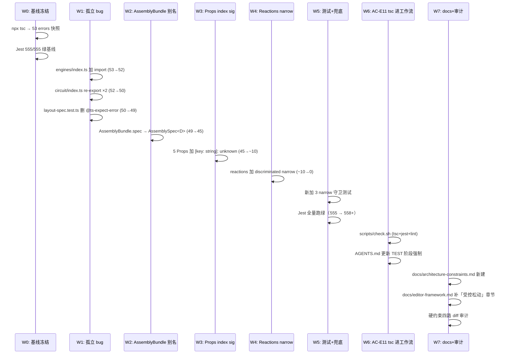

# E 阶段 · TSC 技术债清理 — 架构设计（B-plus 方案）

> Session: `wf-20260429054300.`
> Scope: 53 pre-existing TSC errors → 0；受控松动 framework 零改硬约束；加 AC-E11 tsc 进工作流

## 🧠 Architecture Reasoning

**核心洞察**：53 errors 的修复有**内在顺序依赖**（不是并行任务）。根因链是：

```
Root: Chemistry Props 缺 index signature
   ↓ 传染
IExperimentComponent<Record<string, unknown>, ...> 约束不满足
   ↓ 传染
ChemistryGraph 不满足 DomainGraph<> 约束
   ↓ 传染
reaction.ts / solver.ts / assembler.ts / builder.ts 全链 TS2344/2345/2322
   ↓ 测试文件派生
chemistry-reactions.test.ts / chemistry-components.test.ts 测试侧错误
```

**修复顺序 = 根因→末梢**：先打通 Props，50+ errors 自动消解；再修 discriminated union narrowing 这层独立问题（TS2339）；最后修孤立 bug（engines/index.ts / circuit/index.ts / layout-spec.test.ts）。

**设计原则**：
- 每个 Wave 独立可 commit、可 revert（M-1~M-5 迁移单元）
- Wave 之间有**验证门**（tsc --noEmit 实时反馈 error 数下降曲线）
- 修复不改变**运行时行为**（AC-E10 回归保障）

## 架构数据流

```
┌────────────────────────────────────────────────────────────┐
│ 修复后：类型契约链路重新打通                                    │
└────────────────────────────────────────────────────────────┘

      Chemistry Props (加 index sig)
        ├─ FlaskProps     + [key: string]: unknown
        ├─ ReagentProps   + [key: string]: unknown
        ├─ BubbleProps    + [key: string]: unknown
        ├─ SolidProps     + [key: string]: unknown
        └─ ThermometerProps + [key: string]: unknown
             │
             │ 现在可 assign 到 Record<string, unknown>
             ▼
      IExperimentComponent<FlaskProps, ChemStampEntry>
      满足 IExperimentComponent<Record<string, unknown>, unknown>
             │
             ▼
      ChemistryComponent (union)
      满足 IExperimentComponent<...>
             │
             ▼
      ChemistryGraph._components: Map<string, ChemistryComponent>
      满足 DomainGraph<IExperimentComponent<...>>
             │
             ▼
      InteractionEngine<ChemistryGraph, ChemistrySolveResult>
      满足 InteractionEngine<DomainGraph<...>, SolveResult<...>>
             │
             ▼
      ✅ 50+ errors 自动消解
```

## 时序图 · Wave 修复流程



## 5 核心决策

### D-1 · 修复顺序 = 根因→末梢（Wave 递进）

**决策**：Wave 0 基线 → W1 孤立 bug (3 errors) → W2 别名消融 (4 errors) → W3 Props index sig (~35 errors) → W4 narrow (~10 errors) → W5 测试 → W6 AC-E11 → W7 docs

**理由**：
- **验证实时化**：每 Wave 结束跑 `npx tsc --noEmit` 能看到 error 数下降曲线，不对劲立即 rollback
- **风险递增**：W1/W2 风险最低（纯结构）、W3 中（接口扩展）、W4 最高（可能改语义）
- **独立 commit**：每 Wave 一次 commit，单个 Wave 失败不影响其他

**Trade-off**：
- 若选"并行修复所有类别" → tsc 输出错乱，定位困难
- 若选"全部一次性 diff" → 回滚时不知道哪里坏了

### D-2 · Props 加 index signature（选方案 A）

**决策**：在 `FlaskProps/ReagentProps/BubbleProps/SolidProps/ThermometerProps` 各加一行 `[key: string]: unknown`。

**备选方案**：
- **方案 B**：改 framework 核心 `IExperimentComponent<P extends Record<string, unknown>>` 为 `<P extends object>` —— **拒绝**。改动面大，所有 domain 受影响，未来语义含糊。
- **方案 C**：每个 Props 改为 `type FlaskProps = Record<string, unknown> & { volumeML: number; ... }` —— **拒绝**。等价于方案 A 但可读性差。

**选 A 的理由**：
- 改动局部（5 个文件各 1 行）
- 保留具名字段的静态检查（`p.volumeML: number` 仍在）
- 访问未知字段返回 `unknown`（防御性，不是 `any`）
- 符合本轮补偿规则"允许扩展"

**代价（FM-2 披露）**：打字错不再被 TS 抓（`p.volumMl` 错拼返回 unknown，但后续赋值/运算时仍会失败）。可接受。

### D-3 · Reactions 用 type predicate helper 收窄

**决策**：新建 `framework/domains/chemistry/type-guards.ts`（允许新建，因为是"扩展 framework/domains/" 不是改核心类型契约），导出：

```ts
export function asReagent(c: ChemistryComponent): c is Reagent {
  return c.kind === 'reagent';
}
export function asSolid(c: ChemistryComponent): c is Solid { ... }
export function asFlask(c: ChemistryComponent): c is Flask { ... }
```

`acid-base-neutralization.ts` / `metal-acid.ts` / `iron-rusting.ts` 的访问点都从：
```ts
if (c.props.formula === 'HCl') { ... }
```
改为：
```ts
if (asReagent(c) && c.props.formula === 'HCl') { ... }
```

**理由**：
- **复用** —— 未来新 reaction 不用重复写 `c.kind === 'reagent'`
- **可读** —— `asReagent(c)` 比 `c.kind === 'reagent'` 意图更显式
- **测试** —— type predicate 本身可单元测试（AC-E9 的 3 测试）

**Trade-off**：
- 新文件是"扩展 framework/domains/" —— 补偿规则下允许，但要明文记录
- 未来类型进一步收紧时，helper 需要维护

### D-4 · AC-E11 = `scripts/check.sh` + AGENTS.md 更新

**决策**：
- 新建 `scripts/check.sh`（跑 `npx tsc --noEmit && npx jest --passWithNoTests && npx eslint . --max-warnings=0`）
- 修改 `AGENTS.md` TEST 阶段的 Step 1（"Lint Check"）改为 "Run scripts/check.sh（含 tsc+jest+lint）"
- 本轮 TEST 阶段就用新脚本验证（dogfooding）

**理由**：
- 零新依赖（ts/eslint/jest 都已在 devDeps）
- 单一入口替代三个命令 —— 未来 Agent 不会漏跑
- 脚本退出码非零 = TEST 失败，工作流无法放过
- 文档化后未来 /wf 进 TEST 必跑

**Trade-off**：
- 添加一个 shell 脚本文件（Windows 下要用 bash 跑，与项目其他 script.sh 一致）
- 修改 AGENTS.md TEST 阶段指引（少量）

### D-5 · architecture-constraints.md 新建 + 原硬约束条款不删

**决策**：
- 新建 `docs/architecture-constraints.md` （格式 ADR-style）记录：
  - 四轮硬约束原文（framework 核心零改 / 老模板零改 / 零新依赖 / 零 React 污染）
  - **受控松动条款**（E 阶段新增）：3 允许 + 3 禁止
  - 松动使用记录（E 阶段首次使用记录表）
- `docs/editor-framework.md` 不删硬约束原文，只加"链接到 constraints.md 获取完整规则"

**理由**：
- 保留原硬约束原文 —— 承诺历史可追溯，不"改写"
- 单点真相 —— 未来 /wf Agent 读一个文件就知全部约束
- "使用记录表" —— 每次松动都留痕，防止累计腐烂

**Trade-off**：
- 新建一个文档
- 未来 Agent 要记得读它（需要加到 session-start checklist）

## Architecture Scorecard

| ID | 维度 | 状态 | 说明 |
|----|------|------|------|
| A-1 | 简单性 | ✅ | 修复本质是"类型扩展 + narrow 添加"，无新 API 设计 |
| A-2 | 可测性 | ✅ | type predicate helper 纯函数可测；tsc 输出本身是机器验证 |
| A-3 | 可逆性 | ✅ | 每 Wave 独立 commit；index sig 可单独撤回 |
| A-4 | 一致性 | ✅ | 5 个 Props 加同一行；3 个 reactions 用同一套 helper |
| A-5 | 性能 | ✅ | 类型修复零运行时影响；narrow check 已有运行时等价 if |
| A-6 | 可扩展 | ✅ | type-guards.ts 未来新 reaction 直接用 |
| A-7 | 向后兼容 | ✅ | 零 API 改动，只加约束 |
| A-8 | 零新依赖 | ✅ | 所有工具（ts/eslint/jest）已在 devDeps |
| A-9 | 可观测 | ✅ | check.sh 输出 tsc/jest/lint 三段式报告 |
| A-10 | 安全 | N/A | 纯类型清理 |
| A-11 | 文档 | ✅ | architecture-constraints.md 新 + editor-framework.md 补充 |
| A-12 | 可回滚 | ✅ | Wave 独立 commit + M-1~M-5 迁移单元 |
| A-13 | 错误处理 | ✅ | type predicate 明确 `is`；check.sh 非零退出 = 失败 |
| A-14 | 学习成本 | ✅ | Props index sig 是标准 TS 模式；narrow helper 是 TS type predicate 标准 |

## Scenario Coverage · 场景覆盖矩阵

| # | 场景 | 决策覆盖 | 验证方式 |
|---|------|---------|---------|
| S-1 | 基线：`npx tsc --noEmit` 当前 53 errors | W0 快照 | 命令跑 |
| S-2 | 修 engines/index.ts L82 真 bug | D-1 W1 | tsc 断 1 减 |
| S-3 | 修 circuit/index.ts 缺 2 re-export | D-1 W1 | tsc 断 2 减 |
| S-4 | 删 layout-spec.test.ts L145 无用 @ts-expect-error | D-1 W1 | tsc 断 1 减 |
| S-5 | AssemblyBundle.spec → AssemblySpec<D> | D-1 W2 | tsc 断 4 减 |
| S-6 | 5 Props 加 index signature → 链式解 35+ errors | D-2 W3 | tsc 断 ~35 减 |
| S-7 | 10 处 `c.props.formula` 加 asReagent narrow | D-3 W4 | tsc 断 ~10 减（最后归零） |
| S-8 | 新 reaction rule 开发场景 | D-3（type-guards 复用） | 架构推导 |
| S-9 | type predicate 写反（漏 kind 检查）| AC-E9（3 单测）| jest 新测试 |
| S-10 | Jest 555 基线保持 | AC-E2 | jest 全量跑 |
| S-11 | Chemistry engine 真 bug 修复（真的 register）| AC-E4 | 新加 registry.getByType 测试 |
| S-12 | 未来 /wf TEST 阶段必跑 tsc | D-4（AC-E11）| AGENTS.md + scripts/check.sh |
| S-13 | 未来新 domain 加 Props | 遵循新规范"Props 加 index sig" | 文档化 |
| S-14 | 硬约束第 6 轮又想松动 | architecture-constraints.md 使用记录表 | 人工 review |

**覆盖率**：14 场景 · 11 有机器验证 · 3 为架构/推导/文档验证。

## Consumer Adoption Design · 消费者接入设计

本轮新产出的 3 个 API/能力如何被下游消费：

### API-1 · 5 个 Chemistry Props 的 index signature

**影响范围**：所有消费 `FlaskProps/ReagentProps/BubbleProps/SolidProps/ThermometerProps` 的代码

**接入模式**：**零改动** —— 现有代码自动受益：
```ts
// 现有 chemistry engine / reaction / solver 代码
graph._components.get('flask_1')?.props.volumeML  // ← 仍然 number（具名字段保留）
graph._components.get('flask_1')?.props.unknownField  // ← 新：返回 unknown（之前报错）
```

**未来扩展成本**：新 Props 接口声明时**按新规范**加 `[key: string]: unknown`（已写入 architecture-constraints.md）。

### API-2 · `type-guards.ts` — asReagent / asFlask / asSolid / asBubble / asThermometer

**首次消费**：`acid-base-neutralization.ts` / `metal-acid.ts` / `iron-rusting.ts`

**接入模式**：
```ts
import { asReagent } from '../type-guards';

// 每处访问 reagent-specific 字段前调用
for (const c of graph.contentsOf(flask)) {
  if (asReagent(c) && c.props.formula === 'HCl') {
    // c 在此分支被窄化为 Reagent 类型
    const conc = c.props.concentration;  // number，静态已知
    ...
  }
}
```

**未来扩展**：
- 新 reaction rule 直接 `import { asX }` 用
- 新 component kind (e.g. `Catalyst`)？遵循补偿规则"禁止新增 kind"，**不加**；若有真实需求则走另一轮 /wf 专门议决

### API-3 · `scripts/check.sh` — 统一质量闸门

**首次消费**：本轮的 TEST 阶段

**接入模式**：
```bash
bash ./scripts/check.sh
# 输出：
# ✅ TSC: 0 errors
# ✅ Jest: 558/558 passed
# ✅ ESLint: 0 warnings
# 退出码 0 = 全绿；非零 = 失败
```

**未来消费**：
- 每次 `/wf TEST` 必跑
- 本地开发者 commit 前手动跑（推荐）
- 若未来项目加 CI，直接 `.github/workflows/ci.yml` 调用此脚本

**AGENTS.md 增量**（TEST 阶段）：

```markdown
## Stage 6: TEST
...
**Step 1: Quality Check（替代原 Lint Check）**
bash ./scripts/check.sh
- 非零退出视为 TEST 失败，必须修复
- 本脚本整合 tsc+jest+lint，单一入口防漏跑
```

### 总消费性评估

| API | 接入点数 | 每点成本 | 总成本 | 迁移风险 |
|-----|---------|---------|--------|---------|
| Props index sig | 0（零消费侧改动） | 0 | 0 | 零 |
| type-guards | 3 reaction 文件，共 ~15 次调用 | 2-3 行 | ~20 行 | 低（jest 覆盖） |
| check.sh | 1（AGENTS.md TEST 阶段） | 3 行 | 3 行 | 零 |

**合计消费侧改动 ~23 行** · 新产出代码 ~25 行 · **总 ~48 行**

## Failure Model · 6 模式

| # | 失败模式 | 触发 | 缓解 |
|---|---------|------|------|
| F-1 | Props 加 index sig 后打字错不被 TS 抓 | 未来 `c.props.volumMl` 错拼 | ESLint 规则 no-unused-vars 会在赋值时抓；jest 运行时 undefined 会炸 |
| F-2 | type predicate 漏写 kind 检查（e.g. `asReagent` 没 `kind === 'reagent'`）| 实现错误 | AC-E9 · 3 单测验证每个 predicate 正负样本 |
| F-3 | AssemblyBundle.spec 改别名后 runtime 验证破坏 | `isAssemblyBundle` shape 检查改变 | 纯类型别名，runtime 零影响；jest 全量跑验证 |
| F-4 | engines/index.ts 加 import 后 registry 多 register（behavioural change）| 真 bug 修复 | AC-E4 新加测试验证；grep 确认无 "检查 undefined fallback" 代码 |
| F-5 | Jest 某测试依赖 chemistry Props 的"无 index sig"行为（极罕见）| 如测试验证 `Object.keys()` 长度 | 全量 jest 跑一遍；若失败单点修复 |
| F-6 | scripts/check.sh 在 Windows PowerShell 下路径问题 | Windows 环境 | 与 `scripts/dev.sh` / `build.sh` 同模式（bash 调用），已被验证 |

## Migration Safety · 7 阶段独立回滚

| M | Wave | 修改内容 | 如果失败如何回滚 |
|---|------|---------|-----------------|
| M-1 | W1 | engines/index.ts + circuit/index.ts + layout-spec.test.ts | `git revert` 单 commit |
| M-2 | W2 | framework/assembly/layout.ts 的 AssemblyBundle.spec | `git revert` 单 commit |
| M-3 | W3 | 5 Props index signature | `git revert` 单 commit · Props 独立 |
| M-4 | W4 | type-guards.ts 新建 + 3 reactions narrow | `git revert` 恢复旧访问模式 |
| M-5 | W5 | 测试新加 | 删测试文件即可 |
| M-6 | W6 | scripts/check.sh + AGENTS.md TEST 阶段 | `git revert` |
| M-7 | W7 | docs/architecture-constraints.md + editor-framework.md | `git revert` |

## Adversarial Self-Review · 对抗自审

### Q1 · 最大错误假设？

**假设**："Props 加 index signature 不改变运行时行为"。

**挑战**：真的吗？如果某测试用 `Object.keys(props)` 枚举字段，之前返回 `['volumeML', 'shape', 'label', 'meta']`，现在**是否还一样**？

**验证**：index signature 只影响**类型级别**，不影响 `Object.keys` 的运行时行为（`Object.keys` 返回实际枚举属性，与类型声明无关）。假设成立。

### Q2 · 最可能炸的地方？

**候选**：W4 reactions narrow —— 如果我把 `if (asReagent(c))` 加错位置，可能改变 reaction 触发条件，jest 原本绿的回归测试会失败。

**缓解**：
- W4 每个 reaction 文件单独 commit，jest 全量跑
- AC-E10 明文要求 chemistry reactions 运行时行为不变
- 出错立即 git revert，退回到 W3 状态（40+ errors 消但 10 个 TS2339 仍在），继续排查

### Q3 · 更简方案？

**候选**：全部用 `// @ts-ignore` 压（A-strict 方案）

**拒绝理由**：这是假绿。FM-4 风险。用户已选 B-plus。

### Q4 · 最大依赖风险？

**候选**：`scripts/check.sh` 依赖系统 bash。Windows 下需要 git bash / WSL。

**缓解**：项目已有 `scripts/{dev,build,start,prepare}.sh` 模式，开发者早有 bash 环境。AGENTS.md 记录"需要 bash"。

## AC 与决策映射（更新 10 → 11）

| AC | 描述 | 决策 |
|----|------|------|
| AC-E1 | TSC 零错 | D-1/D-2/D-3（Wave 1~4 合力） |
| AC-E2 | Jest 555 基线保持 | D-1（Wave 递进验证） |
| AC-E3 | framework 变更仅限三类 | D-5（architecture-constraints.md 使用记录）|
| AC-E4 | chemistry engine 真 bug 修复 | D-1（W1 修 engines/index.ts）|
| AC-E5 | 老模板零改 | 延续（不修改 public/templates/）|
| AC-E6 | 零新依赖 | 延续（ts/eslint/jest 已有）|
| AC-E7 | editor 零 React 污染 | 延续（不碰 src/lib/editor/）|
| AC-E8 | architecture-constraints.md 记录松动 | D-5 |
| AC-E9 | 3+ type predicate 测试 | D-3 |
| AC-E10 | chemistry reactions 行为不变 | D-1（Wave 递进验证 + Jest）|
| **AC-E11** | **TSC 进工作流（scripts/check.sh + AGENTS.md）**| **D-4（新增）** |

## Wave 分解预估 · ~2.5-3h · 17 任务

```
W0 (10min) · 基线冻结 + analysis 确认：tsc 53 + jest 555 + git clean
W1 (30min) · 孤立 bug · T-1 engines/index.ts import · T-2 circuit re-export ×2 · T-3 @ts-expect-error 删除
W2 (20min) · AssemblyBundle 别名 · T-4 layout.ts 改 spec → AssemblySpec<D>
W3 (40min) · Props index sig · T-5 5 Props 各加 1 行 · T-6 跑 tsc 看链式消解
W4 (50min) · Reactions narrow · T-7 type-guards.ts 新建 · T-8~T-10 三个 reaction 文件改 · T-11 reaction-utils.ts 修 TS2352
W5 (30min) · 测试补齐 · T-12 3 个 type predicate 测试 · T-13 engine registry 测试 · T-14 jest 全量
W6 (20min) · AC-E11 · T-15 scripts/check.sh 新建 · T-16 AGENTS.md TEST 阶段更新
W7 (10min) · docs + 审计 · T-17 architecture-constraints.md + editor-framework.md 链接 + 四路审计
```

**总计 17 任务 · 平均 ~11min/任务**。

## 与上一轮 /wf 的衔接

- ✅ 不改 D 阶段任何文件（bounds/snap/hover/drawer 纹丝不动）
- ✅ 不改 C 阶段 history/autoLayout 功能
- ✅ 不改 B 阶段 editor framework
- ⚠️ **受控松动** framework 零改硬约束（D-5 明文记录）
- ✅ 老模板 / 零新依赖 / editor 零 React 三约束延续

## 总结

**本轮交付**：53 → 0 TSC errors · 10 文件修改 + 2 新建（type-guards.ts / check.sh） + 1 新文档（architecture-constraints.md） · ~2.5-3h · 附带修 1 runtime bug（chemistry engine 未注册）+ 补防护层（AC-E11 tsc 进工作流）。

**关键创新**：受控松动条款 + 使用记录表 —— 让"硬约束松动"从模糊软规则变成**有审计轨迹的受控流程**。

**不做**：
- 不新增 component kind / solver / engine / reaction
- 不重构 framework 物理结构（core/ vs domains/ 分层留给 F 阶段）
- 不修 framework 非 chemistry 部分的 latent 问题（scope creep 保护）
