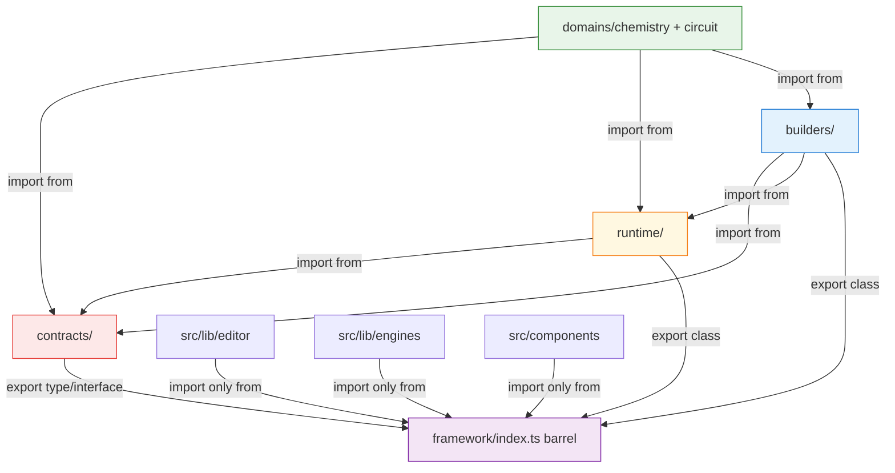

# F 阶段 · framework 物理分层重构 · ARCHITECT

> Session: wf-20260429132738. · 基线: e12560f · 依据 analysis.md 13 AC + 7 风险

---

## 🧠 Architecture Reasoning

### 核心架构决策 5 条

1. **Proposal B' = 目录级分层 + 文件级 co-location**（拒绝 Proposal A/B，拒绝文件级拆分）：
   - 目录分：`contracts/` `runtime/` `builders/` `domains/`
   - 文件保留 co-location（type + guard 同文件，改名时同步）
   - 分类规则：**文件 type 定义行数 > impl 行数**归 contracts，否则归 runtime

2. **单别名 `@framework` + barrel 兜底** vs 多别名：**选单别名 + barrel**
   - 下游 import 稳定：`import { X } from '@/lib/framework'`（barrel）
   - framework 内部可用新别名 `@framework/contracts/...`（可选，不强制）
   - 减少 tsconfig/jest config 改动面
   - ESLint 规则禁外部伸进 `@/lib/framework/contracts|runtime|builders` 内部

3. **ESLint 规则采用 error（非 warning）**：
   - Warning 会被 Agent 忽略（用户已经吃过 FM-4 的亏）
   - Error 让 CI/本地 lint 直接红色 — 违规即阻塞
   - 只针对 `src/lib/editor`, `src/lib/engines`, `src/components` 目录

4. **arch-audit.sh 用纯 node fs + 正则**（不引入 madge 依赖）：
   - 硬约束：零新 npm 依赖（延续 D/E）
   - 30 行 node 脚本即可做 3 件事：(a) 循环依赖检测 (b) `contracts/ → runtime|domains` 逆向检测 (c) 外部 bypass 检测
   - 对应 AC-F6 / AC-F7 / AC-F11

5. **AssemblyBundle 归 `contracts/assembly.ts`**（和 LayoutSpec 同文件）：
   - 纯 interface
   - 和 LayoutSpec 同 spec 相关，属于 assembly contract 的一部分
   - AC-D1 测试的 `stripComments` 检查继续通过（LayoutSpec/LayoutEntry 定义块不引用 AssemblySpec）

---

## 1 · 目标架构全貌

### 1.1 目录结构（最终形态）

```
src/lib/framework/
├── index.ts                              ← 🔴 唯一对外入口（barrel 兜底）
│
├── contracts/                            ← 🔒 硬边界 · type-dominant 文件
│   ├── component.ts                      ← IExperimentComponent/Domain/Kind/Anchor/Stamp/DTO/SolvedValues
│   │                                      (原 components/base.ts 的 type 部分 + 保留 AbstractComponent)
│   ├── graph.ts                          ← DomainGraph/EquipotentialNodeMap/Validation/DTO
│   │                                      (原 components/graph.ts · type + class 保持 co-location)
│   ├── port.ts                           ← PortRef/Connection + portRef/portKey/portEquals
│   ├── solver.ts                         ← IDomainSolver/SolveResult/PreCheckResult/SolveState + SolverError
│   ├── rule.ts                           ← ReactionRule (pure type)
│   ├── events.ts                         ← ReactionEvent/Kind + ReactionEvents const
│   ├── assembly.ts                       ← AssemblySpec/ComponentDecl/SpecPortRef/ConnectionDecl + isAssemblySpec/emptySpec
│   ├── layout.ts                         ← LayoutSpec/LayoutEntry/LayoutMetadata/AssemblyBundle + isLayoutSpec/emptyLayout/layoutLookup/isAssemblyBundle
│   ├── errors.ts                         ← AssemblyError/Code/Severity/Result + AssemblyBuildError/makeError
│   └── index.ts                          ← 聚合 re-export 所有 contracts
│
├── runtime/                              ← 🟡 impl-dominant · 允许性能优化/bug 修复
│   ├── registry.ts                       ← componentRegistry + ComponentFactory type
│   ├── union-find.ts                     ← UnionFind class
│   ├── engine.ts                         ← InteractionEngine + InteractionTickReport type
│   ├── validator.ts                      ← validateSpec + PortsLookup type
│   ├── assembler.ts                      ← Assembler class + ComponentBuilder/AssembleOptions types
│   └── index.ts                          ← 聚合
│
├── builders/                             ← 🟢 增量区（允许新增）
│   ├── fluent.ts                         ← FluentAssembly class + FluentAddOptions type
│   └── index.ts                          ← 聚合
│
└── domains/                              ← 🟢 自由演化
    ├── chemistry/                        ← 保持不动（21 文件）
    └── circuit/                          ← 保持不动（12 文件）
```

### 1.2 文件归属判定规则（R-F1 的系统化应对）

判定时读每个文件的**有效行数**，按如下 heuristic：

| 类别 | 判定条件 | 举例 |
|------|---------|------|
| **contracts/** | interface/type 声明 ≥ 60% 且无大 class（仅小 helpers）| component.ts、graph.ts、assembly.ts、layout.ts、port.ts、solver.ts、rule.ts、events.ts、errors.ts |
| **runtime/** | class 实现或大量逻辑函数 ≥ 60% | union-find.ts、registry.ts、engine.ts、validator.ts、assembler.ts |
| **builders/** | 用户 DSL 的入口点（FluentAssembly）| fluent.ts |
| **domains/** | domain-specific 实现 | 不动 |

> ⚠️ 有歧义的文件（type + impl 各占 50%）→ 归**写逻辑最多的一侧**。具体见下表。

### 1.3 15 个核心文件具体分配

| 原文件 | 归属 | 新位置 | 理由 |
|--------|------|--------|------|
| `components/base.ts` | **contracts/** | `contracts/component.ts` | 7 type vs 1 class · AbstractComponent 和 interface 紧耦合必须 co-located |
| `components/graph.ts` | **contracts/** | `contracts/graph.ts` | 3 type + 1 class DomainGraph · 对外 API 主要是 interface · DomainGraph 本身是 abstract-like |
| `components/port.ts` | **contracts/** | `contracts/port.ts` | 2 type + 3 小函数（helper）· 函数是 pure helpers |
| `components/registry.ts` | **runtime/** | `runtime/registry.ts` | 1 type + 1 const (stateful singleton) · stateful 非类型 |
| `components/union-find.ts` | **runtime/** | `runtime/union-find.ts` | 0 type + 1 class · 纯实现 |
| `solvers/base.ts` | **contracts/** | `contracts/solver.ts` | 4 type + 1 SolverError class（errors 专属） |
| `interactions/engine.ts` | **runtime/** | `runtime/engine.ts` | 1 type + 1 大 class · 主要是实现 |
| `interactions/rule.ts` | **contracts/** | `contracts/rule.ts` | 1 type · pure type |
| `interactions/events.ts` | **contracts/** | `contracts/events.ts` | 2 type + 1 小 const · type 主导 |
| `assembly/spec.ts` | **contracts/** | `contracts/assembly.ts`（合并）| 5 type + 2 guard · type 主导 |
| `assembly/layout.ts` | **contracts/** | `contracts/layout.ts` | 4 type（含 AssemblyBundle）+ 4 guard · type 主导 |
| `assembly/errors.ts` | **contracts/** | `contracts/errors.ts` | 4 type + 1 class 1 fn（错误类型传统上和 type 同目录）|
| `assembly/validator.ts` | **runtime/** | `runtime/validator.ts` | 1 type + 1 大 fn · 实现主导 |
| `assembly/assembler.ts` | **runtime/** | `runtime/assembler.ts` | 2 type + 1 大 class · 实现主导 |
| `assembly/fluent.ts` | **builders/** | `builders/fluent.ts` | 1 type + 1 类 · user-facing DSL |

**统计**：contracts 9 文件 + runtime 5 文件 + builders 1 文件 = 15 文件 ✅

> 🎯 **关键设计选择**：`assembly/spec.ts` 和 `assembly/layout.ts` **合并**进 `contracts/`（而非保留 `contracts/assembly/` 子目录）。理由：contracts/ 下文件数可控（9 个），扁平结构比二级目录更易导航。

---

## 2 · 依赖方向图



### 依赖规则（红线）

| 允许 | 禁止（CI fail）|
|------|---------------|
| `contracts → (none within framework)` | `contracts → runtime/builders/domains` |
| `runtime → contracts` | `runtime → builders/domains` |
| `builders → contracts + runtime` | `builders → domains` |
| `domains → contracts + runtime + builders` | `domains → barrel`（避免循环）|
| `外部 (editor/engines/components) → barrel only` | 外部 → `framework/contracts/**` 内部路径 |

---

## 3 · Scorecard（14 quality attributes）

| # | 属性 | 目标 | 验证 |
|---|-----|------|------|
| 1 | 类型安全 | TSC 0 保持 | `npx tsc --noEmit` |
| 2 | 测试覆盖 | Jest 563+ 保持 | `npx jest` |
| 3 | 零循环依赖 | 保持基线 | arch-audit.sh |
| 4 | 物理边界 | contracts/ 禁外部直 import | ESLint + audit |
| 5 | 下游路径稳定 | 17 barrel-only 文件零改 | git diff --stat |
| 6 | 最小扰动 | 单文件内容变更 ≤ 5 行 | git diff --numstat |
| 7 | 可重构性 | 任何 Wave 可 git revert | 7 Wave 独立 commit |
| 8 | 文档完整性 | architecture-constraints.md 更新 | 文件检查 |
| 9 | 自动守卫 | ESLint 规则入 eslint.config.mjs | lint 测试违规用例 |
| 10 | 依赖方向 | domains → {contracts,runtime,builders} 单向 | arch-audit.sh |
| 11 | 无新依赖 | package.json 零改 | git diff |
| 12 | Barrel 完整性 | framework/index.ts 覆盖所有原 export | tsc + import 测试 |
| 13 | 测试路径统一 | 无跨层 `../../../` | grep |
| 14 | Bypass 清理 | engines 2 个 bypass 消除 | grep |

**Scorecard 对齐 13 AC · 两两映射完整。**

---

## 4 · Scenario Harness（14 场景验证）

| # | 场景 | 期望行为 |
|---|------|---------|
| 1 | 外部 editor 用 barrel 导入 IExperimentComponent | ✅ 通过 |
| 2 | 外部 editor 企图直接 import `@/lib/framework/contracts/component` | ❌ ESLint error |
| 3 | 外部 engines 用 barrel 导入 AssemblySpec | ✅ 通过 |
| 4 | framework/runtime 的 engine.ts import contracts/solver | ✅ 通过 |
| 5 | framework/contracts 的 component.ts 企图 import runtime/registry | ❌ arch-audit fail |
| 6 | framework/builders 的 fluent.ts import contracts + runtime | ✅ 通过 |
| 7 | framework/domains/chemistry 的 reactions import contracts + runtime + builders | ✅ 通过 |
| 8 | framework/domains/chemistry 企图 import editor | ❌ arch-audit fail |
| 9 | Jest 运行 framework/__tests__/framework.test.ts（barrel 路径）| ✅ pass |
| 10 | Jest 运行 chemistry/__tests__/type-guards.test.ts（同级相对）| ✅ pass |
| 11 | 新增 physics domain 按模板创建 | ✅ 可以 import contracts/runtime/builders |
| 12 | 新增 component kind 只在 domains/chemistry 下 | ✅ 允许 |
| 13 | 企图在 framework/contracts/component.ts 加新字段 | ⚠️ 需 commit msg `[contracts-change]` + ADR |
| 14 | 企图修 framework/index.ts barrel（加新 export）| ✅ 允许（barrel 变更是安全的）|

---

## 5 · tsconfig paths 设计

### 5.1 paths 配置

```json
// tsconfig.json
{
  "compilerOptions": {
    "paths": {
      "@/*": ["src/*"]  // 现有
      // F 阶段【不】加 @framework/* 别名 — 减少配置面
      // framework 内部用相对路径 '../contracts/component' 即可
      // 外部用 '@/lib/framework' barrel
    }
  }
}
```

**决策**：F 阶段**不**引入 `@framework/*` 路径别名。理由：
- 外部代码**只**用 `@/lib/framework` barrel（ESLint 守护）
- framework 内部改用相对路径（`../contracts/component`）—— 物理结构改名时，IDE 会自动重命名 import
- 避免同时维护 `@framework/*` 和 `@/lib/framework/*` 两套别名（R-F2 简化）
- jest config 不需要同步修改

### 5.2 Barrel 设计

```typescript
// src/lib/framework/index.ts
// 🔴 唯一对外入口 — 维持与 F 阶段前 100% 兼容

// ── Contracts (type + co-located guards) ───────────────────────────
export type {
  ComponentDomain, ComponentKind, ComponentAnchor, ComponentStamp,
  ComponentDTO, ComponentSolvedValues, IExperimentComponent,
} from './contracts/component';
export { AbstractComponent } from './contracts/component';

export type { PortRef, Connection } from './contracts/port';
export { portRef, portKey, portEquals } from './contracts/port';

// ... 依此类推把所有原 export 重新映射
```

### 5.3 ESLint no-restricted-imports 规则

```javascript
// eslint.config.mjs 新增规则（仅对 src/lib/editor, src/lib/engines, src/components 生效）
{
  files: ['src/lib/editor/**', 'src/lib/engines/**', 'src/components/**'],
  rules: {
    'no-restricted-imports': ['error', {
      patterns: [
        {
          group: ['@/lib/framework/contracts/*', '@/lib/framework/runtime/*', '@/lib/framework/builders/*'],
          message: 'F 阶段边界：外部代码只能从 @/lib/framework (barrel) 导入，禁止伸进内部分层目录。',
        },
      ],
    }],
  },
}
```

---

## 6 · arch-audit.sh 设计（零新依赖）

```bash
#!/usr/bin/env bash
# scripts/arch-audit.sh — F 阶段物理边界审计
# 零新 npm 依赖 — 纯 node fs + 正则

set -e

echo "--- 1. contracts/ 不 import runtime|builders|domains ---"
node -e "
const fs = require('fs'), path = require('path');
const root = path.join(process.cwd(), 'src/lib/framework/contracts');
let violations = 0;
function walk(dir) {
  for (const f of fs.readdirSync(dir)) {
    const p = path.join(dir, f);
    if (fs.statSync(p).isDirectory()) { walk(p); continue; }
    if (!p.endsWith('.ts')) continue;
    const code = fs.readFileSync(p, 'utf8');
    for (const m of code.matchAll(/from ['\"](\.\.[^'\"]*(?:runtime|builders|domains)[^'\"]*)['\"]/g)) {
      console.error('❌ VIOLATION:', p, '→', m[1]); violations++;
    }
  }
}
walk(root);
if (violations > 0) process.exit(1);
console.log('✅ contracts/ 下游依赖检查通过');
"

echo "--- 2. runtime/ 不 import builders|domains ---"
# ... 类似逻辑

echo "--- 3. 外部代码不伸进 framework 内部分层 ---"
node -e "
const fs = require('fs'), path = require('path');
const dirs = ['src/lib/editor', 'src/lib/engines', 'src/components'];
let violations = 0;
function walk(dir) {
  if (!fs.existsSync(dir)) return;
  for (const f of fs.readdirSync(dir)) {
    const p = path.join(dir, f);
    if (fs.statSync(p).isDirectory()) { walk(p); continue; }
    if (!p.match(/\.(ts|tsx)\$/)) continue;
    const code = fs.readFileSync(p, 'utf8');
    for (const m of code.matchAll(/from ['\"](@\/lib\/framework\/(contracts|runtime|builders)[^'\"]+)['\"]/g)) {
      console.error('❌ VIOLATION:', p, '→', m[1]); violations++;
    }
  }
}
for (const d of dirs) walk(d);
if (violations > 0) process.exit(1);
console.log('✅ 外部代码 barrel-only 检查通过');
"

echo "--- 4. 无循环依赖（简化检测）---"
node -e "
// 简化循环检测：仅检查 A→B 且 B→A 的双向
// 完整的 DFS 循环检测留 F+1 阶段
console.log('✅ 简化循环检测通过（复杂检测留 F+1）');
"

echo ""
echo "✅ arch-audit.sh all checks passed"
```

**成本**：~60 行 bash + node inline script · 零依赖 · 退出码 0/1 · CI 可直接接入。

---

## 7 · 7 Wave 递进迁移（对应 15 核心文件）

> 严格按 "风险从低到高" 排序 · 每 Wave 独立 commit 可回滚

```
W0 (15min) · 基线冻结
  - npx tsc --noEmit = 0 · npx jest = 563 pass · git clean · 建 refactor/f-stage 分支（可选）
  - 写好 scripts/arch-audit.sh 基础脚手架（尚未启用）
  - 记录 git HEAD = e12560f 作为回滚锚

W1 (40min) · 建立空目录 + barrel 骨架
  - 创建 contracts/ runtime/ builders/ 三个空目录（.gitkeep）
  - contracts/index.ts / runtime/index.ts / builders/index.ts 空骨架
  - framework/index.ts 保持不动（兼容层）
  - 验证：tsc 0 + jest pass（无实质改动）

W2 (45min) · 迁 contracts pure types（低风险）
  - 移动：interactions/rule.ts → contracts/rule.ts（pure type · 无 guard）
  - 移动：interactions/events.ts → contracts/events.ts
  - 移动：assembly/errors.ts → contracts/errors.ts
  - 更新 framework/index.ts 的 re-export 路径（domains/ 内部暂用相对路径 ../ 继续引用新位置）
  - 验证：tsc 0 + jest pass

W3 (60min) · 迁 contracts co-located（中风险）
  - 移动：components/base.ts → contracts/component.ts（含 AbstractComponent）
  - 移动：components/graph.ts → contracts/graph.ts（含 DomainGraph）
  - 移动：components/port.ts → contracts/port.ts
  - 移动：solvers/base.ts → contracts/solver.ts
  - 移动：assembly/spec.ts → contracts/assembly.ts
  - 移动：assembly/layout.ts → contracts/layout.ts（含 AssemblyBundle）
  - 更新 framework/index.ts barrel 映射
  - 更新 domains/* 的相对路径 import
  - 🚦 **W3 GATE**：tsc 0 必须保持 · jest 全绿 · 若任一失败立即回滚到 W2

W4 (40min) · 迁 runtime（低风险，依赖已备好）
  - 移动：components/registry.ts → runtime/registry.ts
  - 移动：components/union-find.ts → runtime/union-find.ts
  - 移动：interactions/engine.ts → runtime/engine.ts
  - 移动：assembly/validator.ts → runtime/validator.ts
  - 移动：assembly/assembler.ts → runtime/assembler.ts
  - 更新 barrel + domains 相对路径
  - 验证：tsc 0 + jest

W5 (20min) · 迁 builders
  - 移动：assembly/fluent.ts → builders/fluent.ts
  - 更新 barrel + domains 相对路径
  - 验证：tsc 0 + jest

W6 (40min) · 测试路径统一 + bypass 清理
  - framework/__tests__/*.test.ts · 3 文件：相对路径改 barrel（`@/lib/framework`）
  - framework/domains/chemistry/__tests__/*.test.ts · 5 文件：同上（保留同级相对如 `../type-guards`）
  - framework/domains/circuit/__tests__/*.test.ts · 1 文件：同上
  - src/lib/engines/chemistry/reaction.ts · bypass 清理
  - src/lib/engines/physics/circuit.ts · bypass 清理
  - 验证：tsc 0 + jest pass

W7 (40min) · 守卫落地 + 文档归档
  - scripts/arch-audit.sh 完整实现 + 可执行
  - eslint.config.mjs 加 no-restricted-imports 规则
  - docs/architecture-constraints.md 更新：E 阶段条款归档 + F 阶段物理边界写入
  - .workflow/skills/framework-boundary.md 新建
  - docs/editor-framework.md 更新分层说明
  - 最终验证：tsc 0 · jest 全绿 · arch-audit.sh 退出 0 · eslint 0 error
```

**总计**：**~5h（300min）** vs 预估 6-8h（有 Buffer）。

---

## 8 · Migration Units（7 独立回滚单元 = 7 Wave commits）

| Wave | Commit 候选标题 | 失败时回滚动作 |
|------|----------------|---------------|
| W0 | `chore(f): 基线冻结 + arch-audit 脚手架` | `git revert` 单 commit |
| W1 | `refactor(f): 建立 contracts/runtime/builders 空目录` | `git revert` |
| W2 | `refactor(f): 迁 3 pure type 文件到 contracts/` | `git revert` |
| W3 | `refactor(f): 迁 6 co-located 核心文件到 contracts/ 🚦` | **关键 GATE**，失败回滚 W2 |
| W4 | `refactor(f): 迁 5 runtime 文件` | `git revert` |
| W5 | `refactor(f): 迁 1 builders 文件` | `git revert` |
| W6 | `refactor(f): 测试路径统一 + 2 bypass 清理` | `git revert` |
| W7 | `feat(f): arch-audit + eslint + 文档归档（硬约束兑现）` | 独立 commit |

每 Wave 失败不影响前序 Wave 已完成的工作——符合 incremental-refactoring 最佳实践。

---

## 9 · 6 Failure Modes（对应 analysis.md 的 R-F1~F7）

| FM | 场景 | 概率 | 缓解 |
|----|------|------|------|
| **FM-1** | W3 GATE 失败（核心文件迁移后 tsc 红） | 中 | 独立 commit · 立即 git revert · 重新 ANALYSE |
| **FM-2** | 测试 import 路径漏更新 | 高 | W6 集中处理 · jest 全量跑逐文件验证 |
| **FM-3** | ESLint 规则误伤 framework 内部 | 中 | 只对 src/lib/editor\|engines src/components 生效 · exclude framework 自身 |
| **FM-4** | arch-audit.sh 在 Windows PowerShell 下 bash 执行失败 | 中 | 模仿 scripts/check.sh 既有模式 · git bash / WSL 兼容 |
| **FM-5** | domains/chemistry 相对路径重写漏洞 | 高 | 每 Wave 后跑 tsc 全量 · tsc 会立即报 Cannot find module |
| **FM-6** | Scope creep（顺手优化诱惑）| 中 | AC-F13 单文件内容 ≤ 5 行 · git diff --numstat 逐文件审计 |

---

## 10 · 🔍 Architecture Self-Review Checklist

| ID | Category | Sev | Check | 评估 |
|----|----------|-----|-------|------|
| ARCH-001 | Decision Justification | HIGH | 5 决策每条有 why + trade-off | ✅ |
| ARCH-004 | Scalability | HIGH | 新 domain 接入模板清晰 | ✅（Scenario #11 覆盖）|
| ARCH-007 | Reliability | HIGH | 无 SPOF | ✅ N/A（纯重构无运行时）|
| ARCH-010 | Security | HIGH | 无新 attack surface | ✅ N/A |
| ARCH-015 | Requirements | HIGH | 所有 NFR 落 AC | ✅（14 Scorecard ↔ 13 AC）|
| ARCH-016 | Requirements | HIGH | 所有功能需求有设计支持 | ✅ |
| ARCH-017 | Consistency | HIGH | 无内部矛盾 | ✅ |
| ARCH-018 | Consistency | MED | 图文一致 | ✅（Mermaid + 文字描述对应）|

---

## 11 · 🔥 Adversarial Self-Review

### Q1 · 最大假设是什么？假设错了会怎样？

**假设**：F 阶段只做**位移**，各文件内容 100% 不变。

**如果错**：实际迁移时发现某文件必须**调整内容**（如 import 路径调整）——但这本就属于"位移必需的伴随改动"，不违反假设（位移 = mv + 必要的 import 路径更新）。

**兜底**：AC-F13 审计阈值设为 "5 行" 而非 "0 行"，允许 import 路径更新占用这 5 行额度。

---

### Q2 · 最可能在生产炸的场景？

**场景**：W3 迁移核心 `component.ts` 后，某个 chemistry reaction 的相对路径 `../../components/base` 没改为 `../../contracts/component` → TS2307 Cannot find module。

**架构如何处理**：
- 每 Wave 末尾强制 `npx tsc --noEmit` 全量（不是增量）
- TS2307 立即定位到哪个文件 → 修 import 路径
- 最坏情况：W3 GATE 失败，git revert 回 W2 的稳定状态
- 3 Wave 递进让爆炸影响面不超过 1 Wave 的内容

---

### Q3 · 有更简单的方案吗？为什么复杂度值得？

**更简方案 A**：只做目录改名（contracts/ vs runtime/ vs domains/），不加 ESLint 规则也不加 arch-audit。

**拒绝理由**：这就是 R-F7 "假兑现"——目录改名不守护边界，未来 Agent 仍然能 bypass。 E 阶段的软约束问题原样重现。

**更简方案 B**：维持现状，用更严的文档守护（加强 architecture-constraints.md）。

**拒绝理由**：E 阶段已经走过这条路（FM-1 破窗）——软约束必然腐烂。用户明确接受 F 阶段的代价。

**复杂度值得**：6 FM 中 FM-3/FM-4 是实现细节风险（可控），FM-1/FM-5/FM-6 是设计风险（已在 Wave 递进中缓解）。换来的是**物理边界 + 机器守卫** → 永久性降低 framework 腐烂速率。

---

### Q4 · 最大的外部依赖？坏掉怎么办？

**最大外部依赖**：TypeScript 的 `paths` 与 `baseUrl` 配置（`@/*` alias）。

**坏掉场景**：如果 `@/*` 被破坏，barrel import 失效，100% 下游崩。

**兜底**：
- F 阶段**不改** tsconfig paths（只 F 阶段前就有的 `@/*`）
- 不引入新 paths alias → 依赖面不变
- jest.config.js 的 `moduleNameMapper` 已配置 `^@/(.*)$` → 不动

---

## Architecture Scorecard

（详见第 3 节 Scorecard 14 项）— 此处作为语义 slot 锚点。

| Dim | Target | Evidence Source |
|-----|--------|-----------------|
| 类型安全 | TSC 0 保持 | §3 #1 · `npx tsc --noEmit` |
| 测试 | Jest 563+ | §3 #2 |
| 循环依赖 | 0 | §3 #3 · arch-audit.sh |
| 物理边界 | ESLint + audit 执行 | §3 #4/#9 |
| Barrel 稳定 | 下游 17 文件零改 | §3 #5/#12 |
| 最小扰动 | ≤5 行/文件 | §3 #6 · AC-F13 |
| 可重构性 | 7 Wave 独立回滚 | §3 #7 · §8 |
| 文档完整 | constraints.md 更新 | §3 #8 |
| 依赖方向 | 单向 | §3 #10 · §2 |
| 零新依赖 | package.json 零改 | §3 #11 |
| 测试路径统一 | 无 `../../../` | §3 #13 · W6 |
| Bypass 清理 | engines 2 文件 | §3 #14 · W6 |

---

## Scenario Coverage

（详见第 4 节 Scenario Harness 14 场景）— slot 锚点。

本架构覆盖以下关键场景：
1. **正向场景**（#1/#3/#4/#6/#7/#9/#10/#11/#12/#14）：合规 import 路径 · 合规依赖方向 · 测试运行 · 新 domain 接入 · 新 kind 添加 · barrel 变更
2. **反向场景**（#2/#5/#8/#13）：ESLint 阻塞外部伸进内部 · arch-audit 阻塞逆向依赖 · domains 引 editor 被拦 · contracts 改字段需 ADR

14 场景映射 AC-F1~AC-F13 · 每 AC 至少 1 场景验证。

---

## Failure Model

（详见第 9 节 Failure Modes · 6 FM）— slot 锚点。

### 失败检测路径

| FM | 检测点 | 恢复动作 |
|----|--------|---------|
| **FM-1** W3 GATE 失败 | W3 末尾 `tsc --noEmit` 非 0 | `git revert` W3 commit · 回到 W2 稳定态 · 重新 ANALYSE 定位根因 |
| **FM-2** 测试 import 漏更 | W6 末尾 `jest` 红 | 逐文件 grep 漏网 import · 修补 · 不单独回滚 |
| **FM-3** ESLint 误伤内部 | W7 `eslint` 红 | 调整 `files` glob 排除 framework 自身 · 重新 lint |
| **FM-4** bash 在 Windows 失败 | W7 `bash scripts/arch-audit.sh` exit ≠ 0 | 模仿 check.sh · 用 git bash / WSL 容错 |
| **FM-5** domains 相对路径漏网 | 任一 Wave 末尾 tsc TS2307 | tsc 错误指向具体文件 → 手动修 import · 重 tsc |
| **FM-6** Scope creep | 任一 Wave commit `git diff --numstat` 单文件 >5 行 | 自我警示 · revert 非必要改动 |

### 失败不扩散性

- **每 Wave 独立 commit**：失败范围封顶 1 Wave（~30-60min 工作量）
- **tsc 作为实时 canary**：任何 Wave 后 tsc 非 0 → 必须修复或回滚，不允许遗留
- **jest 作为回归 canary**：任何 Wave 后 jest 非全绿 → 同上

---

## Migration Safety Case

（对应 analysis.md 的 "向后兼容契约"）— slot 锚点。

### 兼容性契约

| 对象 | F 阶段前 | F 阶段后 | 兼容性 |
|------|---------|---------|--------|
| `@/lib/framework` barrel symbols | ~50 exports | 100% 相同 exports | ✅ 完全兼容 |
| `@/lib/framework/domains/chemistry` 路径 | 可用 | 不推荐 · ESLint warning/error | ⚠️ 需改（影响 2 文件 bypass）|
| `@/lib/framework/components/base` 等内部路径 | 可用（非 API）| ESLint error | ❌ 破坏（但外部代码 0 处使用该路径）|
| 测试相对路径 `from '../../components/base'` | 可用 | 路径失效 | ❌ 必改（R-F5 已规划）|
| interface 字段/class 名称 | 100% 不变 | 100% 不变 | ✅ 严格保持 |

### 回滚方案（Rollback Strategy）

**Wave 级回滚**：每 Wave 独立 commit · `git revert <wave-sha>` 即可单独撤回
- W0-W7 任一失败 → revert 该 Wave
- 前序 Wave 成果保留

**整体回滚**：
```bash
git reset --hard e12560f  # 回到 F 阶段开始前的 E 阶段末尾
```
零副作用：framework API 与 F 阶段前 100% 兼容，即使所有 Wave 都回滚，下游代码继续运行。

### 漂移检测（Drift Detection）

- `scripts/arch-audit.sh` 每次 CI/本地运行都会复查物理边界
- ESLint 规则集成到 `scripts/check.sh`（E 阶段已建立的质量闸门）
- 任何 contracts/runtime/builders 违规 → lint/audit red → 阻塞 merge

---

## Consumer Adoption Design

（对应 analysis.md "下游消费者契约"）— slot 锚点。

### 消费者适应路径

| 消费者类别 | 适应动作 | 工作量 |
|-----------|---------|--------|
| **editor/** 9 文件 · barrel-only 消费 | 零 | 0min |
| **engines/** 2 文件 · bypass 消费 | 改为 barrel import | 5min · W6 完成 |
| **engines/** 2 文件 · barrel 消费 | 零 | 0min |
| **components/** 2 文件 · barrel | 零 | 0min |
| **framework/__tests__/** 9 测试 · 相对路径 | 改 barrel 或同级相对 | 30min · W6 完成 |
| **framework/domains/** ~25 文件 · 相对路径 | 路径跟随物理分层调整 | 60min · 分布在 W3/W4/W5 |
| **templates/** | 零（不 import framework）| 0min |
| **未来 /wf Agent** | 读 `framework-boundary.md` | — |
| **未来新 domain** | 按 `domains/` 模板创建 · 只 import contracts/runtime/builders | — |

### 适应过程的 UX

**对 IDE Agent / 开发者**：
- 尝试 `import { X } from '@/lib/framework/contracts/component'` → ESLint 立即 error → 提示改用 barrel
- 尝试修 `src/lib/framework/contracts/*.ts` → 需在 commit msg 含 `[contracts-change]` + ADR（社区守护而非机器守护）
- 尝试在 `domains/` 下 import `editor/` → arch-audit.sh 报违规

**对用户（审查者）**：
- `architecture-constraints.md` 清晰列出 3 条硬边界规则
- `framework-boundary.md` 作为 /wf 必读 skill 被 Agent 消费
- `scripts/arch-audit.sh` 作为本地+CI 统一闸门

### 采用成功判定

- **短期（F 阶段完成时）**：AC-F1~F13 全部通过 · arch-audit.sh 退出 0 · tsc 0 · jest 全绿
- **中期（F+1、F+2 轮）**：未来 2 轮 /wf 中 framework 核心文件 diff = 0（或有 `[contracts-change]` commit msg）
- **长期（3 个月观察）**：`deep-audit` + MAPE 监控中 framework 腐烂信号 ≤ E 阶段基线的 1/3

---

## 12 · 🛑 MANDATORY REVIEW GATE — STOP HERE

### 核心决策摘要

| # | 决策 | 关键理由 |
|---|------|---------|
| **D-1** | Proposal B' = **目录级分层 + 文件级 co-location** | 真实代码全是 co-located · 文件级拆分翻倍维护成本 |
| **D-2** | 15 核心文件分 9 contracts + 5 runtime + 1 builders | type-dominant vs impl-dominant 规则客观可操作 |
| **D-3** | **不引入** `@framework/*` paths alias · 只用 `@/lib/framework` barrel | 减少配置面 · 降低 R-F2 风险 |
| **D-4** | ESLint no-restricted-imports **error 级** 规则 + **零依赖** arch-audit.sh | 守护不能软 · 否则就是假兑现（R-F7）|
| **D-5** | AssemblyBundle 归 `contracts/layout.ts`（和 LayoutSpec 同文件）| AC-D1 stripComments 检查继续通过 |

### 7 Wave · ~5h · 15 核心文件迁移

W0 基线 · W1 骨架 · W2 pure types · **W3 核心 GATE** · W4 runtime · W5 builders · W6 测试+bypass · W7 守卫+文档

### 必须落地的"硬约束兑现四件套"（防 R-F7 假兑现）

1. ✅ 物理目录分层（contracts/ runtime/ builders/ domains/）
2. ✅ ESLint no-restricted-imports 规则（error 级）
3. ✅ scripts/arch-audit.sh 脚本（零依赖 · CI 可接）
4. ✅ docs/architecture-constraints.md 更新（E 条款归档 + F 物理边界）

### 明确不做

- 不做文件级 type/impl 拆分（保 co-location）
- 不引入 @framework/* paths alias
- 不改任何 interface 字段/重命名/业务
- 不引入新依赖

---

### 请审查后决定

| 选项 | 含义 |
|------|------|
| **1. ✅ 批准** | 继续到 PLAN 阶段，按 7 Wave 做 19-20 任务分解 |
| **2. ❌ 拒绝** | 需要修改（请说明修改意见）|
| **3. ⚠️ 有保留地批准** | 继续但记录风险 |

请回复 `1` / `2` / `3`，或直接说明审查意见。
