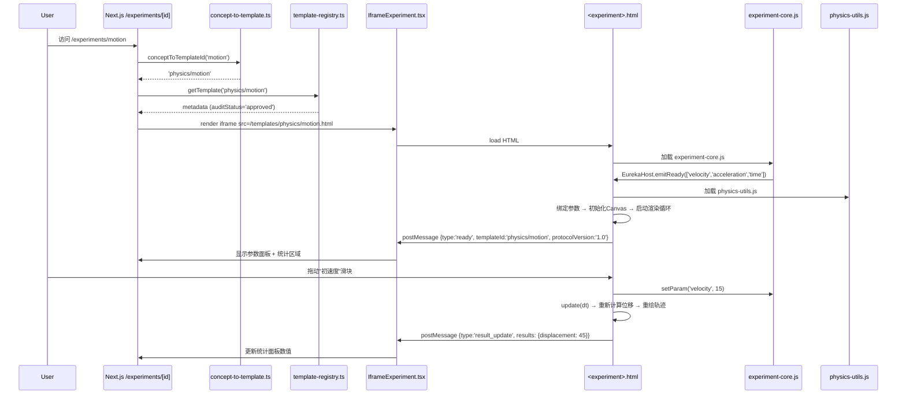

# EGPSpace Batch-2 Architecture: Cross-Subject Experiment Template Infrastructure

> 前置：Triple-Lock 架构已在第一批完成验证（`wf-20260424091211.`）  
> 当前目标：建立可扩展的跨学科基础设施，使新学科模板能够低摩擦接入
> 核心约束：不修改 `IframeExperiment.tsx`，向后兼容4个已上线物理模板

---

## 架构概览

本批次（Batch 2）的核心任务不是"增加模板数量"，而是**将物理专用的共享基础设施抽象为跨学科通用层**。这解决了第一批验证的架构瓶颈：`physics-core.js` 是物理专用的，化学/生物学科无法复用。

**分层策略**（两层共享模型）：
```
Layer 1: experiment-core.js    ← 跨学科通用（通信、状态、参数、渲染循环）
Layer 2: {subject}-utils.js    ← 学科专用（公式、常量、渲染辅助）
Layer 3: template-specific.js  ← 模板专用（实验逻辑、Canvas/SVG绘制）
```

**向后兼容策略**：
- 旧模板继续引用 `physics-core.js`（该文件变为 `experiment-core.js` + `physics-utils.js` 的合并兼容包）
- 新模板拆分引用 `experiment-core.js` → `{subject}-utils.js` → 模板逻辑

---

## 模块设计

### Module 1: experiment-core.js（通用共享层）

**职责**：定义与Host的postMessage通信协议，管理模板生命周期，提供跨学科通用工具。

**导出接口**：
```typescript
interface EurekaCore {
  // 生命周期
  setTemplateId(id: string): void;
  emitReady(supportedParams: ParamMeta[]): void;
  emitError(message: string, code?: string): void;

  // 参数系统
  bindParam(name: string, config: ParamConfig): void;
  getParam(name: string): number;
  setParam(name: string, value: number): void;

  // 渲染循环
  startRenderLoop(fn: (dt: number) => void): number;
  stopRenderLoop(id: number): void;

  // Host命令订阅
  onHostCommand(callback: (cmd: HostCommand) => void): void;
}

interface ParamConfig {
  min: number;
  max: number;
  step: number;
  defaultValue: number;
  unit?: string;
  onChange?: (value: number) => void;
}

type HostCommand =
  | { type: 'set_param'; param: string; value: number }
  | { type: 'reset' }
  | { type: 'pause' }
  | { type: 'resume' };
```

**关键设计决策**：
- **参数系统内置**：旧模板直接在DOM中操作input range，新模板通过 `bindParam()` 注册参数，`experiment-core` 自动管理DOM控件渲染和事件绑定。这使得模板代码可以更专注于物理模拟而非UI样板。
- **渲染循环托管**：`startRenderLoop()` 内部使用 `requestAnimationFrame` + delta-time计算，支持 `pause/resume` 命令。模板只需提供 `update(dt)` 函数。

### Module 2: physics-utils.js（物理专用层）

**职责**：提供物理学科的公式计算、单位换算、常量定义和物理专用渲染辅助。

**导出内容**：
```javascript
// 常量
export const G = 9.8;               // m/s²
export const PI = Math.PI;

// 力学公式
export const buoyancyForce = (rhoFluid, volume, g = G) => rhoFluid * volume * g;
export const gravityForce = (mass, g = G) => mass * g;
export const leverTorque = (force, armLength) => force * armLength;
export const snellsLaw = (n1, theta1, n2) => Math.asin((n1 * Math.sin(theta1)) / n2);

// 运动学公式（第二批新增）
export const kineticEnergy = (mass, velocity) => 0.5 * mass * velocity * velocity;
export const potentialEnergy = (mass, height, g = G) => mass * g * height;
export const waveDisplacement = (amplitude, wavelength, frequency, time, x) =>
  amplitude * Math.sin(2 * PI * (x / wavelength - frequency * time));
export const faradayEMF = (dPhi, dt) => -dPhi / dt;  // ε = -dΦ/dt

// 渲染辅助
export const drawArrow = (ctx, fromX, fromY, toX, toY, color = '#000') => { ... };
export const drawAxis = (ctx, originX, originY, width, height, options) => { ... };
export const drawEnergyBar = (ctx, x, y, value, maxValue, label, color) => { ... };
```

### Module 3: 第二批物理模板（4个）

| 模板ID | 核心物理概念 | 参数 | 可视化方案 | 技术栈 |
|--------|-------------|------|-----------|--------|
| `physics/motion` | 运动学（v-t, s-t图） | 初速度、加速度、时间 | Canvas2D绘制坐标系+运动轨迹+时序动画 | Canvas2D |
| `physics/energy` | 机械能守恒 | 质量、高度、初速度 | SVG小球+能量分布柱状图（动能/势能/总能量） | SVG + Canvas2D |
| `physics/waves` | 机械波（简谐波） | 振幅、波长、频率、波速 | Canvas2D绘制正弦波+波的叠加（干涉/衍射） | Canvas2D |
| `physics/electromagnetism` | 法拉第电磁感应 | 磁通量、线圈匝数、变化率 | SVG磁铁+线圈+感应电流动画（大小/方向） | SVG |

---

## 数据流设计



---

## 向后兼容策略

### 旧模板（浮力/杠杆/折射/电路）的兼容路径

旧模板引用路径：`/templates/_shared/physics-core.js`

```javascript
// physics-core.js (兼容包 —— 保留，仅用于旧模板)
// 这个文件的内容是：experiment-core.js + physics-utils.js 的合并
// 旧模板中的 `EurekaHost` 对象通过此文件获得，API签名完全不变

import { EurekaHost, bindParam, getParam, setParam } from './experiment-core.js';
import * as physics from './physics-utils.js';

window.EurekaHost = EurekaHost;
Object.assign(window, physics);
```

### 新模板的加载路径

```html
<!-- 新模板（如 motion.html） -->
<script src="/templates/_shared/experiment-core.js"></script>
<script src="/templates/_shared/physics-utils.js"></script>
<script>
  // 模板专用代码
  EurekaHost.setTemplateId('physics/motion');
  bindParam('velocity', { min: 0, max: 50, step: 1, defaultValue: 0, unit: 'm/s' });
  bindParam('acceleration', { min: -10, max: 10, step: 0.1, defaultValue: 2, unit: 'm/s²' });
  // ...
</script>
```

---

## 决策记录

```json
{
  "decisions": [
    {
      "id": "D-B2-1",
      "choice": "将 physics-core.js 拆分为 experiment-core.js + physics-utils.js，旧文件保留为兼容wrapper",
      "rationale": "向后兼容是硬性约束。旧模板的iframe是独立沙箱，它们加载的 physics-core.js 可以保持为合并包。新模板按最佳实践拆分加载。",
      "alternatives": ["完全重写共享层（需要修改旧模板）", "直接复制一份改名（代码重复）"],
      "status": "approved"
    },
    {
      "id": "D-B2-2",
      "choice": "experiment-core.js 内置参数系统bindParam()，替代模板直接DOM操作",
      "rationale": "观察到第一批4个模板中，参数滑块的HTML结构和事件监听代码高度重复。提取到通用层可以减少60%的模板样板代码。",
      "alternatives": ["保留第一批的DOM直接操作方式（模板代码冗长但可预测）"],
      "status": "approved"
    },
    {
      "id": "D-B2-3",
      "choice": "第二批物理模板继续使用Canvas2D/SVG，不引入WebGL",
      "rationale": "运动学、机械能、机械波、电磁感应这4个实验的交互复杂度与第一批相当，Canvas2D/SVG足以胜任。引入WebGL会增加复杂度且无必要。",
      "alternatives": ["使用Three.js/WebGL（过度设计）"],
      "status": "approved"
    },
    {
      "id": "D-B2-4",
      "choice": "不新增任何外部npm依赖",
      "rationale": "保持与第一批一致的原则：零依赖，使用浏览器原生API。这降低了supply chain风险和部署复杂度。",
      "alternatives": ["引入D3.js（运动学可视化更便利但需要额外依赖）"],
      "status": "approved"
    },
    {
      "id": "D-B2-5",
      "choice": "postMessage协议保持v1.0不变，不在本批次引入协议升级",
      "rationale": "协议变更需要同时修改Host端（IframeExperiment.tsx），而约束是不修改Host端。所有新增消息类型必须能在v1协议下表达。",
      "alternatives": ["引入v2协议支持学科扩展字段（风险：需要修改Host）"],
      "status": "approved"
    }
  ]
}
```

---

## 安全考量

本批次的安全边界与第一批完全一致：
- **Triple-Lock 1**: `/api/generate` 系统提示中的 canvas 禁令保持不变
- **Triple-Lock 2**: `concept-to-template.ts` 新增第二批关键词映射后必须仍通过 `isApprovedTemplate()` 检查
- **Triple-Lock 3**: `template-registry.ts` 新增的第二批模板初始 `auditStatus` 为 `'pending'`，只有通过审计后才标记 `'approved'`
- **iframe sandbox**: 新模板继续使用相同的安全策略，`allow-scripts` 但不允许 `allow-same-origin`（与第一批一致）

---

## 性能考量

- **模板体积**: 单文件gzip <50KB（沿用NFR-1）。`experiment-core.js` 约5KB gzip，`physics-utils.js` 约3KB gzip，模板HTML约10-20KB gzip，总计单模板package约20-30KB，符合要求。
- **加载顺序优化**: 使用 `<script type="module">` + `import`（HTTP/2复用连接），或保持 `<script>` 按序加载（实验模板数量少，差异可忽略）。
- **渲染性能**: 第二批运动学模板动画帧率目标 ≥30fps，`experiment-core.js` 的 `requestAnimationFrame` + delta-time循环已优化避免卡顿。

---

## 思考摘要

1. **核心挑战**: 第一批验证了三重锁架构，但共享层是物理专用的，无法支持跨学科扩展
2. **关键决策**: 采用"两层共享"模型（通用层 + 学科专用层），旧模板通过兼容wrapper保持零修改
3. **最大创新**: `experiment-core.js` 内置参数系统 `bindParam()`，将第一批中高度重复的滑块DOM操作代码提取到通用层
4. **范围控制**: 本批次仅限物理学科内的第二批4个实验 + 跨学科基础设施抽象，不真正新增化学/生物模板（移至第三批）
5. **向后兼容保证**: 旧模板引用的 `physics-core.js` 保留为兼容包，API签名100%不变
