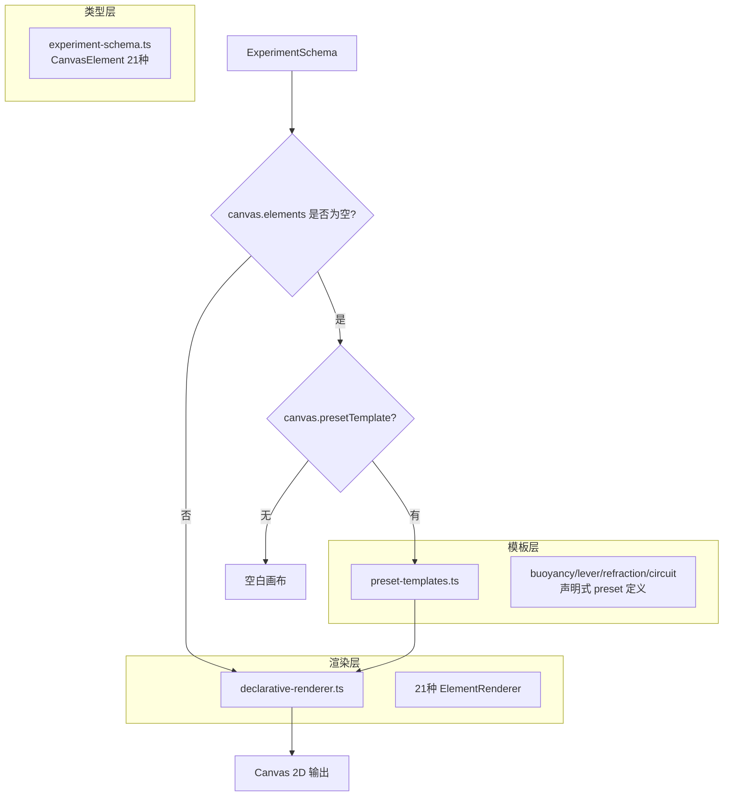
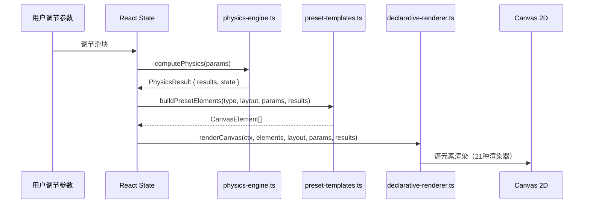

# 组件化渲染引擎架构设计

## 概述

本架构将 EGPSpace 的渲染系统从三重分裂（命令式 drawXxx + CanvasElement 8种 + DrawElement 21种）统一为单一声明式组件系统，实现各学科引擎与渲染的完全解耦。

---

## 架构目标

| 目标 | 当前状态 | 目标状态 |
|------|---------|---------|
| 新增实验类型 | 需手写 drawXxx() 函数 | 只需组合现有组件 |
| 类型系统 | 两套并行（8种 + 21种） | 单一统一（21种） |
| 渲染器覆盖 | 8种基础类型 | 21种全量类型 |
| 学科支持 | 仅物理（4种） | 物理+化学+生物+数学 |

---

## 核心架构：三层组件化渲染



---

## 模块设计

### 模块 1：统一类型层（experiment-schema.ts）

**职责**：定义单一的 `CanvasElement` 类型，覆盖所有 21 种元素

**关键决策**：扩展 `ElementType` 并补充 `CanvasElement` 字段，而非替换现有类型

```typescript
// 扩展后的 ElementType（21种）
export type ElementType =
  // 基础几何（原有 8 种）
  | 'rect' | 'circle' | 'line' | 'arrow' | 'text' | 'polygon' | 'arc' | 'image'
  // 物理专用（新增）
  | 'spring' | 'wave' | 'pendulum' | 'forceArrow' | 'lightRay'
  // 化学专用（新增）
  | 'beaker' | 'molecule' | 'bubble' | 'reaction'
  // 数学专用（新增）
  | 'axis' | 'functionPlot' | 'point'
  // 组合（新增）
  | 'group';

// CanvasElement 扩展字段（全部可选，向后兼容）
export interface CanvasElement {
  // ... 现有字段保留 ...
  // 新增：支持 DrawElement 命名约定
  cx?: number | string;   // circle 中心 x（兼容 x）
  cy?: number | string;   // circle 中心 y（兼容 y）
  r?: number | string;    // circle 半径（兼容 radius）
  x1?: number | string;   // line/arrow 起点 x
  y1?: number | string;   // line/arrow 起点 y
  // 物理专用字段
  length?: number | string;
  coils?: number;
  amplitude?: number | string;
  wavelength?: number | string;
  angle?: number | string;
  magnitude?: number | string;
  anchorX?: number | string;
  anchorY?: number | string;
  // 化学专用字段
  fillLevel?: number | string;
  liquidColor?: string;
  moleculeType?: string;
  count?: number;
  reactants?: string[];
  products?: string[];
  // 数学专用字段
  xMin?: number;
  xMax?: number;
  yMin?: number;
  yMax?: number;
  fn?: string;
  // 组合字段
  children?: CanvasElement[];
  transform?: { translateX?: number | string; translateY?: number | string; scale?: number | string; rotate?: number | string };
}
```

**为什么这样设计而非创建新类型**：
- 向后兼容：现有 Schema 数据无需迁移
- 渐进式：新字段全部可选，不破坏现有代码
- 单一真相：消除 CanvasElement vs DrawElement 的双重维护

---

### 模块 2：全量渲染层（declarative-renderer.ts）

**职责**：将 `CanvasElement[]` 渲染到 Canvas 2D，覆盖全部 21 种类型

**关键决策**：使用 `Record<ElementType, RenderFn>` 映射（O(1) 查找），不使用 switch-case 链

```typescript
type RenderFn = (
  ctx: CanvasRenderingContext2D,
  el: CanvasElement,
  layout: CanvasLayout,
  params: Record<string, number>,
  computed: Record<string, number>
) => void;

// 新增 13 种渲染器
const RENDERERS: Record<ElementType, RenderFn> = {
  // 原有 8 种（保留）
  rect, circle, line, arrow, text, polygon, arc, image,
  // 物理专用（新增）
  spring: renderSpring,
  wave: renderWave,
  pendulum: renderPendulum,
  forceArrow: renderForceArrow,
  lightRay: renderLightRay,
  // 化学专用（新增）
  beaker: renderBeaker,
  molecule: renderMolecule,
  bubble: renderBubble,
  reaction: renderReaction,
  // 数学专用（新增）
  axis: renderAxis,
  functionPlot: renderFunctionPlot,
  point: renderPoint,
  // 组合（新增）
  group: renderGroup,
};
```

**各渲染器设计**：

| 渲染器 | 关键参数 | 动态绑定支持 |
|--------|---------|------------|
| `renderSpring` | x, y, length, coils, amplitude | length（弹簧伸缩） |
| `renderWave` | x, y, amplitude, wavelength, phase | amplitude, phase |
| `renderPendulum` | anchorX, anchorY, length, angle, bobRadius | angle（摆动） |
| `renderForceArrow` | x, y, angle, magnitude | magnitude, angle |
| `renderLightRay` | x, y, angle, length | angle（折射角） |
| `renderBeaker` | x, y, width, height, fillLevel, liquidColor | fillLevel（液面高度） |
| `renderMolecule` | x, y, moleculeType, scale | x, y（运动） |
| `renderBubble` | x, y, radius, count, speed | y（上升动画） |
| `renderAxis` | x, y, xMin, xMax, yMin, yMax | 无 |
| `renderFunctionPlot` | fn, xMin, xMax | 无 |
| `renderPoint` | x, y, size | x, y |
| `renderGroup` | children, transform | transform |

---

### 模块 3：声明式 Preset 模板层（preset-templates.ts）

**职责**：将原 `drawBuoyancy()` 等命令式函数转换为声明式 `CanvasElement[]` 定义

**关键决策**：Preset 模板是**纯数据**（`CanvasElement[]`），不包含任何 Canvas 2D 代码

```typescript
export type PresetTemplateType = 'buoyancy' | 'lever' | 'refraction' | 'circuit';

export function buildPresetElements(
  type: PresetTemplateType,
  layout: CanvasLayout,
  params: Record<string, number>,
  computed: Record<string, number>
): CanvasElement[];
```

**浮力实验 Preset 示例**（声明式等价于原 `drawBuoyancy()`）：

```typescript
// 液体背景
{ id: 'liquid', type: 'rect', x: 0, y: '{liquidLevel}', width: '{width}', height: '{liquidHeight}', fill: '#06B6D4', opacity: 0.3 },
// 液面虚线
{ id: 'surface', type: 'line', x: 0, y: '{liquidLevel}', x2: '{width}', y2: '{liquidLevel}', stroke: '#0EA5E9', strokeWidth: 2 },
// 物体
{ id: 'object', type: 'rect', x: '{objectX}', y: '{objectY}', width: 60, height: 80, fill: '{stateColor}', stroke: '#333', strokeWidth: 2 },
// 浮力箭头
{ id: 'buoyantArrow', type: 'forceArrow', x: '{objectCenterX}', y: '{objectY}', angle: -90, magnitude: '{arrowLength}', fill: '#3B82F6', label: 'F浮' },
// 重力箭头
{ id: 'gravityArrow', type: 'forceArrow', x: '{objectCenterX}', y: '{objectBottom}', angle: 90, magnitude: '{gravityLength}', fill: '#EF4444', label: 'G' },
```

**为什么使用 `buildPresetElements()` 而非静态 JSON**：
- Preset 模板需要根据 `layout.width/height` 动态计算坐标（如 `liquidLevel = height * 0.6`）
- 静态 JSON 无法表达这种布局依赖，需要函数来生成初始坐标
- 生成后的 `CanvasElement[]` 中的动态值（如 `{objectY}`）由渲染器在每帧解析

---

### 模块 4：DynamicExperiment.tsx 重构

**职责**：移除命令式 `drawXxx()` 函数，渲染路径统一走 `renderCanvas()`

**重构前**：
```typescript
// 命令式路径（350行）
switch (rules.type) {
  case 'buoyancy': drawBuoyancy(ctx, width, height, params, calculation); break;
  case 'lever': drawLever(ctx, width, height, params, calculation); break;
  // ...
}
```

**重构后**：
```typescript
// 统一声明式路径
const elements = schema?.canvas?.elements?.length
  ? schema.canvas.elements
  : buildPresetElements(rules.type as PresetTemplateType, layout, params, computed);

renderCanvas(ctx, elements, layout, params, computed);
```

---

## 数据流图



---

## Architecture Scorecard

| ID | 检查项 | 评估 | 说明 |
|----|--------|------|------|
| ARCH-001 | 每个技术选择有明确理由 | ✅ PASS | 每个模块设计都有"为什么这样设计"说明 |
| ARCH-002 | 权衡已说明 | ✅ PASS | 静态JSON vs buildPresetElements()的权衡已说明 |
| ARCH-004 | 水平扩展策略 | N/A | 纯前端渲染，无状态服务 |
| ARCH-007 | 无单点故障 | ✅ PASS | 渲染器降级到 renderPlaceholder，不崩溃 |
| ARCH-008 | 数据持久化 | N/A | 渲染层无持久化需求 |
| ARCH-009 | 故障模式和恢复 | ✅ PASS | 未知类型降级到 renderPlaceholder |
| ARCH-010 | 认证授权 | N/A | 纯渲染层，无认证需求 |
| ARCH-011 | 敏感数据处理 | N/A | 无敏感数据 |
| ARCH-015 | 覆盖所有 NFR | ✅ PASS | 可扩展性、可维护性、向后兼容性均已设计 |
| ARCH-016 | 支持所有功能需求 | ✅ PASS | 7条验收标准均有对应架构设计 |
| ARCH-017 | 无内部矛盾 | ✅ PASS | 三层架构职责清晰，无重叠 |
| ARCH-018 | 图表与文字一致 | ✅ PASS | Mermaid 图与模块描述一致 |

---

## Failure Model

**故障类型 1：未知元素类型**
- 检测：`RENDERERS[el.type]` 返回 `undefined`
- 恢复：降级到 `renderPlaceholder`（显示虚线框 + 类型名），不崩溃

**故障类型 2：动态表达式求值失败**
- 检测：`resolveDynamicValue` 中 `new Function()` 抛出异常
- 恢复：返回 `0`，元素渲染在默认位置

**故障类型 3：Preset 模板类型不匹配**
- 检测：`buildPresetElements` 收到未知 type
- 恢复：返回空数组 `[]`，画布显示空白

---

## Migration Safety Case

**迁移策略：双轨并行 → 渐进切换**

1. **阶段 1（本次实现）**：新增 preset-templates.ts 和扩展渲染器，`DynamicExperiment.tsx` 优先走声明式路径，命令式 `drawXxx()` 作为备用保留
2. **阶段 2（可选）**：视觉验证通过后，删除命令式 `drawXxx()` 函数
3. **回滚机制**：若声明式路径出现问题，`DynamicExperiment.tsx` 中的 `if (schema?.canvas?.elements?.length)` 条件可快速回退到命令式路径

---

## Scenario Coverage

| 场景 | 架构支持 | 实现方式 |
|------|---------|---------|
| 现有浮力实验 | ✅ | preset-templates.ts 的 buoyancy preset |
| LLM 生成新化学实验 | ✅ | Schema 中直接使用 beaker/bubble/arrow 组件 |
| 纯声明式自定义实验 | ✅ | canvas.elements 直接定义，无需 preset |
| 动态参数绑定 | ✅ | `{variableName}` 语法，渲染器每帧解析 |
| 化学烧杯液面动态变化 | ✅ | beaker 的 fillLevel 绑定到参数 |
| 数学函数图像 | ✅ | functionPlot 渲染器 + fn 字段 |
| 物理摆动动画 | ✅ | pendulum 渲染器 + angle 动态绑定 |

---

## 思考摘要

| 问题 | 答案 |
|------|------|
| 最简架构是什么？ | 三层：类型层（扩展CanvasElement）+ 渲染层（扩展renderer）+ 模板层（preset-templates） |
| 最大假设是什么？ | Preset 模板能精确还原命令式 drawXxx() 的视觉效果 |
| 最可能的生产故障？ | 动态表达式求值失败导致元素位置为0，已通过 try-catch 降级处理 |
| 最简单的替代方案？ | 直接在 DynamicExperiment.tsx 中内联声明式定义，但会导致文件过大 |
| 为什么选择 preset-templates.ts 独立文件？ | 关注点分离：模板定义与渲染逻辑解耦，便于测试和扩展 |
