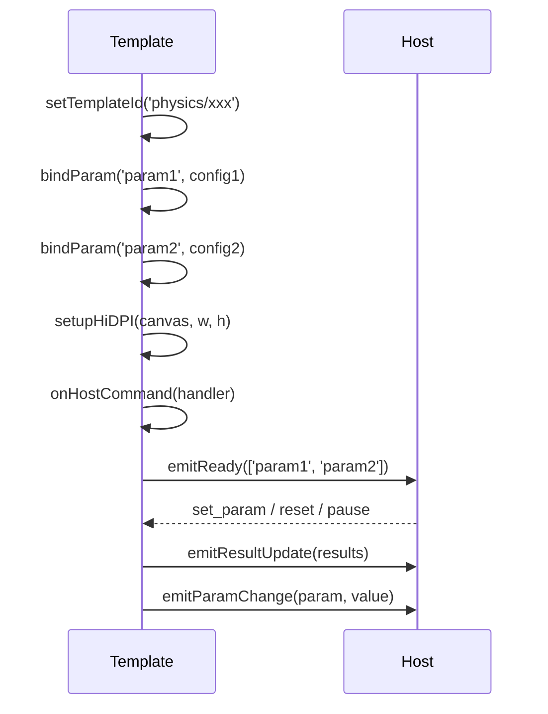

# EGPSpace 物理实验模板 — 设计模式归纳

> 基于 10 个物理实验模板的深度分析，提炼可复用的设计模式

---

## 1. 模板结构模式 (Template Structure Pattern)

### 问题
每个实验模板需要统一的结构布局（统计面板 → Canvas 容器 → 参数卡片 → 公式展示），但又有各自的具体差异。

### 模式：HTML 骨架 + 模块化填充
```
┌─ eureka-root ─────────────────────────────┐
│  ┌─ eureka-grid-3 ──────────────────────┐ │
│  │  [stat-1] [stat-2] [stat-3]          │ │
│  └──────────────────────────────────────┘ │
│  ┌─ eureka-canvas-wrapper {topic} ──────┐ │
│  │  <canvas class="eureka-canvas">      │ │
│  │  [overlay / badge / hint]            │ │
│  └──────────────────────────────────────┘ │
│  ┌─ eureka-card ────────────────────────┐ │
│  │  <h3 class="eureka-card-title">      │ │
│  │  <div id="params-root">             │ │
│  │    <!-- bindParam 生成的控件 -->      │ │
│  │  </div>                              │ │
│  └──────────────────────────────────────┘ │
│  ┌─ eureka-formula ─────────────────────┐ │
│  │  <p class="eureka-formula-title">    │ │
│  │  <div class="eureka-formula-expression"> │
│  │  <p class="eureka-formula-note">     │ │
│  └──────────────────────────────────────┘ │
└───────────────────────────────────────────┘
```

### 变体
| 模板 | 统计面板 | Canvas 区域 | 参数卡片 | 公式展示 |
|------|----------|-------------|----------|----------|
| sound | 2 项 (v, f) | 1 canvas + 介质选择 segmented | 3 参数 (v, f, λ) | 1 公式 |
| motion | 3 项 (v, a, s) | 2 canvas (v-t, s-t) + 运动类型 segmented | 可变参数 | 可变公式 |
| waves | 3 项 (v, f, λ) | 2 canvas (wave1, superpose) | 2 组 × 3 参数 | 1 公式 |
| buoyancy | 3 项 (F浮, G, 状态) | 1 canvas + overlay 标签 | 4 参数 (ρ物, ρ液, V, g) | 1 公式 |
| circuit | 3 项 (R, I, P) | 1 canvas + 串联/并联 segmented | 3 参数 (U, R₁, R₂) | 3 公式 |
| lever | 3 项 (左力矩, 右力矩, 平衡) | 1 canvas + badge | 4 参数 (F₁, L₁, F₂, L₂) | 1 公式 |
| refraction | 3 项 (θ₁, θ₂, 临界) | 1 canvas + badge | 3 参数 (θ₁, n₁, n₂) | 1 公式 + 全反射提示 |
| reflection | 2 项 (θ₁, θ₂) | SVG 渲染 | 1 参数 (θ₁) | 1 公式 |

### 核心原则
- **统计面板在上方**：即时反馈关键数值
- **Canvas 占据最大面积**：视觉主体
- **参数卡片在下方**：操作区域
- **公式展示在最底部**：理论依据

---

## 2. 生命周期模式 (Lifecycle Pattern)

### 问题
每个模板都需要按照固定顺序初始化，并与 Host 建立通信通道。

### 模式：5 步初始化序列
```
① setTemplateId(id)        → 注册模板 ID
② bindParam(...) × N       → 声明并生成参数控件
③ setupHiDPI(canvas)       → 初始化 Canvas（处理 HiDPI）
④ onHostCommand(callback)  → 监听 Host 命令
⑤ emitReady(params)        → 通知 Host 模板就绪
```

### 时序图


### 关键约束
- `emitReady` 必须且只能调用一次
- `emitReady` 的 `supportedParams` 数组必须与 `bindParam` 注册的参数一致
- `onHostCommand` 必须在 `emitReady` 之前注册

---

## 3. 计算-渲染分离模式 (Compute-Render Separation)

### 问题
物理计算逻辑和 Canvas 渲染逻辑混杂会导致代码难以维护和测试。

### 模式：compute() → render(p)
```javascript
function compute() {
  // 纯计算，返回结果对象 p
  const p = { ... };
  return p;
}

function render(p) {
  // 纯渲染，接收计算结果
  EurekaCanvas.clear(ctx, cssW, cssH);
  // ... 绑定渲染代码
}
```

### 优势
- **可测试性**：compute() 可独立测试（physics-utils.js 内置测试系统）
- **可维护性**：物理公式修改不影响渲染逻辑
- **性能**：compute 和 render 可独立优化

### 变体
| 模板 | compute 返回 | render 使用 |
|------|-------------|------------|
| sound | { waveform data } | ctx.strokePath() |
| motion | { vt, st points, currentMode } | ctx 绑制两条曲线 |
| waves | { wave1, wave2, superposition points } | ctx 绘制三条曲线 |
| buoyancy | { buoyancy, weight, immersion, status } | 绘制容器、液体、物体、力箭头 |
| circuit | { Rtotal, I, U1, U2, I1, I2, P } | 按拓扑绘制电路图 + 电流动画 |
| lever | { leftTorque, rightTorque, targetAngle, status } | 绘制杠杆、砝码、支点 |
| refraction | { refractionAngle, tir, criticalAngle, status } | 绘制界面、法线、光线 |
| reflection | { reflectionAngle } | SVG 绘制镜面、法线、光线 |

---

## 4. 事件处理模式 (Event Handling Pattern)

### 问题
参数控件的事件绑定容易产生样板代码，且需要与 Host 同步。

### 模式：wire() 辅助函数统一绑定
```javascript
function wire(el, key, param) {
  el.addEventListener('input', () => {
    const v = parseFloat(el.value);
    state[key] = v;
    update({ param, value: v });  // 内部调用 emitParamChange + emitResultUpdate
  });
}

// 使用：
wire(ctlRhoObj, 'rhoObj', 'objectDensity');
wire(ctlRhoLiq, 'rhoLiq', 'liquidDensity');
```

### Segmented 控件事件模式
```javascript
document.querySelectorAll('.eureka-segmented-item').forEach((btn) => {
  btn.addEventListener('click', () => {
    // 1. 更新 active 状态
    document.querySelectorAll('.eureka-segmented-item').forEach(b => b.classList.remove('active'));
    btn.classList.add('active');
    // 2. 更新状态
    state.topology = parseInt(btn.dataset.topology, 10);
    // 3. 通知 Host
    update({ param: 'topology', value: state.topology });
    EurekaHost.emitInteraction('mode-switch', { topology: '...' });
  });
});
```

### 拖拽交互模式（buoyancy 杠杆实现）
```javascript
canvas.addEventListener('pointerdown', (e) => {
  // Hit test: 检查点击是否在物体区域内
  if (inObjectBox(x, y)) {
    dragging = true;
    canvas.setPointerCapture(e.pointerId);
    EurekaHost.emitInteraction('drag-start', {});
  }
});

canvas.addEventListener('pointermove', (e) => {
  if (!dragging) return;
  // 计算新的浸没比例
  state.userImmersion = r;
  updateAll();  // 不传 emitParam，拖拽时不发送 param_change
});

canvas.addEventListener('pointerup', endDrag);
canvas.addEventListener('pointercancel', endDrag);
```

---

## 5. 错误处理模式 (Error Handling Pattern)

### 问题
渲染循环中的错误可能导致整个模板崩溃，需要优雅降级。

### 模式：try-catch + emitError 上报
```javascript
// 渲染循环中的错误处理
try {
  fn(dt);
} catch (err) {
  _host.emitError('Render loop error: ' + err.message, 'render_error');
  loop.running = false;
  return;
}

// Host 命令处理中的错误处理
EurekaHost.onHostCommand((cmd) => {
  try {
    // ... 处理命令
  } catch (err) {
    EurekaHost.emitError('Host command handler failed: ' + err.message, 'handler_error');
  }
});
```

### 错误代码约定
| code | 含义 |
|------|------|
| `template_error` | 通用模板错误 |
| `render_error` | 渲染循环错误 |
| `handler_error` | Host 命令处理错误 |

---

## 6. 参数可用性控制模式 (Parameter Availability Pattern)

### 问题
不同模式下某些参数应该隐藏或禁用（如匀速运动时 v₀ 和 a 无意义）。

### 模式：映射表驱动的 applyMode()
```javascript
// motion.html 的模式映射表
const MOTION_MODES = {
  uniform: {
    label: '匀速',
    v0Visible: false,
    aVisible: false,
    formulaTitle: '匀速运动',
    formulaExpr: 's = v₀ × t',
    v0Default: 5,
    aDefault: 0,
  },
  accelerated: {
    label: '匀变速',
    v0Visible: false,
    aVisible: true,
    formulaTitle: '匀变速运动',
    formulaExpr: 'v = v₀ + a·t,  s = v₀t + ½at²',
    v0Default: 0,
    aDefault: 2,
  },
  acceleratedWithV0: {
    label: '匀变速带初速度',
    v0Visible: true,
    aVisible: true,
    formulaTitle: '匀变速运动（带初速度）',
    formulaExpr: 'v = v₀ + a·t,  s = v₀t + ½at²',
    v0Default: 3,
    aDefault: 2,
  },
};

function applyMode(mode) {
  const m = MOTION_MODES[mode];
  // 控件可见性
  ctlV0.parentElement.style.display = m.v0Visible ? '' : 'none';
  ctlA.parentElement.style.display = m.aVisible ? '' : 'none';
  // 预设值
  if (!m.v0Visible) setParam('v0', m.v0Default, false);
  if (!m.aVisible) setParam('a', m.aDefault, false);
  // 公式更新
  formulaTitle.textContent = m.formulaTitle;
  formulaExpr.textContent = m.formulaExpr;
}
```

### sound.html 的介质映射表
```javascript
const MEDIUMS = {
  air:   { label: '空气', speed: 343 },
  water: { label: '水',   speed: 1482 },
  steel: { label: '钢铁', speed: 5960 },
};
```

---

## 7. 动态 Y 轴缩放模式 (Dynamic Y-Axis Scaling)

### 问题
v-t 图和 s-t 图的 Y 轴范围取决于当前参数，固定范围会导致曲线超出视图或过小。

### 模式：计算范围 + padding + 兜底
```javascript
function drawVT(p) {
  // 计算当前参数下的最大速度
  const maxV = p.v0 + p.a * p.tMax;
  const yMax = Math.max(Math.abs(maxV), Math.abs(p.v0), 1);  // || 1 兜底
  const yMin = -yMax;

  // Y 轴范围 = [yMin - padding, yMax + padding]
  const padding = yMax * 0.15;
  // ... 绑定 Y 轴
}
```

### 兜底策略
- 使用 `|| 1` 防止零除
- padding 比例约 15%
- 确保 0 线始终可见

---

## 8. SVG 渲染模式 (SVG Rendering Pattern)

### 问题
某些实验（如反射）更适合使用 SVG 而非 Canvas，因为 SVG 支持原生 DOM 事件和矢量缩放。

### 模式：SVG 命名空间 + 内联 SVG
```html
<svg xmlns="http://www.w3.org/2000/svg" viewBox="0 0 680 400">
  <!-- 镜面 -->
  <line x1="340" y1="40" x2="340" y2="360" stroke="#9CA3AF" stroke-width="3"/>
  <!-- 法线 -->
  <line x1="100" y1="200" x2="580" y2="200" stroke="#6B7280" stroke-dasharray="4,4"/>
  <!-- 入射光线 -->
  <line id="incident-ray" ... />
  <!-- 反射光线 -->
  <line id="reflected-ray" ... />
  <!-- 角度弧 -->
  <path id="incident-arc" ... />
  <path id="reflected-arc" ... />
</svg>
```

### SVG 动态更新
```javascript
function updateSVG(p) {
  const incRay = document.getElementById('incident-ray');
  incRay.setAttribute('x1', ...);
  incRay.setAttribute('y1', ...);
  // ...
}
```

### 选择指南
| 场景 | 推荐 | 理由 |
|------|------|------|
| 实时动画 (>30fps) | Canvas | 性能优势 |
| 静态/准静态图 | SVG | 矢量缩放 + DOM 事件 |
| 需要交互事件 | SVG | 原生 DOM 事件 |
| 大量粒子/波形 | Canvas | 避免 DOM 开销 |

---

## 9. Canvas 辅助工具模式 (Canvas Utilities Pattern)

### 问题
Canvas 绑制经常重复的辅助操作（清屏、画箭头、画坐标轴等）需要统一封装。

### 模式：EurekaCanvas 工具集
```javascript
const EurekaCanvas = {
  /** HiDPI Canvas 初始化 */
  setupHiDPI(canvas, cssW, cssH) {
    const dpr = window.devicePixelRatio || 1;
    canvas.width = cssW * dpr;
    canvas.height = cssH * dpr;
    canvas.style.width = cssW + 'px';
    canvas.style.height = cssH + 'px';
    const ctx = canvas.getContext('2d');
    ctx.scale(dpr, dpr);
    return ctx;
  },

  /** 清屏 */
  clear(ctx, w, h, color = '#FFFFFF') {
    ctx.fillStyle = color;
    ctx.fillRect(0, 0, w, h);
  },

  /** 画箭头 */
  drawArrow(ctx, x1, y1, x2, y2, color, label) {
    ctx.strokeStyle = color;
    ctx.lineWidth = 2.5;
    ctx.beginPath();
    ctx.moveTo(x1, y1);
    ctx.lineTo(x2, y2);
    ctx.stroke();
    // 箭头头部
    const angle = Math.atan2(y2 - y1, x2 - x1);
    const headLen = 10;
    ctx.fillStyle = color;
    ctx.beginPath();
    ctx.moveTo(x2, y2);
    ctx.lineTo(x2 - headLen * Math.cos(angle - Math.PI / 6), y2 - headLen * Math.sin(angle - Math.PI / 6));
    ctx.lineTo(x2 - headLen * Math.cos(angle + Math.PI / 6), y2 - headLen * Math.sin(angle + Math.PI / 6));
    ctx.closePath();
    ctx.fill();
    // 标签
    if (label) {
      ctx.fillStyle = color;
      ctx.font = 'bold 13px system-ui, sans-serif';
      const mx = (x1 + x2) / 2;
      const my = (y1 + y2) / 2;
      ctx.fillText(label, mx + 8, my - 8);
    }
  },
};
```

---

## 10. 首次运行提示模式 (First-Run Hint Pattern)

### 问题
用户首次打开实验模板时可能不知道如何交互。

### 模式：EurekaHints 定时提示
```javascript
setTimeout(() => {
  try {
    EurekaHints.show(canvas, '👆 提示文字', 5000);
  } catch {}
}, 600);
```

### 各模板的提示
| 模板 | 提示文字 | 延迟 | 持续 |
|------|----------|------|------|
| sound | 👆 切换介质观察声速变化 | 600ms | 5s |
| motion | 👆 切换「匀速/匀变速」观察运动类型 | 600ms | 5s |
| waves | 👆 调整两列波的频率观察拍频 | 600ms | 5s |
| buoyancy | 👆 拖动绿色物体改变浸没深度 | 600ms | 5s |
| circuit | 👆 切换「串联/并联」观察电流变化 | 600ms | 5s |
| lever | 👆 调整左右力或臂长，观察杠杆倾斜 | 600ms | 5s |
| refraction | 👆 尝试把 n₁ 调到 1.5、n₂ 调到 1.0 观察全反射 | 600ms | 6s |
| electromagnetism | 👆 调整磁铁速度观察感应电流方向 | 600ms | 5s |
| energy | 👆 调整初始角度观察能量转化 | 600ms | 5s |
| heat | 👆 对比两种物质的升温速度 | 600ms | 5s |
| lens | 👆 改变物距观察像的变化 | 600ms | 5s |

---

## 11. SVG + Canvas 混合渲染模式 (Hybrid SVG+Canvas Pattern)

### 问题
同一实验中，某些可视化适合 SVG（结构化图形），另一些适合 Canvas（实时数据图表），单一渲染方式无法兼顾。

### 模式：compute() 结果分别驱动 SVG 和 Canvas
```javascript
function compute() {
  // 纯计算，返回结果对象
  return { angle, kineticEnergy, potentialEnergy, totalEnergy };
}

function renderSVG(p) {
  // SVG 更新：单摆角度、物体位置等
  pendulumLine.setAttribute('x2', ...);
  pendulumBob.setAttribute('cx', ...);
}

function renderCanvas(p) {
  // Canvas 更新：能量柱状图、曲线图等
  EurekaCanvas.clear(ctx, w, h);
  drawBar(keX, p.kineticEnergy, '#3B82F6');
  drawBar(peX, p.potentialEnergy, '#EF4444');
  drawBar(teX, p.totalEnergy, '#6B7280');
}

function update() {
  const p = compute();
  renderSVG(p);
  renderCanvas(p);
}
```

### 代表模板
| 模板 | SVG 部分 | Canvas 部分 |
|------|----------|-------------|
| energy | 单摆动画（线+球旋转） | 能量柱状图（KE/PE/E） |
| electromagnetism | 磁铁/线圈/电流箭头 | 磁通量曲线图 |

### 选择指南
| 子可视化 | 推荐 | 理由 |
|----------|------|------|
| 结构化物理对象（单摆、光路、电路） | SVG | 矢量无损、元素可交互 |
| 数据图表（柱状图、曲线图） | Canvas | 高频更新、无需 DOM 开销 |
| 声明式周期动画 | SVG `<animate>` | 无需 JS 控制循环 |

---

## 12. 双物质/双参数对比模式 (Dual Comparison Pattern)

### 问题
某些实验需要对比两种物质/两种条件下的物理量变化，单一曲线无法体现差异。

### 模式：同一图表双曲线 + 共享坐标轴
```javascript
function drawComparisonChart(p) {
  // 绘制共享坐标轴
  drawAxis(ctx, ...);

  // 曲线 A（蓝色）
  ctx.strokeStyle = '#3B82F6';
  ctx.beginPath();
  for (let t = 0; t <= p.timeMax; t += dt) {
    const tempA = p.heatingPower * t / (p.mass * p.specificHeatA);
    const y = mapY(tempA);
    if (t === 0) ctx.moveTo(mapX(t), y); else ctx.lineTo(mapX(t), y);
  }
  ctx.stroke();

  // 曲线 B（红色）
  ctx.strokeStyle = '#EF4444';
  ctx.beginPath();
  for (let t = 0; t <= p.timeMax; t += dt) {
    const tempB = p.heatingPower * t / (p.mass * p.specificHeatB);
    const y = mapY(tempB);
    if (t === 0) ctx.moveTo(mapX(t), y); else ctx.lineTo(mapX(t), y);
  }
  ctx.stroke();

  // 图例
  drawLegend(ctx, [{ color: '#3B82F6', label: '物质A' }, { color: '#EF4444', label: '物质B' }]);
}
```

### 代表模板
| 模板 | 对比对象 | 可视化 |
|------|----------|--------|
| heat | 物质A vs 物质B（比热容不同） | 双温度曲线 + 吸热柱状图 |

### 延伸应用
- 双电阻对比（不同阻值的 I-V 曲线）
- 双弹簧对比（不同劲度系数的 F-x 曲线）
- 双介质对比（不同折射率的光路图）

---

## 13. 光路图三线法模式 (Three-Ray Diagram Pattern)

### 问题
透镜/面镜成像实验需要绘制特征光线，但光线计算涉及多个边界条件（实像/虚像、焦点内/外）。

### 模式：三条特征光线 + 虚实线区分
```javascript
function drawLensRays(p) {
  const { focalLength, objectDistance, imageDistance, objectHeight, imageHeight } = p;
  const isVirtual = objectDistance < focalLength;

  // 光线 1：平行于主轴 → 折射后过焦点
  drawRay(ctx, objX, objY, lensX, objY, '#3B82F6', !isVirtual); // 入射段实线
  drawRay(ctx, lensX, objY, imageX, imageY, '#3B82F6', !isVirtual); // 折射段

  // 光线 2：过光心 → 方向不变
  drawRay(ctx, objX, objY, lensX, centerY, '#10B981', true);
  drawRay(ctx, lensX, centerY, imageX, imageY, '#10B981', !isVirtual);

  // 光线 3：过焦点 → 折射后平行于主轴
  drawRay(ctx, objX, objY, lensX, focalY, '#F59E0B', !isVirtual);
  drawRay(ctx, lensX, focalY, imageX, focalY, '#F59E0B', !isVirtual);

  // 虚像时：绘制虚线延长线
  if (isVirtual) {
    drawDashedRay(ctx, lensX, objY, virtualImageX, virtualImageY, '#3B82F6');
    drawDashedRay(ctx, lensX, centerY, virtualImageX, virtualImageY, '#10B981');
  }
}
```

### 代表模板
| 模板 | 光学元件 | 三线法 |
|------|----------|--------|
| lens | 凸透镜 | 平行→焦点、过光心、过焦点→平行 |
| refraction | 界面 | 入射光线 + 折射光线（非三线法，但共享光路绘制逻辑） |

### 延伸应用
- 凹透镜：三条特征光线（虚焦点方向）
- 凸面镜/凹面镜：反射三线法
- 复合透镜系统：多组三线叠加

---

## 14. 能量柱状图模式 (Energy Bar Chart Pattern)

### 问题
能量守恒实验需要可视化动能、势能、总能量的实时变化，曲线图不够直观。

### 模式：多柱并排 + 颜色语义 + 总能量参考线
```javascript
function drawEnergyBars(ctx, ke, pe, total, x, y, w, h) {
  const maxE = total * 1.1; // 留 10% 余量
  const barW = w / 4;

  // 动能柱（蓝色）
  drawBar(ctx, x, y, barW, (ke / maxE) * h, '#3B82F6', 'KE');
  // 势能柱（红色）
  drawBar(ctx, x + barW * 1.5, y, barW, (pe / maxE) * h, '#EF4444', 'PE');
  // 总能量柱（灰色）
  drawBar(ctx, x + barW * 3, y, barW, (total / maxE) * h, '#6B7280', 'E');

  // 总能量参考线（虚线）
  ctx.setLineDash([4, 4]);
  ctx.strokeStyle = '#6B7280';
  const refY = y - (total / maxE) * h;
  ctx.beginPath();
  ctx.moveTo(x, refY);
  ctx.lineTo(x + w, refY);
  ctx.stroke();
  ctx.setLineDash([]);
}
```

### 代表模板
| 模板 | 柱状图内容 | 颜色语义 |
|------|------------|----------|
| energy | KE / PE / E | 蓝/红/灰 |
| heat | Q_A / Q_B | 蓝/红 |

### 延伸应用
- 弹性势能实验：KE / PE_elastic / E
- 热力学：内能 / 做功 / 吸热
- 电容：电场能 / 磁场能 / 总电磁能

---

## 模式速查表

| # | 模式名称 | 核心思想 | 代表模板 |
|---|----------|----------|----------|
| 1 | 模板结构 | HTML 骨架 + 模块化填充 | 所有模板 |
| 2 | 生命周期 | 5 步初始化 + emitReady | 所有模板 |
| 3 | 计算-渲染分离 | compute() → render(p) | 所有模板 |
| 4 | 事件处理 | wire() + segmented + drag | motion, buoyancy, circuit |
| 5 | 错误处理 | try-catch + emitError | 所有模板 |
| 6 | 参数可用性 | 映射表 + applyMode() | motion, sound |
| 7 | 动态 Y 轴缩放 | 计算范围 + padding + 兜底 | motion |
| 8 | SVG 渲染 | 命名空间 + 动态属性 | reflection |
| 9 | Canvas 工具 | setupHiDPI + clear + drawArrow | 所有 Canvas 模板 |
| 10 | 首次运行提示 | EurekaHints.show() | 所有模板 |

---

## 反模式 (Anti-Patterns)

| # | 反模式 | 描述 | 替代方案 |
|---|--------|------|----------|
| 1 | 上帝函数 | compute + render + event 全在一个函数 | 分离为 compute() / render() / wire() |
| 2 | 硬编码 UI | 手动创建 DOM 元素不用 bindParam | 使用 bindParam 自动生成控件 |
| 3 | 固定 Y 轴 | v-t/s-t 图使用固定 Y 轴范围 | 动态计算范围 + padding |
| 4 | 忽略 HiDPI | Canvas 不处理 devicePixelRatio | 使用 EurekaCanvas.setupHiDPI() |
| 5 | 同步阻塞 | 渲染循环中使用 while 循环 | 使用 requestAnimationFrame |
| 6 | 全局变量 | 使用全局变量传递状态 | 使用本地 state 对象 + 参数传递 |
