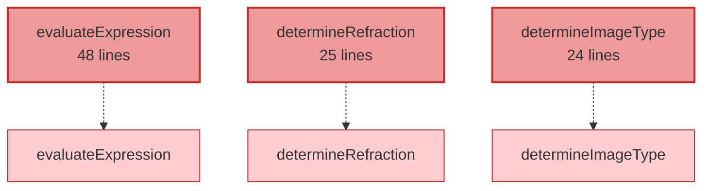
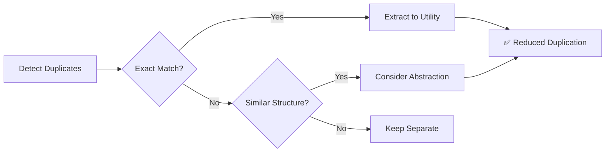

## 📊 Duplicate Pattern Diagrams

> Generated: 2026-04-22
> View in VS Code, GitHub, or any Mermaid-compatible viewer

### 🔗 Duplicate Network

```mermaid
graph TD
  g0["evaluateExpression<br/>48 lines"]:::duplicate
  n1["evaluateExpression"]:::copy
  g0 -.-> n1
  g2["determineRefraction<br/>25 lines"]:::duplicate
  n3["determineRefraction"]:::copy
  g2 -.-> n3
  g4["determineImageType<br/>24 lines"]:::duplicate
  n5["determineImageType"]:::copy
  g4 -.-> n5

  classDef duplicate fill:#ef9a9a,stroke:#c62828,stroke-width:2px
  classDef copy fill:#ffcdd2,stroke:#c62828
```

### 🔧 Refactoring Suggestion

```mermaid
flowchart LR
  A[Detect Duplicates] --> B{Exact Match?}
  B -->|Yes| C[Extract to Utility]
  B -->|No| D{Similar Structure?}
  D -->|Yes| E[Consider Abstraction]
  D -->|No| F[Keep Separate]
  C --> G[✅ Reduced Duplication]
  E --> G
```
