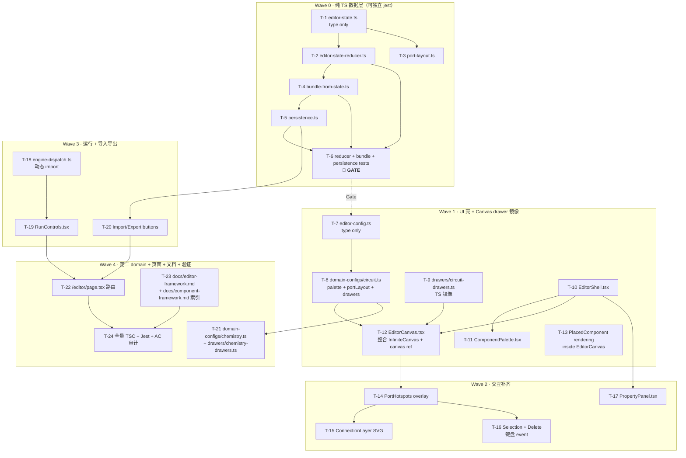

# EXECUTION PLAN · B 阶段 · 编辑器 framework

> Session: `wf-20260428234611.` · 承接 `architecture.md` 的 5 决策 + 14 AC + 20 新文件

---

## 关键路径与 Wave 依赖



### 关键路径（最长依赖链）

`T-1 → T-2 → T-4 → T-6(Gate) → T-7 → T-8 → T-12 → T-14 → T-18 → T-19 → T-22 → T-24`

**最长 12 步**，Wave 并行度中等。可并行：
- Wave 0 内 T-3（port-layout）与 T-5（persistence）相互独立
- Wave 1 内 T-8 和 T-9 可并行
- Wave 4 内 T-21 和 T-23 可并行

---

## 22 任务详解

### Wave 0 · 纯 TS 数据层（~40min）

| T | 文件 | AC | 估时 | 依赖 |
|---|------|-----|------|------|
| **T-1** | `src/lib/editor/editor-state.ts` | AC-B1 | 8min | — |
| **T-2** | `src/lib/editor/editor-state-reducer.ts` | AC-B2 | 15min | T-1 |
| **T-3** | `src/lib/editor/port-layout.ts` | AC-B13 | 5min | T-1 |
| **T-4** | `src/lib/editor/bundle-from-state.ts` | AC-B3, AC-B4 | 8min | T-1 |
| **T-5** | `src/lib/editor/persistence.ts` | AC-B11 | 5min | T-4 |
| **T-6** 🚦 | `src/lib/editor/__tests__/{reducer,bundle-from-state,persistence,port-layout}.test.ts` | AC-B2, AC-B3, AC-B4, AC-B11, AC-B13 | 15min | T-2, T-3, T-4, T-5 |

**T-2 reducer 必须实现 15 个 action**：
```
placeComponent / moveComponent / selectComponent / deleteSelection /
updateProp / startWire / updateWireCursor / finishWire / cancelWire /
removeConnection / setCamera / switchDomain / loadBundle
```
每个 action 一个纯函数，不 mutate 输入 state。

**T-6 Wave 0 GATE**（≥ 15 测试必须绿）：
- reducer：每个 action 至少 1 用例
- bundle-from-state：roundtrip (state → bundle → 反向) 相等
- persistence：save + load + 失败路径（quota, invalid json）
- port-layout：从 anchor + portOffset 得到屏幕坐标

### Wave 1 · UI 壳 + Canvas drawer 镜像（~60min）

| T | 文件 | AC | 估时 | 依赖 |
|---|------|-----|------|------|
| **T-7** | `src/lib/editor/editor-config.ts` | AC-B7 | 5min | — |
| **T-8** | `src/lib/editor/domain-configs/circuit.ts` | AC-B7, AC-B13 | 10min | T-7 |
| **T-9** | `src/lib/editor/drawers/circuit-drawers.ts` | AC-B13 | 15min | T-7 |
| **T-10** | `src/components/editor/EditorShell.tsx` | — | 10min | T-1 |
| **T-11** | `src/components/editor/ComponentPalette.tsx` | IS-2, IS-3 | 10min | T-8, T-10 |
| **T-12** | `src/components/editor/EditorCanvas.tsx` | IS-1, IS-4 | 15min | T-9, T-10 |

**T-9 是关键复用**：复制 `public/templates/_shared/circuit-draw.js` 的逻辑到 TS，每个元件一个纯函数 `(ctx, comp, values) => void`。因为逻辑是镜像关系而非重写，估时 15min。

**T-12** 用 `InfiniteCanvas` 包 `<canvas>` + useEffect 重绘：
```tsx
useEffect(() => {
  const ctx = canvasRef.current!.getContext('2d')!;
  ctx.clearRect(...);
  drawGrid(ctx);
  for (const placed of state.placed) {
    const drawer = config.drawers[placed.kind];
    drawer(ctx, placed, runResult?.perComponent[placed.id]);
  }
}, [state.placed, runResult]);
```

### Wave 2 · 交互补齐（~50min）

| T | 文件 | AC | 估时 | 依赖 |
|---|------|-----|------|------|
| **T-14** | `src/components/editor/PortHotspots.tsx` | IS-5, IS-6, AC-B12 | 15min | T-12 |
| **T-15** | `src/components/editor/ConnectionLayer.tsx` | IS-6 | 15min | T-14 |
| **T-16** | Selection + Delete（在 EditorCanvas 里 + 键盘 event） | IS-7 | 10min | T-14 |
| **T-17** | `src/components/editor/PropertyPanel.tsx` | IS-8, AC-B14 | 10min | T-10 |

**T-14 端口 hotspot**：
- 每个 placed 渲染一个 `<div>` overlay，用 `port-layout.ts` 得到 `{screenX, screenY}`
- `pointer-events: all` · `onClick` 触发 `startWire` 或 `finishWire`（看当前 `draftWire` 是否为空）
- hover 改高亮色 · 无 draft 时点击触发 startWire；有 draft 时点击触发 finishWire

**T-15 连线渲染**：
- `<svg>` 全屏覆盖 · `<path>` 画每条 committed connection · 一条额外 `<path>` 画 `draftWire`（从起点到 cursor）
- stroke 颜色/宽度由 `EditorDomainConfig.connectionStyle`（暂硬编码）

### Wave 3 · 运行 + 导入导出（~30min）

| T | 文件 | AC | 估时 | 依赖 |
|---|------|-----|------|------|
| **T-18** | `src/lib/editor/engine-dispatch.ts` | AC-B10 | 10min | T-4 |
| **T-19** | `src/components/editor/RunControls.tsx` | AC-B10, IS-9 | 10min | T-18 |
| **T-20** | Import/Export buttons（在 EditorShell 或 RunControls） | IS-12, IS-13 | 10min | T-5 |

**T-19 RunControls**：
- "Run" 按钮：先 `bundleFromState(state)` · 再 `assembleBundle` 预检 · 若失败显示错误 · 成功则 `engine.compute` · `perComponent` 存入组件 state 传给 EditorCanvas drawer 作 overlay
- 运行结果面板：table 显示 `perComponent` 的 key-value

### Wave 4 · Chemistry domain + 路由 + 文档 + 全量验证（~30min）

| T | 文件 | AC | 估时 | 依赖 |
|---|------|-----|------|------|
| **T-21** | `src/lib/editor/domain-configs/chemistry.ts` + `drawers/chemistry-drawers.ts` | AC-B7 | 10min | T-8 模式复用 |
| **T-22** | `src/app/editor/page.tsx` | S-1~S-5 | 5min | T-19, T-20 |
| **T-23** | `docs/editor-framework.md` + `docs/component-framework.md` 索引 | — | 10min | — |
| **T-24** | TSC + Jest 全量 + AC 逐条 grep/diff 审计 | AC-B5, AC-B6, AC-B8, AC-B9 | 10min | T-22 |

**T-22 /editor/page.tsx** 最小化：
```tsx
'use client';
import { EditorShell } from '@/components/editor/EditorShell';
export default function EditorPage() { return <EditorShell initialDomain="circuit" />; }
```

**T-24 AC 审计命令**：
- AC-B5: `git diff --stat -- public/templates/physics/circuit.html public/templates/chemistry/metal-acid-reaction.html` = 空
- AC-B6: `git diff --shortstat -- src/lib/framework/{components,solvers,interactions,assembly}` = 空
- AC-B9: `npx tsc --noEmit`（0 退出）
- AC-B8: `npx jest`（全量绿）

---

## 验收门槛（14 AC → 任务映射）

| AC | 任务 | 验证方式 |
|----|------|---------|
| **AC-B1** 纯数据可 JSON 序列化 | T-1, T-6 | roundtrip 测试 |
| **AC-B2** reducer 零 React | T-2, T-6 | jest 独立 import 运行 |
| **AC-B3** bundle 可被 Assembler 消费 | T-4, T-6 | 测试 assembleBundle 不抛 |
| **AC-B4** JSON fingerprint 双路一致 | T-4, T-6 | Builder DSL 产物 vs editor 产物字节比较 |
| **AC-B5** 老模板零改 | T-24 | `git diff --stat` 空 |
| **AC-B6** framework 零改 | T-24 | `git diff --shortstat` 空 |
| **AC-B7** 新 domain 只加 config | T-21 | 新建 chemistry.ts 不改 editor 核心 |
| **AC-B8** 测试 ≥ 20 新增 | T-6 + 追加 | jest 统计 |
| **AC-B9** TSC 零错 | T-24 | `npx tsc --noEmit` |
| **AC-B10** Run 显示 perComponent | T-19 | Runbook + 单元（engine-dispatch mock test） |
| **AC-B11** localStorage roundtrip | T-6 | jest with mock storage |
| **AC-B12** 连线正确形成 | T-14, T-15, T-6 | reducer 测试 + 连线 UI 测试 |
| **AC-B13** portLayout 独立可演化 | T-3, T-8 | 代码审查（drawer 不直接引用坐标） |
| **AC-B14** 属性面板实时刷新 | T-17 | Runbook |

---

## 风险与缓解（5 风险）

| ID | 风险 | Sev | 缓解 |
|----|------|-----|------|
| **R-A** | Canvas 坐标系与 InfiniteCanvas 的 `camera.offset + scale` 转换错乱 | P0 | T-3 `port-layout.ts` 提供 `screenToCanvas` / `canvasToScreen` 统一入口；所有事件入口都走它；新增 4 单元测试 |
| **R-B** | T-9 TS drawer 镜像与 JS drawer 行为漂移 | P0 | T-24 快照测试：同一 component DTO 在 TS 和 JS drawer 下生成的画布像素 hash 一致（用 node-canvas or 代替方案：像素比较转成描述性断言：stroke 命令序列一致） |
| **R-C** | Bundle → Assembler 不兼容（connections 端口名错） | P0 | T-4 `bundleFromState` 在构造时就按 `EditorDomainConfig.palette` 验证端口名；不兼容时抛异常（不静默） |
| **R-D** | React.memo 失效导致 move 元件时全画布重绘 | P1 | T-12 用 useCallback 包 dispatch；PlacedComponent 用 `React.memo((prev,next) => prev.placed === next.placed)`；move 用 rAF 节流 |
| **R-E** | localStorage quota exceeded 静默失败 | P1 | T-5 try/catch · 向 RunControls 传播错误 · UI toast "保存失败：容量已满" |

---

## Out-of-Scope（明确不做）

- ❌ 撤销/重做（undo/redo）
- ❌ 自动布局 / 正交布线
- ❌ 多选（框选）
- ❌ 端口吸附
- ❌ 连线美化
- ❌ 服务端 save
- ❌ 协作
- ❌ minimap
- ❌ 模板库（仅提供导入 JSON 替代）
- ❌ 触屏 full support

---

## 预估与节奏

| Wave | 估时 | 累计 |
|------|------|------|
| W0 纯数据层 + Gate | 40min | 40min |
| W1 UI 壳 + drawer 镜像 | 60min | 100min |
| W2 交互补齐 | 50min | 150min |
| W3 运行 + 导入导出 | 30min | 180min |
| W4 chemistry + 路由 + 文档 | 30min | 210min |

**总计 ~3.5h** · 每 Wave 一个 git commit 可能（M-1~M-4）· 也可合并最终一个 commit。

---

## 测试增量

- Wave 0 GATE：≥ 15 测试（reducer 各 action + bundle roundtrip + persistence + port-layout）
- Wave 1 追加：≥ 3（drawer 镜像像素/命令序列）
- Wave 3 追加：≥ 2（engine-dispatch mock test）
- **总新增 ≥ 20**（AC-B8 兑现）
- **目标总量** 485/485 全绿（465 上轮基线 + 20 新）
