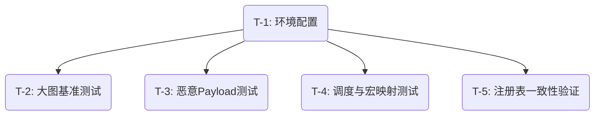

## Execution Plan
本次计划将依据 5 项安全与性能基准测试补齐要求，分为四个垂直切片（Vertical Slices）实现，以确立系统的性能天花板和隔离底线：

| 任务 ID | 任务内容 | 接收标准 (Acceptance Criteria) | 预计修改文件 | 依赖任务 |
|--------|---------|------------------------------|-------------|---------|
| T-1 | 更新测试运行环境 | `jest.config.js` 的 roots 包含 tests 目录。 | `jest.config.js` | 无 |
| T-2 | 实现大图性能压测与熔断 | 构造 >10,000 节点微元结构，验证装配与首帧的性能；引入 `performance.now()` 计算均值并设置 1000ms 的熔断抛出。 | `tests/large-graph.benchmark.ts` | T-1 |
| T-3 | 实现 postMessage 恶意荷载防护 | 模拟发送包含恶意 `__proto__` 或 `constructor.prototype` 劫持的深度嵌套 Payload；验证器安全抛弃该消息且沙箱主线程不抛出栈异常。 | `tests/postmessage-security.test.ts` | T-1 |
| T-4 | 补充调度公平性与宏导出容错 | 补充 TickEngine fairness test 模拟引入慢速求解器（拖死单次 Tick）；补充 `macro invalid export map test` 检测宏挂载不存在的引脚。 | `src/lib/framework/core/__tests__/TickEngine.test.ts`, `tests/macro-export.test.ts` | T-1 |
| T-5 | 实现注册表一致性扫描测试 | 反射读取 `*-registry.ts`，验证每一项模板在 `public/templates` 下均有对应 HTML，杜绝幽灵引用。 | `tests/registry-consistency.test.ts` | T-1 |

## Task Dependencies

## Complexity Constraints
- **并发资源限制 (T-2 大图测试)**：在 JS 单线程环境下初始化数万对象必然引发明显的 CPU 阻滞和 GC 压力。因此该测试在执行中只计算装配速度，避免进行深度逻辑推演，且配置宽容超时。
- **递归深度控制 (T-3 恶意结构)**：构造攻击树时必须确保深层树在创建时不会导致测试自身的栈溢出（即在模拟攻击者时，不使用无限递归构建，而是特定定深）。

## Fallback Paths
- **测试环境挂载失败**：若修改 `jest.config.js` 后由于环境缓存原因没有识别 `tests/` 路径，后备方案为将这 4 个新增文件全部迁移至 `src/__tests__/integration/` 目录下，由默认规则执行。
- **基准测试 CI 抖动**：若大图解析在非本地环境中严重超时（如 GitHub Actions 只有两核），后备方案是捕获超时异常并判定为 Soft Skip，不在标准测试流水线中报红。