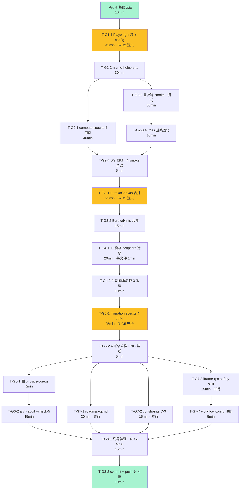

# G 阶段 · PLAN · 8 Wave × 24 任务执行计划

> **Session**: `wf-20260430013937.`
> **上游**: analysis.md 13 G-Goal · architecture.md 5 决策 + 8 Wave 粗时序
> **总估时**: 5h 10min（含 buffer · 实际可能 4h30min-5h30min）
> **Critical Path**: T-G0-1 → T-G1-1 → T-G2-1 → T-G3-1 → T-G4-1 → T-G5-1 → T-G6-1
> **最高风险任务**: T-G3-1（R-G1 源头 · EurekaCanvas 合并）· T-G1-1（R-G2 源头 · Playwright 装）· T-G5-1（R-G5 守护点）

---

## 🧠 Plan 思考摘要

**Critical Path 选择**：W0→W6 是硬链路（任何一个失败都阻塞后续）。W7（Track-C 文档三件）**可与 W6 并行**（都在 W5 smoke 通过后）。W8 是终局验证。

**高风险任务早调度**：
- **T-G3-1 EurekaCanvas 合并** 排在 W3（中段）· 早于 W4 迁移 · R-G1 若在此爆发，可立即回滚到 W2（smoke 已绿）· 不会污染迁移
- **T-G1-1 Playwright 装** 排在 W1 首位 · R-G2 若装不上，立即 fallback 到 manual smoke（文档化 · 不阻塞 Track-B 继续）
- **T-G5-1 4 迁移采样 smoke** 排在 W5 · 是 R-G5 的唯一守护点 · 必须全绿才能进 W6 删除

**Fail Fast 顺序**：T-G1-1 和 T-G3-1 是两大风险源头 · 都在 Wave ≤ 3 触发 · 总时长 ≤ 2.5h 就能暴露 R-G1/R-G2 · 剩余 2.5h 足以应变。

**并行机会**：
- W7 Track-C 的 3 个文档任务（T-G7-1 roadmap · T-G7-2 constraints · T-G7-3 skill）可并行
- W2 的 4 个 compute spec 可并行编写

**最小第一切片**：T-G0-1（10min）输出\"基线已冻结\"是第一个可测试的 vertical slice · 提供回滚锚点。

---

## 依赖图（Mermaid）

---

## 24 任务详细清单

### Wave 0 · 基线冻结（10min）

#### T-G0-1 · 基线验证与记录

| 项 | 值 |
|---|---|
| **Acceptance** | `npx tsc --noEmit` 0 errors · `npx jest` 563+ pass · `git status` clean · HEAD = `6fe982a` 或更新 |
| **文件改动** | 新建 `output/g-baseline.txt`（可选） |
| **依赖** | 无（起点） |
| **风险** | 无 |
| **时长** | 10min |
| **验证命令** | `npx tsc --noEmit 2>&1 \| Select-String "error TS" \| Measure-Object; npx jest --listTests \| Measure-Object; git status` |

---

### Wave 1 · Playwright 基础设施（75min · R-G2 源头）

#### T-G1-1 · Playwright 装依赖 + playwright.config.ts

| 项 | 值 |
|---|---|
| **Acceptance** | `npx playwright --version` 正常返回 · `playwright.config.ts` 存在 · `npx playwright test --list` 能列出（允许 0 个 case） |
| **文件改动** | `package.json` +1 devDep + 1 script · 新建 `playwright.config.ts` · 新建 `tests/e2e/` 目录 |
| **依赖** | T-G0-1 |
| **风险** | 🔴 **R-G2 Windows 装失败** · fallback：manual smoke + 文档记录 · 继续 Track-C 不阻塞 |
| **时长** | 45min（含 Chromium 下载 ~150MB） |
| **验证命令** | `pnpm add -D @playwright/test; npx playwright install chromium; npx playwright --version` |
| **详细配置** | `baseURL: http://localhost:5000` · `webServer: { command: 'bash ./scripts/dev.sh', reuseExistingServer: true, timeout: 120_000 }` · `use: { browserName: 'chromium' }` · `testDir: ./tests/e2e` · `expect: { timeout: 10_000 }` |

#### T-G1-2 · iframe-helpers.ts 工具函数库

| 项 | 值 |
|---|---|
| **Acceptance** | 5 个 helper: `waitForIframeReady(page, selector, timeout)` · `getIframeConsoleErrors(page)` · `waitForIframeComputeResult(page, selector)` · `assertNoTimeoutWarning(page)` · `takeIframeScreenshot(page, name)` |
| **文件改动** | 新建 `tests/e2e/iframe-smoke/iframe-helpers.ts` ~80 行 |
| **依赖** | T-G1-1 |
| **风险** | 🟡 iframe postMessage 时序 flaky · 用 waitForFunction + 10s timeout 缓解 |
| **时长** | 30min |
| **验证** | 导入测试：`import { waitForIframeReady } from './iframe-helpers'` 无报错 |

---

### Wave 2 · Compute Smoke 4 用例（85min）

#### T-G2-1 · compute.spec.ts 4 用例编写

| 项 | 值 |
|---|---|
| **Acceptance** | 4 个 test case 覆盖 `physics/circuit` · `physics/buoyancy` · `chemistry/acid-base-titration` · `chemistry/metal-acid-reaction` · 每个断言：(1) page load < 10s · (2) iframe ready 事件收到 · (3) canvas 像素非空 · (4) 无 "timeout waiting for host response" 警告文本 · (5) 截图保存 |
| **文件改动** | 新建 `tests/e2e/iframe-smoke/compute.spec.ts` ~120 行 |
| **依赖** | T-G1-2 |
| **风险** | 🟡 R-G3 时序 flaky · helpers 的 10s timeout 缓解 |
| **时长** | 40min |
| **验证** | `npx playwright test --list tests/e2e/iframe-smoke/compute.spec.ts` 列出 4 个 case |

#### T-G2-2 · 首次跑 smoke + 调试

| 项 | 值 |
|---|---|
| **Acceptance** | 4 case 全部通过 · 控制台无 ERROR · 各 case 耗时 < 15s |
| **文件改动** | 可能调整 helpers / config timeout |
| **依赖** | T-G2-1 |
| **风险** | 🔴 **R-G3** · 首次跑最容易 flaky · 允许 3 次 auto-fix 循环 |
| **时长** | 30min |
| **验证** | `npm run test:e2e tests/e2e/iframe-smoke/compute.spec.ts` all pass |

#### T-G2-3 · 4 PNG 基线固化

| 项 | 值 |
|---|---|
| **Acceptance** | `tests/e2e/iframe-smoke/__screenshots__/` 下有 4 张 PNG · git add 入库 |
| **文件改动** | +4 PNG |
| **依赖** | T-G2-2 |
| **风险** | 无 |
| **时长** | 10min |
| **验证** | `Get-ChildItem tests/e2e/iframe-smoke/__screenshots__/ -Filter *.png \| Measure-Object` ≥ 4 |

#### T-G2-4 · W2 验收闸门

| 项 | 值 |
|---|---|
| **Acceptance** | G-Goal-2 达成：4 compute smoke 全绿 + 基线 PNG 入库 |
| **文件改动** | 无 |
| **依赖** | T-G2-3 |
| **时长** | 5min |

---

### Wave 3 · 底座合并（40min · R-G1 源头 🔴）

#### T-G3-1 · EurekaCanvas 合并到 experiment-core.js

| 项 | 值 |
|---|---|
| **Acceptance** | `experiment-core.js` 含完整 `EurekaCanvas` 对象（从 physics-core.js 原样复制 · 含 `setupHiDPI` / `clearCanvas` 等所有方法）· `window.EurekaCanvas = EurekaCanvas` 挂载 · TSC 0 · 4 compute smoke 仍全绿（合并不应破坏已有） |
| **文件改动** | `public/templates/_shared/experiment-core.js` +~50 行 |
| **依赖** | T-G2-4 |
| **风险** | 🔴 **R-G1 源头** · 若漏复制某方法 → 后续 11 模板炸 · 缓解：diff 对比 + W5 smoke 兜底 |
| **时长** | 25min |
| **验证** | `Select-String -Path public/templates/_shared/experiment-core.js -Pattern "EurekaCanvas"` 出现 · `npm run test:e2e compute.spec.ts` 保持全绿 |

#### T-G3-2 · EurekaHints 合并到 experiment-core.js

| 项 | 值 |
|---|---|
| **Acceptance** | `experiment-core.js` 含 `EurekaHints` 对象 · `window.EurekaHints` 挂载 · localStorage key 命名空间保持不变（避免 first-run 提示复现） |
| **文件改动** | `experiment-core.js` +~20 行 |
| **依赖** | T-G3-1 |
| **风险** | 🟡 localStorage key 变了 → 已用户看过一次的提示重现 · 缓解：原样复制 key |
| **时长** | 15min |
| **验证** | grep `EurekaHints` 存在 · smoke 保持全绿 |

---

### Wave 4 · 11 模板迁移（30min）

#### T-G4-1 · 11 模板 script src 从 physics-core 改为 experiment-core

| 项 | 值 |
|---|---|
| **Acceptance** | 11 个 HTML 文件 script src 改完 · `rg 'physics-core\.js' public/templates` 返回 0 匹配 · 每文件 diff 仅 1 行 |
| **文件改动** | 11 × .html · 每个 -1/+1 · 总 +11/-11 |
| **依赖** | T-G3-2 |
| **清单** | `chemistry/{combustion-conditions,electrolysis,iron-rusting,reaction-rate}.html` + `physics/{density,friction,lever,phase-change,pressure,refraction,work-power}.html` |
| **风险** | 🟡 R-G5 潜伏 · 此时没测试守护 · 需靠 T-G4-2 肉眼 + T-G5-1 smoke 兜底 |
| **时长** | 20min |
| **验证** | `rg 'physics-core\.js' public/templates -l` 空 |

#### T-G4-2 · 肉眼抽检 3 采样

| 项 | 值 |
|---|---|
| **Acceptance** | 浏览器打开 friction / pressure / combustion-conditions 3 页面 · 控制台无 ReferenceError `EurekaCanvas is not defined` · 画面渲染正常 |
| **文件改动** | 无 |
| **依赖** | T-G4-1 |
| **风险** | 🟡 本地 dev server 启动需 ~20s · 预留 buffer |
| **时长** | 10min |
| **验证** | Chrome DevTools Console 无红色 Error |

---

### Wave 5 · 迁移采样 Smoke（30min · R-G5 守护点）

#### T-G5-1 · migration.spec.ts 4 采样用例

| 项 | 值 |
|---|---|
| **Acceptance** | 4 个 test case 覆盖 `physics/friction` · `physics/pressure` · `physics/refraction` · `chemistry/combustion-conditions` · 每个断言：(1) page load · (2) iframe ready · (3) canvas 非空 · (4) 控制台无 ReferenceError · (5) 截图保存 |
| **文件改动** | 新建 `tests/e2e/iframe-smoke/migration.spec.ts` ~100 行 |
| **依赖** | T-G4-2 |
| **风险** | 🔴 **R-G5 唯一守护点** · 若 red → 迁移有问题 · 回滚到 W3 · 严禁跳过 |
| **时长** | 25min |
| **验证** | `npm run test:e2e migration.spec.ts` all pass |

#### T-G5-2 · 4 迁移采样 PNG 基线

| 项 | 值 |
|---|---|
| **Acceptance** | `__screenshots__/` 新增 4 PNG · 合计 8 PNG 入库 |
| **文件改动** | +4 PNG |
| **依赖** | T-G5-1 |
| **时长** | 5min |

---

### Wave 6 · 删除 physics-core + arch-audit（20min）

#### T-G6-1 · 删除 public/templates/_shared/physics-core.js

| 项 | 值 |
|---|---|
| **Acceptance** | 文件不存在 · `git status` 显示 deleted · 8 smoke 全部保持绿（再跑一次确认） |
| **文件改动** | `-1 file (public/templates/_shared/physics-core.js ~200 行)` |
| **依赖** | T-G5-2 |
| **风险** | 🟡 FM-G5 外部引用漏查 · 缓解：`rg physics-core` 全库搜 → 0 才删 |
| **时长** | 5min |
| **验证** | `Test-Path public/templates/_shared/physics-core.js` returns False · smoke 全绿 |

#### T-G6-2 · arch-audit.sh +check 5 "iframe 底座单一"

| 项 | 值 |
|---|---|
| **Acceptance** | `scripts/arch-audit.sh` 新增 check：`rg 'physics-core\.js' public/templates` 若有匹配 → fail · `bash scripts/arch-audit.sh` exit 0 |
| **文件改动** | `scripts/arch-audit.sh` +~10 行 |
| **依赖** | T-G6-1 |
| **风险** | 无 |
| **时长** | 15min |
| **验证** | 先跑 pass · 故意加一个 `<script src="physics-core.js">` 到某文件跑 fail · 回滚测试 |

---

### Wave 7 · Track-C 文档（50min · 并行机会）

> **这 4 个任务 T-G7-1 / T-G7-2 / T-G7-3+4 可并行**（不互相依赖）· 单线执行约 50min · 理论最短 20min

#### T-G7-1 · docs/roadmap-g.md（并行）

| 项 | 值 |
|---|---|
| **Acceptance** | 文件存在 · 含 3 章节（Track-A 测试 · Track-B 底座 · Track-C 防复发）· 含"G+1 候选"节（CI 集成 · pixel diff · mobile 视口 · Coze 同步）· 字数 > 2500 |
| **文件改动** | 新建 `docs/roadmap-g.md` ~3000 字 |
| **依赖** | T-G5-2（可与 T-G6 并行） |
| **时长** | 20min |

#### T-G7-2 · docs/architecture-constraints.md +C-3（并行）

| 项 | 值 |
|---|---|
| **Acceptance** | 新增 C-3 "iframe 底座单一原则"节 · 使用记录表追加 #8 "G 阶段兑现 C-3" · grep "C-3" 和 "#8" 匹配 |
| **文件改动** | `docs/architecture-constraints.md` +~30 行 |
| **依赖** | T-G5-2（可与 T-G6 并行） |
| **时长** | 15min |

#### T-G7-3 · .workflow/skills/iframe-rpc-safety.md（并行）

| 项 | 值 |
|---|---|
| **Acceptance** | 新建 skill 文件 · 含 4 部分：Rules（至少 3 条：listener 顶层挂 / compute_result 不依赖 onHostCommand / 新模板必须引用 experiment-core）· Anti-Patterns · Gotchas · SOP |
| **文件改动** | 新建 `.workflow/skills/iframe-rpc-safety.md` ~150 行 |
| **依赖** | T-G5-2 |
| **时长** | 15min |

#### T-G7-4 · workflow.config.js 注册 skill

| 项 | 值 |
|---|---|
| **Acceptance** | `workflow.config.js` 的 `projectSkills` 数组含 `iframe-rpc-safety` |
| **文件改动** | `workflow.config.js` +1 行 |
| **依赖** | T-G7-3 |
| **时长** | 5min |

---

### Wave 8 · 终局验证 + 产出（25min）

#### T-G8-1 · 13 G-Goal 逐项验证

| 项 | 值 |
|---|---|
| **Acceptance** | G-Goal-1 ✓ Playwright · G-Goal-2 ✓ 4 smoke · G-Goal-3 ✓ rg 空 · G-Goal-4 ✓ grep EurekaCanvas 在 experiment-core · G-Goal-5 ✓ physics-core 不存在 · G-Goal-6 ✓ tsc+jest · G-Goal-7 ✓ arch-audit · G-Goal-8 ✓ roadmap · G-Goal-9 ✓ C-3 · G-Goal-10 ✓ skill 注册 · G-Goal-11 ✓ 8 PNG · G-Goal-12 ✓ git log scope · G-Goal-13 ✓ regression 0（smoke 全绿证明） |
| **文件改动** | 无 |
| **依赖** | T-G6-2 + T-G7-1 + T-G7-2 + T-G7-4 |
| **时长** | 15min |

#### T-G8-2 · commit + push 分 4 批

| 项 | 值 |
|---|---|
| **Acceptance** | 4 个独立 commit：(1) Track-B 基础 `feat(e2e): Playwright 基础 + compute smoke` · (2) Track-A 迁移 `refactor(templates): physics-core→experiment-core 统一底座` · (3) Track-A 守护 `feat(arch-guard): arch-audit +check-5` · (4) Track-C 防复发 `docs/feat(workflow): G 阶段路线图 + C-3 + skill` · 每 commit diff 不跨 track |
| **文件改动** | Git 操作 |
| **依赖** | T-G8-1 |
| **风险** | 无 |
| **时长** | 10min |

---

## 风险热力图（7 风险 → 任务）

| 风险 ID | 描述 | 负责任务 | 缓解点 |
|--------|------|--------|--------|
| **R-G1** P0 | EurekaCanvas 合并漂移 | **T-G3-1 + T-G3-2** | T-G2-4 smoke 作前置基线 · T-G5-1 作后置兜底 |
| **R-G2** P1 | Playwright Windows 兼容 | **T-G1-1** | fallback manual smoke · 不阻塞 Track-A |
| **R-G3** P1 | iframe 加载时序 flaky | T-G1-2 + T-G2-2 | 10s timeout · waitForFunction · auto-fix 3 轮 |
| **R-G4** P2 | pixel diff 易碎 | 无（V2 已规避）| 截图保存不比对 |
| **R-G5** P1 | 迁移引入 regression | **T-G5-1** 唯一守护 | 迁移前 W2 基线 · 迁移后 W5 强制 smoke |
| **R-G6** P1 | Coze 同步滞后 | 无（D-G5 OOS）| 文档指引 + G+1 候选 |
| **R-G7** P2 | Scope creep | T-G8-2 | 4 批分离 · diff 自审 |

---

## 资源 + Buffer

**总估时**: 5h 10min · **含 buffer**: ~1h · **实际预期**: 4h30-5h30

**并行节省空间**: W7 三个文档可并行 → 理论省 30min · 若单人执行就顺序做

**回滚策略**:
- Wave 独立 commit · 任意 Wave 失败 revert ≤ 10min
- 整体失败 `git reset --hard 6fe982a` 回 F 阶段末尾

---

## 思考回溯（与 Plan 思考摘要对齐）

- Critical Path：W0→W6 串行 · 无可抖动
- 高风险早调度：T-G1-1 W1 · T-G3-1 W3 · T-G5-1 W5 · 累计风险暴露点在 2.5h 处
- 并行机会：W7 文档 × 3 + W2 spec 4 并行编写（同文件）
- 最小切片：T-G0-1 10min 就是 verifiable vertical slice
