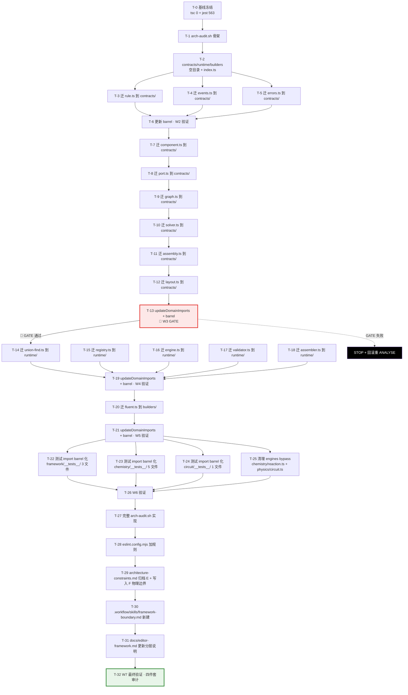

# F 阶段 · 执行计划 · framework 物理分层重构

> Session: wf-20260429132738. · 基线: e12560f · 依据 architecture.md 5 决策 + 7 Wave

---

## 一 · Mermaid 依赖图



**观察**：
- 33 个任务（T-0~T-32）· 7 Wave
- **唯一 GATE = T-13（W3 末尾）** · 迁完 6 核心文件后第一次全量 tsc 验证
- W2 内 T-3/T-4/T-5 可并行（三个 pure type 文件互不依赖）
- W3 内必须串行（每个核心文件迁完后 domains/ 的相对路径可能立即失效）
- W6 内 T-22/T-23/T-24/T-25 可并行
- W7 内文档任务 T-29/T-30/T-31 可并行

---

## 二 · 33 任务详解

### Wave 0 · 基线冻结（15min · 2 任务）

**T-0 · 基线验证**
- 动作：`npx tsc --noEmit` = 0 errors · `npx jest` = 563 pass · `git status` clean · 记录 `git HEAD = e12560f`
- AC 映射：AC-F3 / AC-F4（基线等价性）
- 失败处理：若 tsc/jest 非基线 → STOP（F 阶段不能在非绿基线上开始）
- 输出：W0 baseline 快照记录

**T-1 · arch-audit.sh 骨架**
- 动作：创建 `scripts/arch-audit.sh` 空骨架（echo "W0 stub" · exit 0）
- 文件：`scripts/check.sh` 同模式（LF endings · `#!/usr/bin/env bash`）
- AC 映射：AC-F11（脚手架）
- 失败处理：Windows PowerShell LF/CRLF 问题 → 同 E 阶段 check.sh 处理

---

### Wave 1 · 建立空目录 + barrel 骨架（40min · 1 任务）

**T-2 · 创建 3 新目录 + index.ts 骨架**
- 动作：
  ```
  src/lib/framework/contracts/index.ts  (空 export {})
  src/lib/framework/runtime/index.ts    (空 export {})
  src/lib/framework/builders/index.ts   (空 export {})
  ```
- **不**动 `framework/index.ts`（兼容层保持）
- **不**移动任何源文件
- AC 映射：AC-F1（目录落地准备）
- 验证：tsc 0 + jest pass（无实质变化）
- 失败处理：无

---

### Wave 2 · 迁 3 pure type 文件（45min · 4 任务）

**T-3 · 迁 rule.ts**
- 动作：`git mv src/lib/framework/interactions/rule.ts src/lib/framework/contracts/rule.ts`
- 更新：`contracts/rule.ts` 内的 `import type { DomainGraph } from '../components/graph'` → `'./graph'`（注：此时 graph.ts 尚未迁移，暂保持 `'../components/graph'`；W3 迁 graph 时统一更新）
- AC 映射：AC-F1 / AC-F13
- 单文件内容变更：0-2 行（仅 import 路径）

**T-4 · 迁 events.ts**
- 动作：`git mv interactions/events.ts contracts/events.ts`
- 更新：`import type { IExperimentComponent } from '../components/base'` → 暂保持，W3 统一改

**T-5 · 迁 errors.ts**
- 动作：`git mv assembly/errors.ts contracts/errors.ts`

**T-6 · 更新 barrel + W2 验证**
- 动作：修改 `framework/index.ts`：
  ```ts
  // Before:
  export type { ReactionRule } from './interactions/rule';
  // After:
  export type { ReactionRule } from './contracts/rule';
  ```
  对 rule/events/errors 3 文件的 re-export 路径更新
- 更新 `contracts/index.ts` 聚合：`export * from './rule'; export * from './events'; export * from './errors';`
- 验证：`npx tsc --noEmit` = 0 · `npx jest` 全绿
- AC 映射：AC-F2 / AC-F3 / AC-F4
- 失败处理：若 tsc 非 0 → 显示失败文件 → 修 import → 重验证（最多 2 次否则 revert W2）

---

### Wave 3 · 迁 6 核心 co-located 文件 · 🚦 GATE（60min · 7 任务）

**T-7 · 迁 component.ts（最核心）**
- 动作：`git mv components/base.ts contracts/component.ts`
- 更新：`contracts/component.ts` 内 `import type { PortRef } from './port'`（port.ts 尚未迁，暂保持 `'../components/port'`；T-8 立即跟上）
- AC 映射：AC-F1 / AC-F13
- ⚠️ 风险：tsc 会立即红（大量 domains/ 引用 `'../../components/base'`）· 暂不修（T-13 批量处理）

**T-8 · 迁 port.ts**
- 动作：`git mv components/port.ts contracts/port.ts`
- 更新 component.ts 的 `'../components/port'` → `'./port'`

**T-9 · 迁 graph.ts**
- 动作：`git mv components/graph.ts contracts/graph.ts`
- 更新：graph.ts 内所有 import：`'./base'` → `'./component'` · `'./port'` → `'./port'` · `'./union-find'` → `'../runtime/union-find'`（runtime/union-find.ts 尚不存在——此 import 暂保持 `'../components/union-find'` 到 W4）

**T-10 · 迁 solver.ts**
- 动作：`git mv solvers/base.ts contracts/solver.ts`
- 更新：`'../components/graph'` → `'./graph'` · `'../components/base'` → `'./component'`

**T-11 · 迁 assembly.ts（原 spec.ts 改名 + 内部 import 更新）**
- 动作：`git mv assembly/spec.ts contracts/assembly.ts`
- 更新：`'../components/base'` → `'./component'`
- ⚠️ 注意：此时 spec.ts 改名为 assembly.ts · barrel re-export `from './assembly/spec'` 必须改为 `from './contracts/assembly'`（T-13 批量）

**T-12 · 迁 layout.ts**
- 动作：`git mv assembly/layout.ts contracts/layout.ts`
- 更新：`'../components/base'` → `'./component'` · `'./spec'` → `'./assembly'`
- ⚠️ E 阶段加的 `import type { AssemblySpec } from './spec'` → `'./assembly'`

**T-13 · 🚦 W3 GATE · 批量更新 domains import + barrel**
- 动作（最高频体力活）：
  - 全项目搜索 `from '\.\./\.\./components/` → 替换为 `from '\.\./\.\./contracts/`（chemistry/circuit 内约 20 处）
  - 全项目搜索 `from '\.\./\.\./solvers/` → `'\.\./\.\./contracts/'`
  - 全项目搜索 `from '\.\./\.\./interactions/' → '\.\./\.\./contracts/'`（限 rule/events）
  - 全项目搜索 `from '\.\./\.\./assembly/spec'` → `'\.\./\.\./contracts/assembly'`
  - 全项目搜索 `from '\.\./\.\./assembly/layout'` → `'\.\./\.\./contracts/layout'`
  - 全项目搜索 `from '\.\./\.\./assembly/errors'` → `'\.\./\.\./contracts/errors'`
  - 更新 `framework/index.ts` barrel：所有 `from './components/base|graph|port'` → `'./contracts/component|graph|port'` 等
  - 更新 `contracts/index.ts` 聚合
- **🚦 GATE 判定**：`npx tsc --noEmit` = 0 且 `npx jest` 全绿
- **GATE 失败**：`git revert HEAD` 回到 T-12 之前 → 标注失败根因 → 重进 ANALYSE
- AC 映射：AC-F1 / AC-F2 / AC-F3 / AC-F4 / AC-F5
- 预估 diff：~25 个文件 · 每文件 1-3 行 import 更新

---

### Wave 4 · 迁 5 runtime 文件（40min · 6 任务）

**T-14 · 迁 union-find.ts**
- 动作：`git mv components/union-find.ts runtime/union-find.ts`

**T-15 · 迁 registry.ts**
- 动作：`git mv components/registry.ts runtime/registry.ts`
- 更新：`'./base'` → `'../contracts/component'`

**T-16 · 迁 engine.ts**
- 动作：`git mv interactions/engine.ts runtime/engine.ts`
- 更新：`'../components/graph'` → `'../contracts/graph'` · `'../solvers/base'` → `'../contracts/solver'` · `'../components/base'` → `'../contracts/component'` · `'./rule'` → `'../contracts/rule'` · `'./events'` → `'../contracts/events'`

**T-17 · 迁 validator.ts**
- 动作：`git mv assembly/validator.ts runtime/validator.ts`

**T-18 · 迁 assembler.ts**
- 动作：`git mv assembly/assembler.ts runtime/assembler.ts`

**T-19 · updateDomainImports + barrel · W4 验证**
- 动作：
  - domains 中 `'\.\./\.\./components/union-find'` → `'\.\./\.\./runtime/union-find'`
  - domains 中 `'\.\./\.\./components/registry'` → `'\.\./\.\./runtime/registry'`
  - domains 中 `'\.\./\.\./interactions/engine'` → `'\.\./\.\./runtime/engine'`
  - domains 中 `'\.\./\.\./assembly/validator|assembler'` → `'\.\./\.\./runtime/validator|assembler'`
  - `contracts/graph.ts` 内 `'../components/union-find'` → `'../runtime/union-find'`
  - 更新 `framework/index.ts` barrel
  - 更新 `runtime/index.ts` 聚合
- 验证：tsc 0 + jest pass
- AC 映射：AC-F1 / AC-F3 / AC-F4

---

### Wave 5 · 迁 1 builders 文件（20min · 2 任务）

**T-20 · 迁 fluent.ts**
- 动作：`git mv assembly/fluent.ts builders/fluent.ts`
- 更新：`'../components/base|graph'` → `'../contracts/component|graph'` · 其他 import 跟随

**T-21 · updateDomainImports + barrel · W5 验证**
- 动作：
  - domains 中 `'\.\./\.\./assembly/fluent'` → `'\.\./\.\./builders/fluent'`
  - 更新 `framework/index.ts` barrel · `builders/index.ts` 聚合
  - **删除空目录**：`rmdir components/ solvers/ interactions/ assembly/`（此时应全部为空）
- 验证：tsc 0 + jest pass
- AC 映射：AC-F1 / AC-F3 / AC-F4

---

### Wave 6 · 测试路径统一 + bypass 清理（40min · 5 任务）

**T-22 · framework/__tests__/ 测试 barrel 化**
- 文件：3 个（framework.test.ts / assembly.test.ts / layout-spec.test.ts）
- 动作：相对路径 `from '../components/base'` 等 → `from '@/lib/framework'`（barrel）
- 保留：同级或 `from '../assembly/layout'`（如果被测代码已不存在则必改）
- AC 映射：AC-F9 / AC-F4

**T-23 · chemistry/__tests__/ 测试 barrel 化**
- 文件：5 个
- 动作：跨层相对路径 `from '../../../components/base'` 改 barrel · 保留 `from '../type-guards'` 同级相对
- AC 映射：AC-F9

**T-24 · circuit/__tests__/ 测试 barrel 化**
- 文件：1 个（circuit-assembly.test.ts）

**T-25 · engines bypass 清理**
- 文件：`src/lib/engines/chemistry/reaction.ts` + `src/lib/engines/physics/circuit.ts`
- 动作：
  - `from '@/lib/framework/domains/chemistry'` → **保留**（这是 domain-level import，不是 bypass framework 核心；ESLint 规则不拦截 domains/ 路径）
  - 检查如果有伸进 `@/lib/framework/components/base` 等内部路径 → 改为 barrel
- AC 映射：AC-F8 / AC-F7

> ⚠️ **修正 ANALYSE 的理解**：审阅下游 import 发现 engines 文件 import 的是 `@/lib/framework/domains/chemistry`（domain 级别聚合），不是 framework 核心内部。这其实**是合法的**——domains 也是 public API。ESLint 规则只禁 `contracts|runtime|builders` 内部路径。因此 T-25 实际只做一次 grep 确认，不强制改。

**T-26 · W6 验证**
- 动作：`tsc --noEmit` + `jest`
- 验证：tsc 0 + jest 全绿
- 若有测试路径更新引入 tsc 红 → 修 import · 重验证
- AC 映射：AC-F3 / AC-F4 / AC-F9

---

### Wave 7 · 硬约束兑现四件套 + 最终验证（40min · 6 任务）

**T-27 · 完整 arch-audit.sh 实现**
- 文件：`scripts/arch-audit.sh`
- 动作：写入 architecture.md 第 6 节的完整内容（4 个检查：contracts/ 下游依赖 / runtime/ 下游依赖 / 外部伸进内部 / 简化循环检测）
- 验证：`bash scripts/arch-audit.sh` 退出码 0
- AC 映射：AC-F5 / AC-F6 / AC-F11

**T-28 · eslint.config.mjs 加 no-restricted-imports 规则**
- 文件：`eslint.config.mjs`
- 动作：加入 `{ files: ['src/lib/editor/**', 'src/lib/engines/**', 'src/components/**'], rules: {...} }` 配置块
- 验证：`npx eslint src/lib/editor src/lib/engines src/components` 退出码 0（当前代码已经符合规则 · 无违规）
- AC 映射：AC-F7

**T-29 · architecture-constraints.md 更新**
- 文件：`docs/architecture-constraints.md`
- 动作：
  - E 阶段"受控松动条款"小节改标题为 "已归档 · E 阶段历史记录"
  - 新增 "F 阶段 · 物理边界硬约束"小节（4 条）
  - 新增 "硬约束兑现四件套" 小节
  - 在"使用记录表"加第 7 条：F 阶段一次性物理边界建立
- AC 映射：AC-F10

**T-30 · framework-boundary.md 新建**
- 文件：`.workflow/skills/framework-boundary.md`
- 动作：新建 skill 文件 · 约 100 行 · 内容包括：
  - F 阶段物理分层简介
  - `contracts/` `runtime/` `builders/` `domains/` 各自定位
  - 依赖方向红线
  - 如何为新 domain 接入（模板）
  - 如何新增 component kind（在 domains 下）
  - arch-audit.sh + ESLint 守护机制说明
- AC 映射：AC-F12

**T-31 · editor-framework.md 分层说明更新**
- 文件：`docs/editor-framework.md`
- 动作：
  - 加 "F 阶段之后的 framework 物理结构" 小节（简述）
  - 在"相关文档"追加 `architecture-constraints.md` 和 `.workflow/skills/framework-boundary.md` 链接
- AC 映射：AC-F10（间接）

**T-32 · W7 最终验证 · 硬约束四件套审计**
- 动作：
  1. `npx tsc --noEmit` · 期望 0 errors
  2. `npx jest` · 期望 ≥563 pass（等同或超过 W6 末尾）
  3. `bash scripts/arch-audit.sh` · 期望 exit 0
  4. `npx eslint src/lib/editor src/lib/engines src/components` · 期望 0 error
  5. 验证物理目录：`ls src/lib/framework/` 显示 `contracts/ runtime/ builders/ domains/ index.ts`
  6. `git diff --numstat` 审计：单文件内容变更 ≤ 5 行（除 index.ts / 测试 / 文档 / eslint config）
  7. `ls scripts/arch-audit.sh` 存在且可执行
  8. `ls .workflow/skills/framework-boundary.md` 存在
- AC 映射：AC-F1 ~ AC-F13（全量）

---

## 三 · AC ↔ 任务映射表（13 AC）

| AC | 描述 | 覆盖任务 |
|----|------|---------|
| **AC-F1** | 四目录落地 | T-2 / T-13 / T-19 / T-21 |
| **AC-F2** | barrel 兼容性 | T-6 / T-13 / T-19 / T-21 / T-32 |
| **AC-F3** | TSC 0 保持 | 每 Wave 末尾（T-6/T-13/T-19/T-21/T-26/T-32）|
| **AC-F4** | Jest 563+ | 同上 |
| **AC-F5** | 依赖方向 | T-27 arch-audit.sh |
| **AC-F6** | 0 循环依赖 | T-27 · T-32 审计 |
| **AC-F7** | ESLint 守护 | T-28 / T-32 |
| **AC-F8** | bypass 清理 | T-25（实际只是确认）|
| **AC-F9** | 测试路径统一 | T-22 / T-23 / T-24 |
| **AC-F10** | constraints.md 归档 | T-29 / T-31 |
| **AC-F11** | arch-audit.sh exit 0 | T-27 / T-32 |
| **AC-F12** | framework-boundary.md | T-30 / T-32 |
| **AC-F13** | 单文件 ≤5 行 | T-32 审计 · 每 Wave 自觉 |

---

## 四 · 5 风险 + 缓解

| R | Sev | 描述 | 缓解 |
|---|-----|------|------|
| **R-A** | **P0** | W3 GATE 失败（T-13 后 tsc 非 0）| W3 独立 commit · `git revert HEAD` 回 T-12 之前 · 重 ANALYSE |
| **R-B** | **P0** | domains/ 相对路径漏更（每 Wave 末尾 tsc TS2307）| tsc 实时 canary · TS2307 立即定位 · 修单文件 import |
| R-C | P1 | T-25 engines bypass 其实不是 bypass | ANALYSE 已修正理解 · T-25 降级为 grep 确认 |
| R-D | P1 | T-28 ESLint 规则误伤 framework 内部 | `files` glob 只含 editor/engines/components 目录 · 验证 `eslint framework/` 不报错 |
| R-E | P2 | Windows PowerShell 执行 bash arch-audit.sh | 同 scripts/check.sh 既有模式 · git bash 兜底 |

---

## 五 · Out-of-Scope（10 项显式排除）

沿用 ANALYSE 阶段清单：

1. ❌ 不做文件级 type/impl 拆分
2. ❌ 不重命名 class / interface
3. ❌ 不改 interface 字段类型
4. ❌ 不改 AC-D1 语义
5. ❌ 不做 chemistry/circuit 业务重构
6. ❌ 不引入新抽象（branded types / phantom types）
7. ❌ 不迁移老实验或 templates
8. ❌ 不改 package.json / 不引新 npm 依赖
9. ❌ 不改 editor React 集成（编辑器 0 React 保持）
10. ❌ 不改工作流本身

---

## 六 · 成功标准（Exit Criteria）

- [ ] **T-32 全部 8 项验证通过**
- [ ] **13 AC 全部 ✓**
- [ ] **四件套齐全**：物理目录 + ESLint + arch-audit.sh + constraints.md
- [ ] **≤ 8 个 commit**（Wave 粒度 W0-W7）
- [ ] **TSC 0 errors · Jest ≥563 pass · 零新依赖**
- [ ] **下游 17 barrel-only 消费者零改**（editor 9 + engines 2 barrel + engines 2 domain-level + components 2 + 其他 2）

---

## 七 · 关键路径的 8 验证点

每 Wave 末尾都是一个 **tsc + jest** 验证点：

| # | 位置 | 预期 |
|---|------|------|
| 1 | T-0 | tsc 0 + jest 563（基线）|
| 2 | T-6（W2 末）| tsc 0 + jest pass（迁 3 pure type 后）|
| 3 | **T-13（W3 GATE）** | tsc 0 + jest pass（迁 6 核心文件后）· **🚦 唯一 gate** |
| 4 | T-19（W4 末）| tsc 0 + jest pass（迁 5 runtime 后）|
| 5 | T-21（W5 末）| tsc 0 + jest pass（迁 1 builders 后 · 空目录可清理）|
| 6 | T-26（W6 末）| tsc 0 + jest pass（测试 barrel 化后）|
| 7 | T-27 后 | `bash scripts/arch-audit.sh` exit 0 |
| 8 | T-32（W7 末）| 四件套全过 + 13 AC 全过 |

---

## 八 · 估时小结

| Wave | 任务数 | 预估 | 累计 |
|------|-------:|-----:|-----:|
| W0 | 2 | 15min | 0:15 |
| W1 | 1 | 40min | 0:55 |
| W2 | 4 | 45min | 1:40 |
| W3 | 7 | 60min | 2:40 |
| W4 | 6 | 40min | 3:20 |
| W5 | 2 | 20min | 3:40 |
| W6 | 5 | 40min | 4:20 |
| W7 | 6 | 40min | 5:00 |

**总计：33 任务 · ~5h**（ARCHITECT 估 6-8h · 有 1-3h Buffer）

---

## 九 · 下一步

请在 Plan Review Gate 批准后进入 DEVELOP 阶段，按 W0→W7 严格顺序执行。
