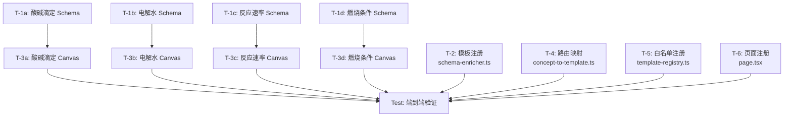

# 化学实验迁移执行计划 (Execution Plan)

## 🧠 计划推理

### 1. 关键路径

关键路径是最长的依赖链，决定了最小交付时间：
```
T-1 (Schema 定义) → T-2 (模板注册) → T-3 (Canvas 渲染) → T-5 (路由集成) → T-6 (页面注册)
```

### 2. 最高风险任务

| 风险等级 | 任务 | 原因 | 缓解策略 |
|----------|------|------|----------|
| **HIGH** | T-3 Canvas 渲染实现 | 化学实验装置复杂，需要大量 Canvas 绘制代码 | 分实验逐步验证，先完成酸碱滴定作为 MVP |
| **MED** | T-1 Schema 定义 | 需确保字段映射到 Legacy Config 正确 | 参考已有物理实验 Schema 作为模板 |
| **LOW** | T-6 页面注册 | 只需修改 Set 和路由映射 | 机械性工作，无技术风险 |

### 3. 可并行任务

```
并行组 1: T-1 (酸碱滴定 Schema) + T-1 (电解水 Schema) — 独立实验，无依赖
并行组 2: T-2 (模板注册) + T-4 (路由映射) — 注册类任务互不依赖
```

### 4. 最小可测试垂直切片

**Phase 1 MVP**: 完成酸碱滴定实验的端到端流程（Schema → 注册 → 渲染 → 页面）
- 验证架构可行性
- 发现问题可尽早调整

**Phase 2 完整交付**: 完成剩余3个化学实验 + 所有集成

---

## 📋 任务分解

### 任务依赖关系图



---

## 📝 详细任务列表

### T-1a: 实现酸碱滴定实验 Schema

**ID**: T-1a  
**描述**: 在 `experiment-schema.ts` 中创建 `createAcidBaseTitrationExperiment()` 工厂函数，定义完整的酸碱滴定实验 Schema。  
**验收标准**:
- [ ] Schema 包含正确的 `meta`（title/topic/icon/levels/subject）
- [ ] Schema 定义了 input 参数：酸浓度(C_acid)、碱浓度(C_base)、已滴加体积(V_added)
- [ ] Schema 定义了计算参数和公式：pH 计算公式、f(NaOH) 计算公式
- [ ] Schema 定义了 teaching（理论、提示、示例）
- [ ] Schema 的 `canvas` 配置指向正确的 preset template
- [ ] TypeScript 编译无错误

**涉及文件**: `src/lib/experiment-schema.ts`  
**依赖**: 无  
**预计工作量**: 中等

---

### T-1b: 实现电解水实验 Schema

**ID**: T-1b  
**描述**: 在 `experiment-schema.ts` 中创建 `createElectrolysisExperiment()` 工厂函数。  
**验收标准**:
- [ ] Schema 包含正确的 meta 信息
- [ ] Schema 定义了 input 参数：电压(V)、电解质浓度(C_electrolyte)、时间(t)
- [ ] Schema 定义了计算参数：阴阳极气体体积 H₂/O₂
- [ ] Schema 定义了 teaching 内容
- [ ] TypeScript 编译无错误

**涉及文件**: `src/lib/experiment-schema.ts`  
**依赖**: 无  
**预计工作量**: 中等

---

### T-1c: 实现反应速率实验 Schema

**ID**: T-1c  
**描述**: 在 `experiment-schema.ts` 中创建 `createReactionRateExperiment()` 工厂函数。  
**验收标准**:
- [ ] Schema 包含正确的 meta 信息
- [ ] Schema 定义了 input 参数：温度(T)、浓度(C_reactant)、催化剂系数(k_catalyst)
- [ ] Schema 定义了计算参数：反应速率 v
- [ ] Schema 定义了 teaching 内容
- [ ] TypeScript 编译无错误

**涉及文件**: `src/lib/experiment-schema.ts`  
**依赖**: 无  
**预计工作量**: 中等

---

### T-1d: 实现燃烧条件实验 Schema

**ID**: T-1d  
**描述**: 在 `experiment-schema.ts` 中创建 `createCombustionExperiment()` 工厂函数。  
**验收标准**:
- [ ] Schema 包含正确的 meta 信息
- [ ] Schema 定义了 input 参数：温度(T)、氧气浓度(C_O2)、燃料类型(fuelType)
- [ ] Schema 定义了计算参数：是否燃烧 isBurning
- [ ] Schema 定义了 teaching 内容
- [ ] TypeScript 编译无错误

**涉及文件**: `src/lib/experiment-schema.ts`  
**依赖**: 无  
**预计工作量**: 中等

---

### T-2: 注册化学实验模板（schema-enricher.ts）

**ID**: T-2  
**描述**: 在 `schema-enricher.ts` 的 `TEMPLATES` 映射中注册 4 个化学实验的工厂函数。  
**验收标准**:
- [ ] `TEMPLATES` 中新增了 4 个化学实验映射
- [ ] `enrichFromTemplate` 能正确补全化学实验 partial schema
- [ ] TypeScript 编译无错误

**涉及文件**: `src/lib/schema-enricher.ts`  
**依赖**: T-1a, T-1b, T-1c, T-1d  
**预计工作量**: 低

---

### T-3a: 实现酸碱滴定 Canvas 渲染（preset-templates.ts）

**ID**: T-3a  
**描述**: 在 `preset-templates.ts` 中实现 `buildAcidBaseTitrationElements` 函数，绘制滴定装置。  
**验收标准**:
- [ ] 绘制滴定管（细颈圆柱形，带刻度）
- [ ] 绘制锥形瓶（三角烧瓶）
- [ ] 绘制液面和液滴下落效果
- [ ] 绘制 pH 值实时显示
- [ ] 参数变化时重新渲染

**涉及文件**: `src/lib/preset-templates.ts`, `src/components/experiment-canvas.tsx`  
**依赖**: T-1a  
**预计工作量**: 高

---

### T-3b: 实现电解水 Canvas 渲染（preset-templates.ts）

**ID**: T-3b  
**描述**: 实现电解水实验的 Canvas 绘制函数。  
**验收标准**:
- [ ] 绘制电解槽（矩形装置）
- [ ] 绘制阴阳极电极
- [ ] 绘制气泡上升动画（通过 params 驱动）
- [ ] 显示 H₂/O₂ 体积数值

**涉及文件**: `src/lib/preset-templates.ts`  
**依赖**: T-1b  
**预计工作量**: 高

---

### T-3c: 实现反应速率 Canvas 渲染（preset-templates.ts）

**ID**: T-3c  
**描述**: 实现反应速率实验的 Canvas 绘制函数。  
**验收标准**:
- [ ] 绘制反应容器
- [ ] 绘制分子碰撞示意（简化粒子动画）
- [ ] 显示反应速率数值
- [ ] 温度参数影响粒子运动速度

**涉及文件**: `src/lib/preset-templates.ts`  
**依赖**: T-1c  
**预计工作量**: 高

---

### T-3d: 实现燃烧条件 Canvas 渲染（preset-templates.ts）

**ID**: T-3d  
**描述**: 实现燃烧条件实验的 Canvas 绘制函数。  
**验收标准**:
- [ ] 绘制三个对照区域
- [ ] 条件满足时显示火焰动画
- [ ] 显示当前条件状态（燃烧/不燃烧）
- [ ] 参数变化实时响应

**涉及文件**: `src/lib/preset-templates.ts`  
**依赖**: T-1d  
**预计工作量**: 高

---

### T-4: 扩展路由映射（concept-to-template.ts）

**ID**: T-4  
**描述**: 在 `concept-to-template.ts` 的 `CONCEPT_MAPPINGS` 中添加化学实验概念映射。  
**验收标准**:
- [ ] 新增酸碱滴定、电解水、反应速率、燃烧条件的概念映射
- [ ] 中英文关键词均覆盖
- [ ] 关键词按特异性排序（多词短语在前）

**涉及文件**: `src/lib/concept-to-template.ts`  
**依赖**: 无  
**预计工作量**: 低

---

### T-5: 注册白名单（template-registry.ts）

**ID**: T-5  
**描述**: 在 `template-registry.ts` 中注册 4 个化学实验模板为已审核状态。  
**验收标准**:
- [ ] 使用 `addApprovedTemplate()` 注册 4 个化学实验
- [ ] auditStatus 设为 'approved'
- [ ] 清理旧的 acid-base placeholder 注册

**涉及文件**: `src/lib/template-registry.ts`  
**依赖**: 无  
**预计工作量**: 低

---

### T-6: 注册统一导出（experiments.ts）

**ID**: T-6  
**描述**: 在 `experiments.ts` 的 `presetExperimentSchemas` 数组中添加 4 个化学实验。  
**验收标准**:
- [ ] `presetExperimentSchemas` 包含所有化学实验
- [ ] `presetExperiments`（Legacy）继续包含物理实验
- [ ] 旧化学 placeholder schemas 被替换或移除

**涉及文件**: `src/lib/experiments.ts`  
**依赖**: T-1a, T-1b, T-1c, T-1d  
**预计工作量**: 低

---

### T-7: 首页页面注册（page.tsx）

**ID**: T-7  
**描述**: 在 `src/app/page.tsx` 的 `presetExperimentIds` Set 中添加 4 个化学实验 ID。  
**验收标准**:
- [ ] `presetExperimentIds` 包含新化学实验 ID
- [ ] 首页化学实验列表的卡片点击能正确路由
- [ ] 旧 stub 实验 ID 被清理或替换

**涉及文件**: `src/app/page.tsx`  
**依赖**: 无  
**预计工作量**: 低

---

### T-8: 扩展 Canvas 分发（experiment-canvas.tsx）

**ID**: T-8  
**描述**: 在 `experiment-canvas.tsx` 的 `presetRenderMap` 中注册化学实验渲染函数。  
**验收标准**:
- [ ] `presetRenderMap` 新增 4 个化学实验映射
- [ ] 路由能正确分发到对应的 `buildPresetElements()` 分支

**涉及文件**: `src/components/experiment-canvas.tsx`  
**依赖**: T-3a, T-3b, T-3c, T-3d  
**预计工作量**: 低

---

## 📊 风险缓解策略

| 风险 | 缓解措施 |
|------|----------|
| Schema 字段映射到 Legacy Config 错误 | T-1 完成后立即运行 T-6 验证转换正确性 |
| Canvas 渲染性能差 | 使用 `requestAnimationFrame`，减少重绘区域 |
| 化学公式复杂无法通用引擎解析 | 在 `computedParams` 中预计算，引擎只负责展示 |
| 向后兼容性破坏 | CODE 阶段每改一个文件运行一次 `tsc --noEmit` |

---

## 🎯 执行优先级

### Phase 1: MVP 验证（关键路径）
1. T-1a — 酸碱滴定 Schema
2. T-3a — 酸碱滴定 Canvas
3. T-6 — 统一导出注册
4. T-7 — 页面注册
5. T-8 — Canvas 分发

### Phase 2: 批量实现
6. T-1b, T-1c, T-1d — 其余 Schema（并行）
7. T-3b, T-3c, T-3d — 其余 Canvas（并行）

### Phase 3: 集成注册
8. T-2 — 模板注册
9. T-4 — 路由映射
10. T-5 — 白名单注册

---

## 🛑 计划审查点 (Plan Review Gate)

以上是执行计划。请审查后做出决定：
1. ✅ 批准 — 继续到 CODE 阶段
2. ❌ 拒绝 — 需要修改（请说明修改意见）
3. ⚠️ 有保留地批准 — 继续但记录风险

请回复 1/2/3 或直接说明您的意见。
