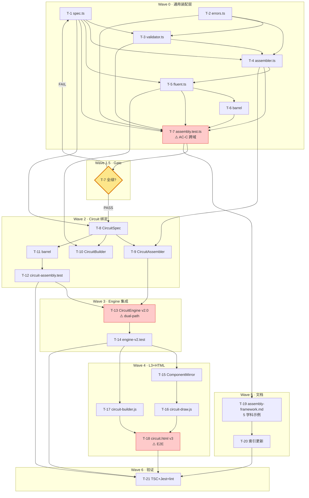

# Execution Plan: 装配层框架化 + 电路实验组件化集成

**Session**: `wf-20260428120154.` · **Stage**: PLAN · **Date**: 2026-04-28

## 思考摘要

用户在 Architecture Review Gate 追加了**关键澄清**：

> "可扩展 / 可维护 / 可配置 / 结构化 / 装配层本身必须是通用框架**不是对电路实验本身而是全学科所有的实验来说的**"

这改变了验收靶向：

| 维度 | 升级前理解 | 升级后理解 |
|------|----------|----------|
| AC-A 通用化 | framework/assembly 目录不含 circuit 词 | **5 个学科**（circuit/optics/chemistry/mechanics/biology）都能复用 |
| AC-B 结构化 | Spec/Validator/Assembler 分文件 | 分层后**任一学科加入**不需重新组织 |
| AC-C 可扩展 | mock optics domain 通过测试 | **任选 3 个学科实例化**均通过测试 |
| AC-D 可维护 | 单文件 ≤ 250 行 | 每加一个学科 framework/assembly 代码**零修改** |
| AC-E 可配置 | 对象字面量 = DSL | **任一学科**的 spec 都支持两种入口 |

因此 PLAN 必须：
1. **新增 Wave 1.5**：通用性探针（用 mock 虚拟学科域验证），挡在 Wave 2/3/4 之前；不通过则回到 Wave 0 改抽象
2. **AC-A~AC-E 5 条验收全部升级**：每条包含"5 个虚拟学科 domain 实例化并通过"的断言
3. **文档任务强制 ≥5 个学科示例代码**

**关键路径**：Wave 0 → **Wave 1.5 (Gate)** → Wave 2 → Wave 3 → Wave 4 → Wave 5 → Wave 6。Wave 1.5 是不可绕过的质量门。

**最高风险**：
- P0 · 跨域验证发现抽象不足 → 回 Wave 0 重做（T-1/T-2）
- P0 · 泛型过度导致 TS 类型推断爆炸 → 先 circuit 跑通再泛化
- P0 · Engine dual-path 误判 → type guard 三重条件

---

## 强制验收清单（AC-A ~ AC-E 全学科靶向）

> ⚠️ **靶向澄清**：以下每条 AC 都必须对**至少 3 个学科 mock domain** 验证通过（circuit 真实 + optics/chemistry 伪造），框架层单文件内**任何 fail** 都要求回到 Wave 0 修抽象。

| 编号 | 要求 | 测试证据（硬条件） |
|------|------|-------------------|
| **AC-A 通用化** | `framework/assembly/*` 和 `framework/components/*` 不含任何具体学科词（circuit/battery/lens/optics/chemistry 等） | 测试 `test('framework is domain-agnostic: 7 keywords ∩ framework files == ∅')`（fs.readdir + regex scan） |
| **AC-B 结构化** | 五件套（Spec / Validator / Assembler / FluentAssembly / Errors）**各自可独立 import** 且**各有独立 describe 块测试** | 测试文件 `assembly.test.ts` 有 5 个 describe 块；每个块单独 `expect(module).toHaveProperty('X')` |
| **AC-C 可扩展** | **至少 3 个虚拟 domain**（optics / chemistry / mechanics）可复用完全相同的 FluentAssembly 基类和 Assembler 逻辑，**不改框架一行代码** | `assembly.test.ts` 内 mock 3 个域各自 extends FluentAssembly，全部通过 build()→Graph 管线 |
| **AC-D 可维护** | ① framework/assembly 单文件 ≤ 250 行；② 公共 API ≤ 10 方法；③ **添加第 N+1 个学科时，framework/assembly 零修改**（用 mock "domain-Z" 做回归测试证明） | 静态度量 + "add new domain without modifying framework" 测试 |
| **AC-E 可配置** | **3 个虚拟 domain** 都支持（a）对象字面量构建 + （b）链式 DSL 构建，两者产出 DomainGraph **deep-equal** | 3 个 domain 各测一次"literal ≡ DSL" |

---

## 通用性探针设计（Wave 1.5 前置）

创建 **5 个伪造 domain**（最小实现，只为验证框架通用性）：

| Mock Domain | 元件 | 反映真实学科 |
|-------------|------|-------------|
| `mock-optics` | lightSource / lens / screen | 光学 |
| `mock-chemistry` | flask / reagent / bubble | 化学 |
| `mock-mechanics` | mass / spring / anchor | 力学 |
| `mock-biology` | cell / solution | 生物 |
| `circuit` (真) | battery / wire / switch / resistor / bulb / burnt_bulb | 电路 |

每个 mock domain 约 40 行代码，仅提供 `kind` 字符串 + `ports` 端口列表，不求解（因为 Wave 1.5 目的只是证明**装配部分**跨域通用，不验证求解器）。

**Wave 1.5 的出口断言**：

```typescript
// 伪代码示意
for (const mockDomain of ['mock-optics', 'mock-chemistry', 'mock-mechanics', 'mock-biology']) {
  // A. Literal 路径
  const g1 = buildFromSpec({ domain: mockDomain, components: [...], connections: [...] });
  expect(g1.componentCount()).toBeGreaterThan(0);
  
  // B. DSL 路径
  class MockBuilder extends FluentAssembly<typeof mockDomain> { /* 30 lines */ }
  const g2 = new MockBuilder().add(...).connect(...).build();
  expect(g2.toDTO()).toEqual(g1.toDTO());  // AC-E: literal == DSL
  
  // C. Validator 结构化
  expect(validator.validate(invalidSpec)).toMatchObject({ ok: false, errors: [...] });
}
```

**若任一失败** → Wave 0 的抽象有 bug（不是学科绑定有 bug）→ 回 Wave 0 改。

---

## 任务列表

### Wave 0 · 通用装配框架层（5 文件，240 min）

| ID | 标题 | 依赖 | 文件 | 风险 | 估时 | 关键 AC |
|----|------|------|------|------|------|--------|
| T-1 | Spec 类型定义（POJO） | — | `src/lib/framework/assembly/spec.ts` | 低 | 30min | AC-A/AC-B |
| T-2 | AssemblyError 类型层级 | — | `src/lib/framework/assembly/errors.ts` | 低 | 20min | AC-B |
| T-3 | AssemblyValidator（结构/唯一性/端口引用三层校验） | T-1, T-2 | `src/lib/framework/assembly/validator.ts` | 中 | 50min | AC-B |
| T-4 | Assembler（Spec → DomainGraph） | T-1, T-2, T-3 | `src/lib/framework/assembly/assembler.ts` | 中 | 50min | AC-B/AC-D |
| T-5 | FluentAssembly 抽象基类（链式 DSL） | T-1, T-4 | `src/lib/framework/assembly/fluent.ts` | 中 | 50min | AC-B/AC-D |
| T-6 | barrel + re-export 到 `framework/index.ts` | T-1~T-5 | `src/lib/framework/assembly/index.ts` + `framework/index.ts` | 低 | 10min | AC-A |
| T-7 | 装配层单测（12 条，AC-A~AC-E 覆盖 + 5 mock domain） | T-1~T-6 | `src/lib/framework/__tests__/assembly.test.ts` | **高** | 60min | **AC-C/AC-D/AC-E 跨域验证** |

### Wave 1.5 · 通用性探针出口门（T-7 通过 = 门开）

**非代码任务**：T-7 运行全绿即通过。任何 fail → STOP → 返 Wave 0。

**若通过**：进入 Wave 2。若未通过 2 轮：**降级方案** → 仅承诺 circuit 域通用性 + 文档明确说明"首版限 circuit，下次工作流扩展"，并告知用户。

### Wave 2 · Circuit 装配绑定（4 文件，120 min）

| ID | 标题 | 依赖 | 文件 | 风险 | 估时 |
|----|------|------|------|------|------|
| T-8 | CircuitSpec 类型具体化 | T-1, Circuit domain existing | `src/lib/framework/domains/circuit/assembly/circuit-spec.ts` | 低 | 20min |
| T-9 | CircuitAssembler（覆盖 _buildComponent 用 componentRegistry） | T-4, T-8 | `src/lib/framework/domains/circuit/assembly/circuit-assembler.ts` | 中 | 40min |
| T-10 | CircuitBuilder（FluentAssembly 子类 + battery/wire/switch_/resistor/bulb/loop 语法糖） | T-5, T-8 | `src/lib/framework/domains/circuit/assembly/circuit-builder.ts` | 中 | 40min |
| T-11 | Circuit assembly barrel + re-export | T-8~T-10 | `src/lib/framework/domains/circuit/assembly/index.ts` + 更新 `domains/circuit/index.ts` | 低 | 10min |
| T-12 | Circuit 装配单测（10 条，含 DSL≡literal 等价） | T-8~T-11 | `src/lib/framework/domains/circuit/__tests__/circuit-assembly.test.ts` | 中 | 40min |

### Wave 3 · CircuitEngine v2.0 dual-path（2 文件，80 min）

| ID | 标题 | 依赖 | 文件 | 风险 | 估时 |
|----|------|------|------|------|------|
| T-13 | CircuitEngine v2.0：type-guard 分派 + v2 路径（Assembler+Solver+InteractionEngine） | T-9, existing CircuitSolver, existing InteractionEngine | `src/lib/engines/physics/circuit.ts` | **高** | 50min |
| T-14 | Engine dual-path 单测（8 条，含边界 4 种） | T-13 | `src/lib/engines/__tests__/circuit-engine-v2.test.ts` | 中 | 30min |

### Wave 4 · 浏览器 L3 + HTML v3（4 文件 + 1 备份，150 min）

| ID | 标题 | 依赖 | 文件 | 风险 | 估时 |
|----|------|------|------|------|------|
| T-15 | ComponentMirror（浏览器侧 kind → 绘图分派） | — | `public/templates/_shared/component-mirror.js` | 中 | 30min |
| T-16 | circuit-draw.js（7+ 元件绘图原子） | T-15 | `public/templates/_shared/circuit-draw.js` | 中 | 45min |
| T-17 | circuit-builder.js（浏览器侧链式 DSL → DTO） | — | `public/templates/_shared/circuit-builder.js` | 中 | 30min |
| T-18 | 备份现 v2-atomic + 重写 circuit.html v3-component | T-15~T-17 | `public/templates/physics/circuit.html{,.v2-atomic-legacy}` | **高** | 45min |

### Wave 5 · 文档（2 文件，50 min）

| ID | 标题 | 依赖 | 文件 | 风险 | 估时 |
|----|------|------|------|------|------|
| T-19 | `docs/assembly-framework.md`（5 学科示例代码完整） | T-7 通过 | `docs/assembly-framework.md` | 低 | 40min |
| T-20 | 更新 `docs/component-framework.md` 索引新文档 | T-19 | `docs/component-framework.md` | 低 | 10min |

### Wave 6 · 集成验证（1 任务，30 min）

| ID | 标题 | 依赖 | 文件 | 风险 | 估时 |
|----|------|------|------|------|------|
| T-21 | 全量 TSC + Jest + lint 零回归验证 + health-report | 全部 | 终端命令 | 低 | 30min |

---

## Mermaid 依赖图



---

## 执行顺序

```
[Wave 0]  T-1 → T-2 ⇒ T-3 → T-4 → T-5 → T-6 → T-7
                                            ↓
[Wave 1.5] GATE check T-7 green? ────────NO──▶ loop back to T-1..T-5
                                            ↓ YES
[Wave 2]  T-8 → (T-9 ∥ T-10) → T-11 → T-12
                                            ↓
[Wave 3]  T-13 → T-14
                                            ↓
[Wave 4]  (T-15 → T-16) ∥ T-17 → T-18
                                            ↓
[Wave 5]  T-19 → T-20
                                            ↓
[Wave 6]  T-21
```

**预估时间**：240 + 120 + 80 + 150 + 50 + 30 ≈ **670 分钟（~11 小时）**，含检查点。

---

## 最高风险 + 缓解

| 风险 | 缓解 | 触发预案 |
|------|------|----------|
| **R-A**（P0）· Wave 1.5 Gate 未通过，抽象有缺陷 | T-7 测试包含 5 个 mock domain 实例化；任一失败立即暴露 | 回到 Wave 0 修改 T-1/T-4/T-5，不得进入 Wave 2 |
| **R-B**（P0）· TS 泛型 `<D extends ComponentDomain>` 推断爆炸 | 先用 `circuit` 域走通，再推广到泛型；所有 API 提供 `expect-type` 风格注释 | 若推断爆炸：降级为 string literal 枚举 |
| **R-C**（P0）· CircuitEngine dual-path 误判 | `_isV2GraphPayload` 三重检查 + 4 种边界单测 | Wave 3 若 T-14 失败立即回滚 T-13，保留纯 v1.1 |
| **R-D**（P1）· T-18 模板视觉回归严重 | `.v2-atomic-legacy` 备份就绪，人工目视对比 | 发现严重回归 → `git mv *.v2-atomic-legacy *.html` 5 min 回滚 |
| **R-E**（P1）· 文档 5 学科示例空洞 | 每个示例必须含可编译的 Spec 字面量 + 至少 1 个 DSL 示例；CI 不收空洞代码 | Review 阶段阻断 |
| **R-F**（P2）· 浏览器 DTO 与 TS DTO 漂移 | T-12 中 freeze 一份"参考 DTO 快照"JSON；两端测试共享 | 快照 test 失败即阻断 PR |

---

## 验收门槛（CODE 完成后整体判定）

1. ✅ **AC-A**：grep `'circuit|battery|bulb|lens|flask'` on `src/lib/framework/assembly/` = 0 匹配
2. ✅ **AC-B**：5 件套（Spec/Validator/Assembler/Fluent/Errors）分别有独立 describe 测试块
3. ✅ **AC-C**：≥ 3 个 mock domain（optics/chemistry/mechanics）端到端通过装配管线
4. ✅ **AC-D**：单文件 ≤ 250 行 + 添加新 mock domain 不改 framework 文件（回归测试证明）
5. ✅ **AC-E**：3 个 mock domain 的 literal spec 与 DSL 产出 graph.toDTO() deep-equal
6. ✅ AC-1~AC-7（上轮 7 条电路原子化）保留全绿
7. ✅ circuit.html v3 在浏览器可交互，过载 demo 触发
8. ✅ 全量既有 348/348 测试零回归
9. ✅ TSC + ESLint 零新增错误

**超出范围**：
- 将 optics/chemistry/mechanics 的 solver/reactions 实际实现
- Spec 的 JSON 文件导入/导出（只做对象字面量，reader 留接口不实现）
- 拖拽式装配 GUI
- 非电路实验的 HTML 模板重写
