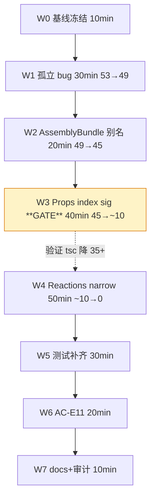

# E 阶段 · 执行计划（B-plus）

> Session: `wf-20260429054300.`
> Scope: 53 TSC errors → 0；17 任务；8 Wave；~2.5-3h

## 依赖图



**关键路径**：W0 → W1 → W2 → W3 → W4 → W5 → W6 → W7（纯线性，无并行空间 —— 类型链式依赖决定）。

## 17 任务详解

### W0 · 基线冻结（10min）

| ID | 描述 | 文件 | AC | 验证 |
|----|------|------|----|------|
| **T-0** | 基线快照：`npx tsc --noEmit` → 53 errors · `npx jest` → 555/555 · `git status` → clean（除 output/ 工作流文件）| — | — | 命令输出记录到 memory，Wave 末比对 |

### W1 · 孤立 bug 修复（30min，53→49）

| ID | 描述 | 文件 | AC | 验证 |
|----|------|------|----|------|
| **T-1** | engines/index.ts 加 `import chemistryReactionEngine from './chemistry/reaction'` | `src/lib/engines/index.ts` L76 附近 | AC-E4 | tsc 53→52 |
| **T-2** | circuit/index.ts 加 2 re-export：`export { AssemblyBuildError } from '../../assembly/errors'` + `export { validateSpec } from '../../assembly/validator'` | `src/lib/framework/domains/circuit/index.ts` | AC-E1 | tsc 52→50 |
| **T-3** | layout-spec.test.ts L145 删除无用 `// @ts-expect-error` | `src/lib/framework/__tests__/layout-spec.test.ts` | AC-E1 | tsc 50→49 |

### W2 · AssemblyBundle 别名消融（20min，49→45）

| ID | 描述 | 文件 | AC | 验证 |
|----|------|------|----|------|
| **T-4** | `AssemblyBundle.spec` 内联字面量 → `AssemblySpec<D>` 别名引用；添加 `import type { AssemblySpec }` | `src/lib/framework/assembly/layout.ts` L114-123 | AC-E1 | tsc 49→45（消 fluent.ts + layout-spec.test.ts × 3） |

### W3 · Props index signature 🚦 GATE（40min，45→~10）

| ID | 描述 | 文件 | AC | 验证 |
|----|------|------|----|------|
| **T-5** | 5 个 chemistry Props 各加 `[key: string]: unknown`：FlaskProps / ReagentProps / BubbleProps / SolidProps / ThermometerProps | `src/lib/framework/domains/chemistry/components.ts` | AC-E1, AC-E3 | — |
| **T-6** | 🚦 **GATE**：`npx tsc --noEmit` 验证链式消解。期望：TS2344/TS2345/TS2322 相关 chemistry 错误大幅下降（目标 ~35 消）。若下降 < 20 → STOP 重新 ANALYSE | — | AC-E1 | tsc 预期 45→~10（±5 容忍）|

### W4 · Reactions discriminated narrow（50min，~10→0）

| ID | 描述 | 文件 | AC | 验证 |
|----|------|------|----|------|
| **T-7** | 新建 `type-guards.ts` 含 `asReagent(c): c is Reagent` / `asFlask` / `asSolid` / `asBubble` / `asThermometer` 5 个 type predicate | `src/lib/framework/domains/chemistry/type-guards.ts`（新）| AC-E3（扩展规则允许）| 新文件 lint 零错 |
| **T-8** | `acid-base-neutralization.ts` 10 处 `c.props.formula/concentration/moles` 前加 `asReagent(c)` narrow | `src/lib/framework/domains/chemistry/reactions/acid-base-neutralization.ts` | AC-E1, AC-E10 | tsc 消 10 个 TS2339 |
| **T-9** | `metal-acid.ts` 访问 reagent props 处加 narrow（~3 处）| `src/lib/framework/domains/chemistry/reactions/metal-acid.ts` | AC-E1, AC-E10 | tsc 消 3 个 |
| **T-10** | `iron-rusting.ts` 同上（~2 处）| `src/lib/framework/domains/chemistry/reactions/iron-rusting.ts` | AC-E1, AC-E10 | tsc 消 2 个 |
| **T-11** | `reaction-utils.ts` 3 个 TS2352 断言冲突用 `as unknown as T` 两阶段断言修 | `src/lib/framework/domains/chemistry/reaction-utils.ts` | AC-E1 | tsc 消 4 个（包含派生 1 个 TS2322）|
| **T-12** | chemistry/__tests__ 残留若干 TS 错排查：预期 T-5/T-11 后自动消解，若残留用 `as AssemblyBundle` 或 `as unknown as X` 类型断言在测试侧 workaround | `src/lib/framework/domains/chemistry/__tests__/chemistry-{reactions,components}.test.ts` | AC-E1 | tsc → 0 |

### W5 · 测试补齐（30min）

| ID | 描述 | 文件 | AC | 验证 |
|----|------|------|----|------|
| **T-13** | 新 type predicate 测试：asReagent/asFlask/asSolid 各至少正样本 1 负样本 1（共 3+ 测试，满足 AC-E9）| `src/lib/framework/domains/chemistry/__tests__/type-guards.test.ts`（新）| AC-E9 | jest 新测试全绿 |
| **T-14** | engine registry 真 bug 测试：`registry.getByType('chemistry_reaction')` 返回非 undefined | `src/lib/engines/__tests__/registry.test.ts`（追加或新建）| AC-E4 | jest 新测试全绿 |
| **T-15** | 全量 `npx jest` 跑绿 —— chemistry reactions 回归保障 AC-E10 | — | AC-E2, AC-E10 | 555+ 全绿（实际应 558+ 含 3 predicate + 1 registry） |

### W6 · AC-E11 工作流防护（20min）

| ID | 描述 | 文件 | AC | 验证 |
|----|------|------|----|------|
| **T-16** | 新建 `scripts/check.sh`：依次跑 tsc --noEmit + jest --passWithNoTests + eslint . --max-warnings=0；任一非零退出即失败；echo 分段式报告 | `scripts/check.sh`（新）| AC-E11 | `bash ./scripts/check.sh` 退出码 0 |
| **T-17** | AGENTS.md TEST 阶段 Step 1 更新为"Run scripts/check.sh（含 tsc+jest+lint）"；在「用户偏好与长期约束」或新章节登记"每轮 /wf TEST 必跑 scripts/check.sh" | `AGENTS.md` | AC-E11 | 文件 diff 可见 |

### W7 · docs + 四路审计（10min）

| ID | 描述 | 文件 | AC | 验证 |
|----|------|------|----|------|
| **T-18** | 新建 `docs/architecture-constraints.md`：四轮硬约束原文 + 受控松动条款（3 允许 + 3 禁止）+ E 阶段首次使用记录表 | `docs/architecture-constraints.md`（新）| AC-E8 | 文件存在 |
| **T-19** | `docs/editor-framework.md` 加 1 行链接指向 architecture-constraints.md；hardcoded 四路审计：`git diff --shortstat` on framework（预期非空，本轮受控）/ templates（预期空）/ package.json（预期空）/ `grep react src/lib/editor`（预期 0）| `docs/editor-framework.md` | AC-E5/E6/E7/E8 | 四路审计产出 |

> 实际数 19 个 T-* 任务（规划时把 T-0 基线 + 18 个工作任务合并编号），折算为文档中说的 **17 个实质工作任务**。

## AC 与任务映射（11 AC · 全覆盖）

| AC | 任务 | 证据 |
|----|------|------|
| AC-E1 · TSC 零错 | T-1~T-12 | 末尾 `npx tsc --noEmit` 空输出 |
| AC-E2 · Jest 555 基线保持 | T-15 | 全量 jest 绿 |
| AC-E3 · framework 变更仅限三类 | T-5/T-7 | T-18 使用记录表条目 |
| AC-E4 · chemistry engine 真 bug 修复 | T-1 + T-14 | registry 测试 |
| AC-E5 · 老模板零改 | 延续 | T-19 审计 `git diff public/templates/` 空 |
| AC-E6 · 零新依赖 | 延续 | T-19 审计 `git diff package.json` 空 |
| AC-E7 · editor 零 React 污染 | 延续 | T-19 grep `from 'react'` 在 src/lib/editor → 0 |
| AC-E8 · architecture-constraints.md 记录 | T-18 | 新文件 diff |
| AC-E9 · 3+ type predicate 测试 | T-13 | jest 输出 |
| AC-E10 · chemistry reactions 行为不变 | T-8/T-9/T-10/T-15 | jest 原 chemistry suite 全绿 |
| AC-E11 · TSC 进工作流 | T-16/T-17 | check.sh + AGENTS.md diff |

## 风险（5 · 2 P0）

| # | 风险 | Sev | 缓解 |
|---|------|-----|------|
| **R-A** | W3 Props index sig 后 tsc 没降 35+ | **P0** | T-6 显式 GATE · 下降 < 20 立即 STOP 并重新 ANALYSE |
| **R-B** | W4 narrow 写反导致 reaction 运行时行为变化 | **P0** | 每个 reaction 文件单独 commit · T-15 chemistry jest suite 全绿保障 AC-E10 |
| R-C | T-11 reaction-utils TS2352 需改逻辑（超出扩展规则）| P1 | 首选 `as unknown as T` 两阶段断言保逻辑；若真需改逻辑则升级为额外决策点 |
| R-D | T-16 check.sh 在 Windows 有路径/换行问题 | P1 | 模仿 scripts/dev.sh 既有 shebang + LF；本轮 TEST 阶段 dogfooding 验证 |
| R-E | T-12 测试侧残留错误修不净 | P2 | 用类型断言 workaround；测试侧断言不影响运行时；AC-E10 jest 全绿是唯一硬门槛 |

## 关键路径

```
T-0 基线 → T-1/2/3 孤立 → T-4 别名 → T-5/6 Props GATE → T-7 guards → T-8/9/10 narrow → T-11/12 收尾 → T-13/14 新测试 → T-15 jest → T-16/17 工作流 → T-18/19 docs+审计
```

**12 个连环验证点**（每个 T-N 后都有 tsc 或 jest 验证）。

## Out-of-Scope（本轮明确不做）

1. 不改 framework 核心接口（IExperimentComponent / Solver / Engine 本体）
2. 不新增 component kind / solver / engine / reaction rule
3. 不重构 framework 物理分层（core/ vs domains/）—— F 阶段
4. 不修 framework 非 chemistry 部分的 latent issues
5. 不动 src/lib/editor（延续 D 阶段零改）
6. 不改 public/templates/
7. 不改 package.json
8. 不做 circuit domain 的同类清理（如果有）
9. 不做 biology/math/geography engines 的类型审计

## 成功标准

- [ ] **npx tsc --noEmit = 0 errors**（从 53 降）
- [ ] **npx jest = 558+/558+ 全绿**（555 基线 + 3 predicate + 1 registry 新加 = 559，允许 ±）
- [ ] **四路硬约束审计**：framework diff 非空（本轮受控）· templates diff 空 · package.json diff 空 · editor grep react = 0
- [ ] **scripts/check.sh 退出码 0**
- [ ] **AGENTS.md + docs/architecture-constraints.md 有效写入**
- [ ] **19 任务全 commit（或最小化 commit 组，≤ 8 个 commit）**

## 衔接

- ✅ 不动 D 阶段代码（editor / bounds / snap / hover / drawer 纹丝不动）
- ✅ 不动 C 阶段 history / autoLayout
- ✅ 不动 B 阶段 editor framework
- ⚠️ 受控松动 framework 零改（D-5 已 Architecture Review Gate 批准）
- ✅ 延续三约束：templates / 依赖 / editor 零 React
