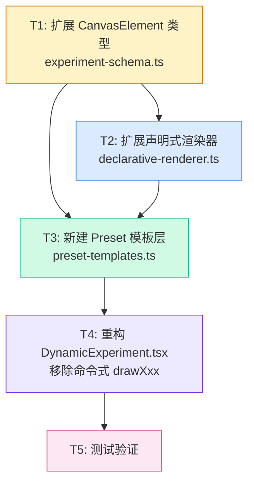

# 执行计划：组件化渲染引擎

## 概述

将 EGPSpace 渲染系统从三重分裂（命令式 drawXxx + CanvasElement 8种 + DrawElement 21种）统一为单一声明式组件系统。

**关键路径**：T1 → T2 → T3 → T4 → T5（测试）

---

## 任务依赖图



**并行机会**：T2 和 T3 的前半部分（类型定义）可以在 T1 完成后并行开始，但 T3 的渲染器调用需要 T2 完成。

---

## T1：扩展 CanvasElement 类型系统

**文件**：`src/lib/experiment-schema.ts`

**验收标准**：
- AC-T1-1：`ElementType` 从 8 种扩展到 21 种，新增 `spring | wave | pendulum | forceArrow | lightRay | beaker | molecule | bubble | reaction | axis | functionPlot | point | group`
- AC-T1-2：`CanvasElement` 接口新增所有必要字段（全部可选），包括 `cx`/`cy`/`r`（circle 兼容）、`length`/`coils`/`amplitude`/`wavelength`（物理专用）、`fillLevel`/`liquidColor`/`moleculeType`（化学专用）、`fn`/`xMin`/`xMax`/`yMin`/`yMax`（数学专用）、`children`/`transform`（组合专用）
- AC-T1-3：TypeScript 编译 0 errors（`npx tsc --noEmit`）
- AC-T1-4：现有 8 种类型的所有字段保持不变（向后兼容）

**具体修改**：

```typescript
// 修改位置：src/lib/experiment-schema.ts L68
// 将 ElementType 从 8 种扩展到 21 种

export type ElementType =
  // 基础几何（原有 8 种，保留）
  | 'rect' | 'circle' | 'line' | 'arrow' | 'text' | 'polygon' | 'arc' | 'image'
  // 物理专用（新增 5 种）
  | 'spring' | 'wave' | 'pendulum' | 'forceArrow' | 'lightRay'
  // 化学专用（新增 4 种）
  | 'beaker' | 'molecule' | 'bubble' | 'reaction'
  // 数学专用（新增 3 种）
  | 'axis' | 'functionPlot' | 'point'
  // 组合（新增 1 种）
  | 'group';

// 修改位置：src/lib/experiment-schema.ts L70-L110（CanvasElement 接口）
// 在现有字段后追加新字段（全部可选）
```

**风险**：无（纯类型扩展，向后兼容）

---

## T2：扩展声明式渲染器

**文件**：`src/lib/declarative-renderer.ts`

**依赖**：T1 完成

**验收标准**：
- AC-T2-1：`RENDERERS` 映射覆盖全部 21 种 `ElementType`，无 `renderPlaceholder` 降级（除 `image` 外）
- AC-T2-2：`renderSpring(ctx, el, ...)` 渲染弹簧（螺旋线），支持 `length`/`coils`/`amplitude` 动态绑定
- AC-T2-3：`renderWave(ctx, el, ...)` 渲染正弦波，支持 `amplitude`/`wavelength`/`phase` 动态绑定
- AC-T2-4：`renderBeaker(ctx, el, ...)` 渲染烧杯，支持 `fillLevel`/`liquidColor` 动态绑定（液面高度可变）
- AC-T2-5：`renderAxis(ctx, el, ...)` 渲染坐标轴，支持 `xMin`/`xMax`/`yMin`/`yMax`
- AC-T2-6：`renderFunctionPlot(ctx, el, ...)` 渲染函数图像，`fn` 字段使用白名单表达式解析（仅允许 `Math.*` 和基本运算符）
- AC-T2-7：`renderForceArrow(ctx, el, ...)` 渲染带标签的力箭头，支持 `angle`/`magnitude`/`label` 动态绑定
- AC-T2-8：`renderPendulum(ctx, el, ...)` 渲染摆，支持 `anchorX`/`anchorY`/`length`/`angle`/`bobRadius`
- AC-T2-9：`renderLightRay(ctx, el, ...)` 渲染光线，支持 `angle`/`length`
- AC-T2-10：`renderMolecule`/`renderBubble`/`renderReaction`/`renderPoint`/`renderGroup` 各自正确渲染

**新增渲染器清单**（13 种）：

| 渲染器 | 关键参数 | 动态绑定 |
|--------|---------|---------|
| `renderSpring` | x, y, length, coils=8, amplitude=8 | length |
| `renderWave` | x, y, width, amplitude, wavelength, phase=0 | amplitude, phase |
| `renderPendulum` | anchorX, anchorY, length, angle, bobRadius=12 | angle |
| `renderForceArrow` | x, y, angle, magnitude, label | magnitude, angle |
| `renderLightRay` | x, y, angle, length | angle |
| `renderBeaker` | x, y, width, height, fillLevel, liquidColor | fillLevel |
| `renderMolecule` | x, y, moleculeType='H2O', scale=1 | x, y |
| `renderBubble` | x, y, radius, count=3 | y |
| `renderReaction` | x, y, reactants, products | — |
| `renderAxis` | x, y, xMin, xMax, yMin, yMax | — |
| `renderFunctionPlot` | x, y, width, height, fn, xMin, xMax | — |
| `renderPoint` | x, y, size=4 | x, y |
| `renderGroup` | x, y, children, transform | transform |

**风险**：`renderFunctionPlot` 的 `fn` 字段安全性（XSS），缓解：白名单解析器

---

## T3：新建 Preset 模板层

**文件**：`src/lib/preset-templates.ts`（新建）

**依赖**：T1 + T2 完成

**验收标准**：
- AC-T3-1：导出 `buildPresetElements(type, layout, params, computed): CanvasElement[]` 函数
- AC-T3-2：`buoyancy` preset 包含液体背景、液面线、物体矩形、浮力箭头（`forceArrow`）、重力箭头（`forceArrow`）、浸入比例文字，共 6 个元素
- AC-T3-3：`lever` preset 包含支点三角形（`polygon`）、杠杆横梁（`rect`）、刻度线（`line` × 11）、左右重物（`rect` × 2）、状态文字（`text`），共 16+ 个元素
- AC-T3-4：`refraction` preset 包含空气区域（`rect`）、介质区域（`rect`）、界面线（`line`）、法线（`line`）、入射光线（`line`）、折射/反射光线（`line`）、角度弧（`arc` × 2）、标注文字（`text` × 4），共 12+ 个元素
- AC-T3-5：`circuit` preset 包含电源（`rect`）、电阻（`rect`）、导线（`line` × 4）、电流箭头（`arrow` × 2）、数值文字（`text` × 3），共 12+ 个元素
- AC-T3-6：相同参数下，preset 模板渲染结果与原 `drawXxx()` 函数视觉上等价（关键元素位置误差 < 5px）
- AC-T3-7：未知 `type` 时返回空数组 `[]`，不抛出异常

**关键实现细节**：

```typescript
// preset-templates.ts 核心结构
export type PresetTemplateType = 'buoyancy' | 'lever' | 'refraction' | 'circuit';

export function buildPresetElements(
  type: string,
  layout: { width: number; height: number },
  params: Record<string, number>,
  computed: Record<string, number>
): CanvasElement[] {
  switch (type) {
    case 'buoyancy': return buildBuoyancyElements(layout, params, computed);
    case 'lever': return buildLeverElements(layout, params, computed);
    case 'refraction': return buildRefractionElements(layout, params, computed);
    case 'circuit': return buildCircuitElements(layout, params, computed);
    default: return [];
  }
}
```

**浮力 preset 关键坐标还原**（来自 `drawBuoyancy()` 的精确还原）：
- `liquidLevel = height * 0.6`（液面高度）
- `objectX = width / 2 - 30`（物体 x 坐标）
- `objectY = liquidLevel - objectHeight * immersionRatio`（物体 y 坐标，依赖 `computed.objectImmersionRatio`）
- `arrowLength = min(buoyantForce / 2, 60)`（浮力箭头长度，依赖 `computed.buoyantForce`）

**风险**：`computed.objectImmersionRatio` 需要从 `calculation.visualization` 注入，T4 中处理

---

## T4：重构 DynamicExperiment.tsx

**文件**：`src/components/DynamicExperiment.tsx`

**依赖**：T3 完成

**验收标准**：
- AC-T4-1：`drawBuoyancy`/`drawLever`/`drawRefraction`/`drawCircuit`/`drawGeneric` 五个函数被移除
- AC-T4-2：渲染路径统一：先检查 `schema?.canvas?.elements?.length`，若有则直接用 `renderCanvas()`；若无则调用 `buildPresetElements()` 生成元素后再用 `renderCanvas()`
- AC-T4-3：`calculation.visualization` 中的值（`objectImmersionRatio` 等）被注入到 `computed` 字典中，供 preset 模板使用
- AC-T4-4：`buildPresetElements` 从 `preset-templates.ts` 导入，不在 `DynamicExperiment.tsx` 中内联
- AC-T4-5：现有浮力/杠杆/折射/电路实验的渲染效果与重构前视觉等价（用户无感知）
- AC-T4-6：TypeScript 编译 0 errors

**具体修改**：

```typescript
// 修改 useEffect 中的渲染逻辑（约 L155-L175）
useEffect(() => {
  if (!canvasRef.current || !calculation || !rules) return;
  const canvas = canvasRef.current;
  const ctx = canvas.getContext('2d');
  if (!ctx) return;

  // 将 visualization 值注入 computed 字典
  const computed: Record<string, number> = {
    ...calculation.results,
    ...(calculation.visualization ?? {}),
  };

  const layout = schema?.canvas?.layout ?? { width: canvas.width, height: canvas.height, background: '#ffffff' };

  // 统一声明式路径
  const elements = schema?.canvas?.elements?.length
    ? schema.canvas.elements
    : buildPresetElements(rules.type, layout, params, computed);

  renderCanvas(ctx, elements, layout, params, computed);
}, [params, calculation, rules, schema]);
```

**风险**：`calculation.visualization` 的键名（`objectImmersionRatio`）需要与 preset 模板中使用的键名完全一致

---

## 任务执行顺序

```
T1（30分钟）→ T2（60分钟）→ T3（60分钟）→ T4（30分钟）→ T5（30分钟）
总计：约 3.5 小时
```

**最高风险任务**：T3（Preset 模板视觉等价性）
- 缓解策略：在 T4 完成后，保留原 `drawXxx()` 函数作为注释，通过视觉对比验证后再删除
- 失败快速检测：T3 完成后立即运行 `npx tsc --noEmit` 验证类型，再手动测试浮力实验渲染效果

---

## 文件变更清单

| # | 文件 | 操作 | 变更内容 |
|---|------|------|---------|
| 1 | `src/lib/experiment-schema.ts` | 修改 | `ElementType` 扩展到 21 种，`CanvasElement` 新增 15 个可选字段 |
| 2 | `src/lib/declarative-renderer.ts` | 修改 | 新增 13 种渲染器函数，扩展 `RENDERERS` 映射 |
| 3 | `src/lib/preset-templates.ts` | 新建 | 4 种实验的声明式 preset 定义，`buildPresetElements()` 函数 |
| 4 | `src/components/DynamicExperiment.tsx` | 修改 | 移除 5 个 `drawXxx()` 函数，重构 `useEffect` 渲染路径 |

**不变更的文件**：
- `src/lib/physics-engine.ts` — 计算引擎不受影响
- `src/lib/physics-knowledge.ts` — 知识库不受影响
- `src/lib/schema-validator.ts` — 验证层不受影响
- `src/components/interactive-experiment-canvas.tsx` — 保留现有 DrawElement 系统

---

## 思考摘要

| 问题 | 答案 |
|------|------|
| 关键路径是什么？ | T1→T2→T3→T4，总计约 3.5 小时 |
| 最高风险任务？ | T3（Preset 模板视觉等价性），需要精确还原 drawXxx() 的像素坐标计算 |
| 可以并行的任务？ | T2 和 T3 的类型定义部分可以并行，但 T3 的渲染器调用需要 T2 完成 |
| 最小可测试切片？ | T1+T2（4种新渲染器）+T3（buoyancy preset）= 第一个可验证切片 |
| 隐式依赖？ | calculation.visualization.objectImmersionRatio 需要在 T4 中注入到 computed 字典 |
