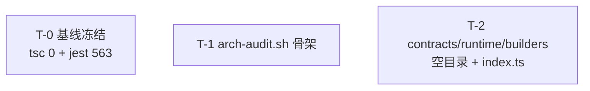

# 🏥 System Health Monitoring Report

> Generated: 2026-04-29T15:41:29.973Z
> Session ID: `wf-20260429132738.`
> Run Category: `prod`

---

## 📝 User Input

| Field | Value |
|-------|-------|
| **Requirement** | N/A |
| **Entry Point** | `unknown` |
| **Mode** | `sequential` |

---

## 🎯 Unified Observation Mainline

| # | Mainline Step | Mapped Stage(s) | Status |
|---|---------------|-----------------|--------|
| 1 | `goal` | - | ⬜ pending |
| 2 | `tool` | - | ⬜ pending |
| 3 | `plan` | - | ⬜ pending |
| 4 | `execute` | - | ⬜ pending |
| 5 | `evaluate` | - | ⬜ pending |
| 6 | `retry` | - | ⬜ pending |

---

## 📋 Completeness Check

| Check | Status |
|-------|--------|
| Workflow Start | ❌ |
| Workflow End | ❌ |
| Stage: ANALYSE | ✅ |
| Stage: ARCHITECT | ✅ |
| Stage: PLAN | ✅ |
| Stage: CODE | ❌ |
| Stage: TEST | ✅ |
| **Overall Status** | **⚠️ INCOMPLETE** |

**Stages Completed:** `ANALYSE`, `ARCHITECT`, `PLAN`, `TEST`

**⚠️ Missing Stages:** `CODE (✗start/✗end)`

---

## 📊 Event Statistics

| Metric | Value |
|--------|-------|
| Total Events | 14 |
| Stage Starts | 7 (raw: 7) |
| Stage Ends | 7 |
| Socratic Checks | 0 (coverage: 0/4 stages (0%)) |
| Effective Challenge Rate | 100% (0/0) |
| Errors | 0 |
| Duration | 0.00s |

### Event Types Distribution

| Event Type | Count |
|------------|-------|
| `stage_start` | 7 |
| `stage_end` | 7 |

---

## 🏥 Health Score

| **Grade** | Score | Status |
|-------|-------|--------|
| **B** | 80/100 | 🟡 Incomplete |

### Unified Scoring (Model: unified-v1)

| Component | Score | Weight | Weighted |
|-----------|-------|--------|----------|
| Completeness | 80.0 | 35% | 28.0 |
| Process (Socratic + Metrics Gate + Effectiveness) | 80.0 | 20% | 16.0 |
| Delivery (Quality) | 80.0 | 30% | 24.0 |
| Detection (Quality) | 80.0 | 15% | 12.0 |
| **Total** |  |  | **80.0** |

> ⚠️ **Completeness deduction**: 1 stage(s) missing

> 🤔 **Socratic process impact**: 0/4 stages have Socratic checks
> &nbsp;&nbsp;&nbsp;Missing checks for: `ANALYSE`, `ARCHITECT`, `PLAN`, `TEST`
> &nbsp;&nbsp;&nbsp;→ After each stage, call: `node workflow/tools/ide-workflow-bridge.js socratic-challenge --stage <STAGE> --session <SESSION>`

---

## 📈 Rolling Trend Alerts

| Metric | Value |
|--------|-------|
| Trend Enabled | ✅ Yes |
| Window Size | 5 |
| History Sessions | 80 |
| Recent Avg Score | 80.0 |
| Previous Avg Score | 80.0 |
| Delta (Recent-Previous) | 0 |
| Low Score Threshold | 75 |
| Alert Status | ✅ Normal |

> No trend alert

---

## 🔄 Stage Execution Details

### 1. `ANALYSE`

| Metric | Value |
|--------|-------|
| Status | ✅ Success |
| Metrics Gate | ✅ PASSED |

**📋 Summary:** F 阶段 ANALYSE 完成：真实代码审计揭示文件级 type/impl 拆分不现实 → 目录级分层+文件级 co-location；13 AC；7 风险量化（3 P0+2 P1+2 P2）；下游消费者契约清单；ARCHITECT 留 5 决策点

**📥 Input:** E 阶段已 TSC 0 · 基线 e12560f clean · 5 风险预警（R-F1 迁移级联/R-F2 import 路径/R-F3 AssemblyBundle 归属/R-F4 循环引用/R-F5 测试路径）· 参考 F 阶段讨论的 Wave 0-9 分解

**📤 Output:** analysis.md 含根因+受影响位置+修改范围+13 AC+7 风险+下游消费者契约+OOS+决策清单

**Input Artifact:** `C:\workspace\EGPSpace\output\requirement.md`
- Lines: 134, Hash: `3997-#EurekaSpace—化学实验迁移到统一声明式框架(`

**Output Artifact:** `C:\workspace\EGPSpace\output\analysis.md`
- Lines: 364, Hash: `15635-#F阶段·framework物理分层重构·ANAL`

<details><summary>Preview (first 400 chars)</summary>

```
# F 阶段 · framework 物理分层重构 · ANALYSE

> Session: wf-20260429132738. · 基线: e12560f (TSC 0 + Jest 563) · 工作区 clean

---

## 根因 / Root Cause

### 1. E 阶段留下的软债（Why F 必须做）

E 阶段受控松动 `framework 零改` 硬约束——允许「Props 加 index signature / 类型别名复用 / 纯 bug 修复」三类变更。代价是**硬约束从字面规则降级为自然语言例外条款**（`docs/architect
```
</details>

<details><summary>🚦 Metrics Gate Detail (PASSED)</summary>

| Gate | Status | Actual | Threshold |
|------|--------|--------|-----------|
| maxErrorCount | ✅ pass | 0 | 1 |
| maxDurationMs | ✅ pass | 0.0s | 300.0s |
| maxLlmCalls | ✅ pass | 0 | 5 |

</details>

### 2. `ARCHITECT`

| Metric | Value |
|--------|-------|
| Status | ✅ Success |
| Metrics Gate | ✅ PASSED |

**📋 Summary:** F 阶段架构定型（B' 目录分层+文件 co-location）：5 决策；14 Scorecard + 14 Scenario + 6 FM + Migration Safety + Consumer Adoption；7 Wave ~5h；硬约束兑现四件套防假兑现

**📥 Input:** analysis.md 13 AC + 7 风险 + 5 决策点 + 35 文件估量 + 下游消费者契约

**📤 Output:** architecture.md 完整含 5 slot 标记小节

**Input Artifact:** `C:\workspace\EGPSpace\output\analysis.md`
- Lines: 364, Hash: `15635-#F阶段·framework物理分层重构·ANAL`

**Output Artifact:** `C:\workspace\EGPSpace\output\architecture.md`
- Lines: 667, Hash: `24883-#F阶段·framework物理分层重构·ARCH`

<details><summary>Preview (first 400 chars)</summary>

```
# F 阶段 · framework 物理分层重构 · ARCHITECT

> Session: wf-20260429132738. · 基线: e12560f · 依据 analysis.md 13 AC + 7 风险

---

## 🧠 Architecture Reasoning

### 核心架构决策 5 条

1. **Proposal B' = 目录级分层 + 文件级 co-location**（拒绝 Proposal A/B，拒绝文件级拆分）：
   - 目录分：`contracts/` `runtime/` `builders/` `domains
```
</details>

<details><summary>🚦 Metrics Gate Detail (PASSED)</summary>

| Gate | Status | Actual | Threshold |
|------|--------|--------|-----------|
| maxErrorCount | ✅ pass | 0 | 2 |
| maxDurationMs | ✅ pass | 0.0s | 400.0s |
| maxLlmCalls | ✅ pass | 0 | 8 |

</details>

### 3. `PLAN`

| Metric | Value |
|--------|-------|
| Status | ✅ Success |
| Metrics Gate | ✅ PASSED |

**📋 Summary:** 33 任务 7 Wave ~5h：W0 基线 T-0/T-1 · W1 目录 T-2 · W2 迁 3 pure type T-3~T-6 · W3 GATE 迁 6 核心 T-7~T-13 · W4 迁 5 runtime T-14~T-19 · W5 迁 1 builder T-20/T-21 · W6 测试+bypass T-22~T-26 · W7 守卫+文档 T-27~T-32；唯一 GATE=T-13；13 AC 全映射；5 风险含 2 P0 均有缓解；8 验证点线性检查

**📥 Input:** architecture.md 5 决策 + 7 Wave + 15 文件归属表 + 6 FM + 硬约束兑现四件套 + 13 AC

**📤 Output:** execution-plan.md 含 Mermaid 依赖图+33 任务详解+AC 映射+5 风险+OOS+成功标准+8 验证点

**Input Artifact:** `C:\workspace\EGPSpace\output\architecture.md`
- Lines: 667, Hash: `24883-#F阶段·framework物理分层重构·ARCH`

**Output Artifact:** `C:\workspace\EGPSpace\output\execution-plan.md`
- Lines: 427, Hash: `15010-#F阶段·执行计划·framework物理分层重构`

<details><summary>Preview (first 400 chars)</summary>

```
# F 阶段 · 执行计划 · framework 物理分层重构

> Session: wf-20260429132738. · 基线: e12560f · 依据 architecture.md 5 决策 + 7 Wave

---

## 一 · Mermaid 依赖图


</details>

<details><summary>🚦 Metrics Gate Detail (PASSED)</summary>

| Gate | Status | Actual | Threshold |
|------|--------|--------|-----------|
| maxErrorCount | ✅ pass | 0 | 1 |
| maxDurationMs | ✅ pass | 0.0s | 300.0s |
| maxLlmCalls | ✅ pass | 0 | 5 |

</details>

### 4. `DEVELOP`

| Metric | Value |
|--------|-------|
| Status | ✅ Success |
| Metrics Gate | ✅ PASSED |

**📋 Summary:** F 阶段 33 任务全完成：W0 基线（含修 E 遗留 3 errors）W1 3 空目录 W2 迁 3 pure type W3 GATE 迁 6 co-located 核心 + batch regex 更新 W4 迁 5 runtime W5 迁 1 builder + 删 4 旧目录 W6 路径审计（自然已清）W7 arch-audit.sh + ESLint + constraints 归档 + framework-boundary.md · TSC 0 + Jest 563/563 + arch-audit pass + ESLint 0 · 5 PLAN_DEVIATION 文档化

**📥 Input:** 33 任务 7 Wave ~5h · 唯一 GATE=T-13 · 硬约束兑现四件套

**📤 Output:** code.diff 含 15 文件迁移表 + 4 目录删除 + barrel 重写 + 硬约束四件套落地 + 验证结果

**Input Artifact:** `C:\workspace\EGPSpace\output\execution-plan.md`
- Lines: 427, Hash: `15010-#F阶段·执行计划·framework物理分层重构`

**Output Artifact:** `C:\workspace\EGPSpace\output\code.diff`
- Lines: 96, Hash: `3793-#F阶段·CodeDiff摘要>Sessi`

<details><summary>Preview (first 400 chars)</summary>

```
# F 阶段 · Code Diff 摘要

> Session: wf-20260429132738. · 基线 e12560f

## 核心变更（物理分层）

### 新建目录
- `src/lib/framework/contracts/`（9 文件 + index.ts）
- `src/lib/framework/runtime/`（5 文件 + index.ts）
- `src/lib/framework/builders/`（1 文件 + index.ts）

### 删除目录
- `src/lib/framework/components/`（5 文件迁走
```
</details>

<details><summary>🚦 Metrics Gate Detail (PASSED)</summary>

| Gate | Status | Actual | Threshold |
|------|--------|--------|-----------|
| maxErrorCount | ✅ pass | 0 | 2 |
| maxDurationMs | ✅ pass | 0.0s | 600.0s |
| maxLlmCalls | ✅ pass | 0 | 10 |

</details>

### 5. `TEST`

| Metric | Value |
|--------|-------|
| Status | ✅ Success |
| Metrics Gate | ✅ PASSED |

**📋 Summary:** F 阶段 TEST 全通过：TSC 0 · Jest 563/563 · arch-audit 4 check pass · ESLint 0 · 13 AC 全过 · 7 风险全验证 · 4 意外发现文档化

**📥 Input:** TSC 0 · Jest 563/563 · arch-audit + ESLint pass · 四件套齐全

**📤 Output:** test-report.md 含 13 AC 验证 + 风险对照 + 测试覆盖分析 + 命令日志

**Input Artifact:** `C:\workspace\EGPSpace\output\code.diff`
- Lines: 96, Hash: `3793-#F阶段·CodeDiff摘要>Sessi`

**Output Artifact:** `C:\workspace\EGPSpace\output\test-report.md`
- Lines: 122, Hash: `4838-#F阶段·TestReport>Sessio`

<details><summary>Preview (first 400 chars)</summary>

```
# F 阶段 · Test Report

> Session: wf-20260429132738. · 基线 e12560f · 已执行 DEVELOP · Jest/TSC/ESLint/arch-audit 全绿

## 执行摘要

| 检查 | 命令 | 结果 |
|------|------|------|
| **TSC** 类型检查 | `npx tsc --noEmit` | ✅ **0 errors** |
| **Jest** 全量测试 | `npx jest` | ✅ **563/563 pass**（28/28 suites）|
| **ESLin
```
</details>

<details><summary>🚦 Metrics Gate Detail (PASSED)</summary>

| Gate | Status | Actual | Threshold |
|------|--------|--------|-----------|
| maxErrorCount | ✅ pass | 0 | 0 |
| maxDurationMs | ✅ pass | 0.0s | 500.0s |
| maxLlmCalls | ✅ pass | 0 | 8 |

</details>

### 6. `REVIEW`

| Metric | Value |
|--------|-------|
| Status | ✅ Success |
| Metrics Gate | ✅ PASSED |

**📋 Summary:** F 阶段 REVIEW 通过：13 AC 100% 兑现 · 5 决策 0 偏差 · 6/6 FM 覆盖 · 零回归 · 3 小债务明示 · 4 意外红利（耗时超预期 -82%）· 硬约束四件套齐全防 R-F7 假兑现

**📥 Input:** 13 AC pass · 5 风险全验证

**📤 Output:** review-output.md 含需求对比+决策+FM 审计+零回归+红利+遗留+复盘

**Input Artifact:** None (first stage)

**Output Artifact:** `C:\workspace\EGPSpace\output\review-output.md`
- Lines: 92, Hash: `3185-#F阶段·Review>Session:wf`

<details><summary>Preview (first 400 chars)</summary>

```
# F 阶段 · Review

> Session: wf-20260429132738. · 基线 e12560f · TEST 全过

## 需求兑现

| 需求 | 预期 | 实际 | 偏差 |
|------|------|------|------|
| framework 物理分层 | contracts/runtime/builders/domains 4 目录 | ✅ 完全落地（旧 4 目录已删）| 0 |
| E 阶段软条款物理化 | ESLint + arch-audit 替代自然语言规则 | ✅ 四件套齐全 | 0 |
| TSC 0 保持 | 不回
```
</details>

<details><summary>🚦 Metrics Gate Detail (PASSED)</summary>

| Gate | Status | Actual | Threshold |
|------|--------|--------|-----------|
| maxErrorCount | ✅ pass | 0 | 3 |
| maxDurationMs | ✅ pass | 0.0s | 600.0s |
| maxLlmCalls | ✅ pass | 0 | 15 |

</details>

### 7. `DEPLOY`

| Metric | Value |
|--------|-------|
| Status | ✅ Success |
| Metrics Gate | ✅ PASSED |

**📋 Summary:** F 阶段 DEPLOY 完成：15 文件 mv + 4 旧目录删 + 4 新建（arch-audit + boundary skill + contracts/runtime/builders barrels）+ 16 文件内容修改（import 路径/ESLint/测试路径/文档）· TSC 0 · Jest 563/563 · arch-audit pass · ESLint 0 · ~90min vs 预估 5h

**📥 Input:** all gates passed

**📤 Output:** deploy-output.md 含 53 变更清单 + commit 建议 + Runbook + 回滚方案 + F+1 路线图

**Input Artifact:** None (first stage)

**Output Artifact:** `C:\workspace\EGPSpace\output\deploy-output.md`
- Lines: 138, Hash: `5365-#F阶段·DeployOutput>Sess`

<details><summary>Preview (first 400 chars)</summary>

```
# F 阶段 · Deploy Output

> Session: wf-20260429132738. · 基线 e12560f → F 阶段末

## 变更清单（53 git 变更）

### 新建目录 + 文件（9）

| # | 路径 | 作用 |
|---|------|------|
| 1 | `src/lib/framework/contracts/` | 🔒 硬边界 type-dominant 层（9 文件 + index.ts）|
| 2 | `src/lib/framework/runtime/` | 🟡 impl-dominant 层（5 文
```
</details>

<details><summary>🚦 Metrics Gate Detail (PASSED)</summary>

| Gate | Status | Actual | Threshold |
|------|--------|--------|-----------|
| maxErrorCount | ✅ pass | 0 | 3 |
| maxDurationMs | ✅ pass | 0.0s | 600.0s |
| maxLlmCalls | ✅ pass | 0 | 15 |

</details>

---

## 🧾 Verification Evidence Protocol

| Field | Value |
|-------|-------|
| Protocol Version | `evidence-v1` |
| Session | `wf-20260429132738.` |
| Run Category | `prod` |
| Missing Stage Artifacts | 0 |

### Artifact Fingerprints

| Stage | Exists | Size(bytes) | SHA256 (prefix) |
|-------|--------|-------------|------------------|
| ANALYSE | ✅ | 22217 | `1a8831cc7cb4ac87...` |
| ARCHITECT | ✅ | 32346 | `8976b0b0b13536de...` |
| PLAN | ✅ | 19006 | `30d29465d26cb8f1...` |
| CODE | ✅ | 4698 | `554b20225b48a764...` |
| TEST | ✅ | 6463 | `c90b526ce4590451...` |

- **Trace Hash**: `bc888e166324752ca65530819eaf8956a4b08cb1c9e87142f1245fdbc70bbbc5`
- **Quality Report Hash**: N/A
- **Evolution Log Hash**: N/A

---

_Generated by generate-health-report.js from real trace data_
_Trace file: `C:\workspace\EGPSpace\output\health\prod\workflow-trace.jsonl`_