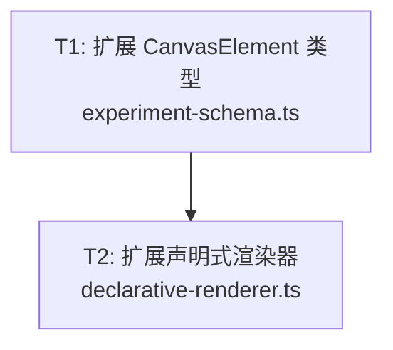

# 🏥 System Health Monitoring Report

> Generated: 2026-04-23T07:17:56.336Z
> Session ID: `wf-20260423-144617`
> Run Category: `prod`

---

## 📝 User Input

| Field | Value |
|-------|-------|
| **Requirement** | 实现组件化渲染引擎：从命令式drawBuoyancy()转向声明式组件系统，CanvasElement→独立渲染组件，各学科引擎与渲染解耦，新实验类型只需组合现有组件 |
| **Entry Point** | `IDE_AGENT` |
| **Mode** | `sequential` |

### Full User Input

```
/wf 实现组件化渲染引擎：从命令式drawBuoyancy()转向声明式组件系统，CanvasElement→独立渲染组件，各学科引擎与渲染解耦，新实验类型只需组合现有组件
```

---

## 🎯 Unified Observation Mainline

| # | Mainline Step | Mapped Stage(s) | Status |
|---|---------------|-----------------|--------|
| 1 | `goal` | - | ⬜ pending |
| 2 | `tool` | - | ⬜ pending |
| 3 | `plan` | - | ⬜ pending |
| 4 | `execute` | - | ⬜ pending |
| 5 | `evaluate` | - | ⬜ pending |
| 6 | `retry` | - | ⬜ pending |

---

## 📋 Completeness Check

| Check | Status |
|-------|--------|
| Workflow Start | ✅ |
| Workflow End | ❌ |
| Stage: ANALYSE | ❌ |
| Stage: ARCHITECT | ❌ |
| Stage: PLAN | ✅ |
| Stage: CODE | ❌ |
| Stage: TEST | ✅ |
| **Overall Status** | **⚠️ INCOMPLETE** |

**Stages Completed:** `PLAN`, `TEST`

**⚠️ Missing Stages:** `ANALYSE (✓start/✗end)`, `ARCHITECT (✓start/✗end)`, `CODE (✗start/✗end)`

---

## 📊 Event Statistics

| Metric | Value |
|--------|-------|
| Total Events | 7 |
| Stage Starts | 4 (raw: 4) |
| Stage Ends | 2 |
| Socratic Checks | 0 (coverage: 0/2 stages (0%)) |
| Effective Challenge Rate | 100% (0/0) |
| Errors | 0 |
| Duration | 0.00s |

### Event Types Distribution

| Event Type | Count |
|------------|-------|
| `workflow_start` | 1 |
| `stage_start` | 4 |
| `stage_end` | 2 |

---

## 🏥 Health Score

| **Grade** | Score | Status |
|-------|-------|--------|
| **D** | 66/100 | 🔴 Incomplete |

### Unified Scoring (Model: unified-v1)

| Component | Score | Weight | Weighted |
|-----------|-------|--------|----------|
| Completeness | 40.0 | 35% | 14.0 |
| Process (Socratic + Metrics Gate + Effectiveness) | 80.0 | 20% | 16.0 |
| Delivery (Quality) | 80.0 | 30% | 24.0 |
| Detection (Quality) | 80.0 | 15% | 12.0 |
| **Total** |  |  | **66.0** |

> ⚠️ **Completeness deduction**: 3 stage(s) missing

> 🤔 **Socratic process impact**: 0/2 stages have Socratic checks
> &nbsp;&nbsp;&nbsp;Missing checks for: `PLAN`, `TEST`
> &nbsp;&nbsp;&nbsp;→ After each stage, call: `node workflow/tools/ide-workflow-bridge.js socratic-challenge --stage <STAGE> --session <SESSION>`

---

## 📈 Rolling Trend Alerts

| Metric | Value |
|--------|-------|
| Trend Enabled | ✅ Yes |
| Window Size | 5 |
| History Sessions | 12 |
| Recent Avg Score | 63.2 |
| Previous Avg Score | 56.2 |
| Delta (Recent-Previous) | +7 |
| Low Score Threshold | 75 |
| Alert Status | 🚨 Triggered |

> Latest health score 66.0 is below threshold 75

---

## 🔄 Stage Execution Details

### 1. `ANALYSE`

| Metric | Value |
|--------|-------|
| Status | ⏳ Running... |
| Metrics Gate | ⬜ N/A (Node Orchestrator mode) |

**📥 Input:** src/lib/experiment-schema.ts, src/lib/physics-engine.ts, src/lib/physics-knowledge.ts, src/lib/schema-validator.ts

**Input Artifact:** `c:\workspace\EGPSpace\output\requirement.md`
- Lines: 159, Hash: `2582-#EGPSpace工作流功能需求分析##项目概述`

**Output Artifact:** ⚠️ Not captured

### 2. `ARCHITECT`

| Metric | Value |
|--------|-------|
| Status | ⏳ Running... |
| Metrics Gate | ⬜ N/A (Node Orchestrator mode) |

**📥 Input:** output/analysis.md

**Input Artifact:** `c:\workspace\EGPSpace\output\analysis.md`
- Lines: 253, Hash: `9108-#需求分析：实验Schema验证层##背景`

**Output Artifact:** ⚠️ Not captured

### 3. `PLAN`

| Metric | Value |
|--------|-------|
| Status | ✅ Success |
| Metrics Gate | ✅ PASSED |

**📋 Summary:** 制定了4个任务的执行计划：T1扩展CanvasElement类型(21种)→T2扩展渲染器(13种新渲染器)→T3新建preset-templates.ts(4种实验声明式定义)→T4重构DynamicExperiment.tsx(移除drawXxx)

**📥 Input:** output/architecture.md

**📤 Output:** output/execution-plan.md：4个任务、依赖图、21条验收标准、文件变更清单

**Input Artifact:** `c:\workspace\EGPSpace\output\architecture.md`
- Lines: 328, Hash: `9324-#组件化渲染引擎架构设计##概述本架构将E`

**Output Artifact:** `c:\workspace\EGPSpace\output\execution-plan.md`
- Lines: 239, Hash: `8494-#执行计划：组件化渲染引擎##概述将EGP`

<details><summary>Preview (first 400 chars)</summary>

```
# 执行计划：组件化渲染引擎

## 概述

将 EGPSpace 渲染系统从三重分裂（命令式 drawXxx + CanvasElement 8种 + DrawElement 21种）统一为单一声明式组件系统。

**关键路径**：T1 → T2 → T3 → T4 → T5（测试）

---

## 任务依赖图


</details>

<details><summary>🚦 Metrics Gate Detail (PASSED)</summary>

| Gate | Status | Actual | Threshold |
|------|--------|--------|-----------|
| maxErrorCount | ✅ pass | 0 | 1 |
| maxDurationMs | ✅ pass | 0.0s | 300.0s |
| maxLlmCalls | ✅ pass | 0 | 5 |

</details>

### 4. `TEST`

| Metric | Value |
|--------|-------|
| Status | ✅ Success |
| Metrics Gate | ✅ PASSED |

**📋 Summary:** 293/293 tests passed (12 suites), 2 new test files created covering 4 preset experiments + 13 new renderers + security/edge cases

**📥 Input:** src/lib/experiment-schema.ts,src/lib/declarative-renderer.ts,src/lib/preset-templates.ts,src/components/DynamicExperiment.tsx

**📤 Output:** output/test-report.md: 15 AC verified, 7 failure paths tested, 0 CVE

**Input Artifact:** `c:\workspace\EGPSpace\output\code.diff`
- Lines: 630, Hash: `18494-#CodeChanges:Phase2/3Migrat`

**Output Artifact:** `c:\workspace\EGPSpace\output\test-report.md`
- Lines: 84, Hash: `3171-#TestReport—组件化渲染引擎**需求*`

<details><summary>Preview (first 400 chars)</summary>

```
# Test Report — 组件化渲染引擎

**需求**: 实现组件化渲染引擎：从命令式 drawBuoyancy() 转向声明式组件系统
**测试时间**: 2026-04-23
**测试结果**: ✅ PASS — 293/293 tests passed, 12 suites

---

## 测试执行结果

### 全量测试套件

```
命令: npx jest --no-coverage
结果: 293 passed, 0 failed
套件: 12 passed, 0 failed
耗时: 1.412s
```

**套件列表**:

```
</details>

<details><summary>🚦 Metrics Gate Detail (PASSED)</summary>

| Gate | Status | Actual | Threshold |
|------|--------|--------|-----------|
| maxErrorCount | ✅ pass | 0 | 0 |
| maxDurationMs | ✅ pass | 0.0s | 500.0s |
| maxLlmCalls | ✅ pass | 0 | 8 |

</details>

---

## 🧾 Verification Evidence Protocol

| Field | Value |
|-------|-------|
| Protocol Version | `evidence-v1` |
| Session | `wf-20260423-144617` |
| Run Category | `prod` |
| Missing Stage Artifacts | 0 |

### Artifact Fingerprints

| Stage | Exists | Size(bytes) | SHA256 (prefix) |
|-------|--------|-------------|------------------|
| ANALYSE | ✅ | 14562 | `4fc057527f6e3a0f...` |
| ARCHITECT | ✅ | 12290 | `487c2ee524edc880...` |
| PLAN | ✅ | 11311 | `b996ad18ee00c068...` |
| CODE | ✅ | 20330 | `3aee3276750cf048...` |
| TEST | ✅ | 4045 | `743fd98be37adbdc...` |

- **Trace Hash**: `a3cf570efdd25f96325c1b4e42111d108ae84865fd4e00518212388f443217ba`
- **Quality Report Hash**: N/A
- **Evolution Log Hash**: N/A

---

_Generated by generate-health-report.js from real trace data_
_Trace file: `c:\workspace\EGPSpace\output\health\prod\workflow-trace.jsonl`_