# EGPSpace 物理实验模板 — 方法论与底层设计 Skill 归纳

> 从 10 个模板中提炼的核心方法论、设计原则和可迁移 Skill

---

## 一、核心方法论

### 1. 声明式参数绑定方法论 (Declarative Parameter Binding)

**核心思想**：参数不是命令式地创建 DOM + 绑定事件，而是声明式地描述参数规格，框架自动生成一切。

```
命令式（反模式）：
  创建 div → 创建 label → 创建 span → 创建 input → addEventListener → 更新 state → 更新 DOM → emit

声明式（标杆模式）：
  bindParam('frequency', { min: 1, max: 20, step: 0.1, defaultValue: 2, unit: 'Hz' })
  → 框架自动生成 DOM、绑定事件、同步 state、emit 通知
```

**关键收益**：
- 减少 60%+ 样板代码
- 参数规格集中管理，一目了然
- 自动保证 DOM ↔ state ↔ Host 三方同步
- 内置 clamp / snap / fmt 工具

**可迁移 Skill**：任何需要"用户可调参数"的系统都适用此方法论。

---

### 2. 映射表驱动方法论 (Mapping-Table Driven Design)

**核心思想**：当系统有多种模式/状态时，不要用 if-else 分支，而是定义映射表 + 统一更新函数。

```
反模式：
  if (mode === 'uniform') { hideV0(); hideA(); setTitle('...'); setFormula('...'); }
  else if (mode === 'accelerated') { hideV0(); showA(); setTitle('...'); setFormula('...'); }
  else if (mode === 'acceleratedWithV0') { showV0(); showA(); setTitle('...'); setFormula('...'); }

标杆模式：
  const MODES = {
    uniform:          { v0Visible: false, aVisible: false, formulaTitle: '...', formulaExpr: '...' },
    accelerated:      { v0Visible: false, aVisible: true,  formulaTitle: '...', formulaExpr: '...' },
    acceleratedWithV0:{ v0Visible: true,  aVisible: true,  formulaTitle: '...', formulaExpr: '...' },
  };
  function applyMode(mode) { /* 统一读取映射表更新 UI */ }
```

**关键收益**：
- 新增模式只需添加映射表条目，无需修改逻辑
- 消除 if-else 链，降低圈复杂度
- 模式间差异一目了然

**可迁移 Skill**：任何有"模式切换"需求的 UI（如：输入模式、拓扑模式、介质选择）。

---

### 3. 计算-渲染分离方法论 (Compute-Render Separation)

**核心思想**：物理计算和视觉渲染是两个正交关注点，必须分离。

```
compute() → { theta1, refractionAngle, tir, criticalAngle, status }
  ↓
render(p) → Canvas 绑定光线、角度弧、状态标注
```

**关键收益**：
- compute() 可独立单元测试
- render() 只关心"怎么画"，不关心"为什么这么画"
- 物理公式修改不影响渲染逻辑，反之亦然
- 性能优化可独立进行（如 compute 降频、render 保持帧率）

**可迁移 Skill**：任何"数据计算 + 可视化"系统。

---

### 4. 单向数据流方法论 (Unidirectional Data Flow)

**核心思想**：数据沿单一方向流动，杜绝双向绑定带来的状态不一致。

```
用户输入 → state 更新 → compute(state) → render(physics) → update UI + emitResultUpdate
                                     ↓
                              emitParamChange (仅用户操作触发)
```

**关键约束**：
- 状态更新只发生在 `state` 对象
- `compute()` 只读 state，返回新对象
- `render()` 只读 compute 结果
- `emitParamChange` 仅在用户操作时触发，程序化修改不触发

**可迁移 Skill**：任何交互系统，尤其是有"外部控制"（Host/LLM）的系统。

---

### 5. 三重锁方法论 (Triple Lock — LLM Output Guard)

**核心思想**：当 LLM 可以控制实验参数时，必须确保其输出不会破坏确定性。

```
锁 1：Prompt 禁令 → 在系统提示词中禁止修改物理常量和核心算法
锁 2：路由分发 → onHostCommand 仅处理白名单命令，未知参数被忽略
锁 3：白名单校验 → bindParam 的 clamp 确保值在 [min, max] 范围内
```

**关键收益**：
- 即使 LLM 产生幻觉，实验画面仍保持确定性
- 纵深防御：任一锁被突破，其他锁仍能保护
- 无需信任 LLM 的输出质量

**可迁移 Skill**：任何 LLM 可控制的交互系统（教育、模拟、游戏）。

---

## 二、底层设计原则

### 原则 1：3 层共享 > 复制粘贴

```
Layer 1 (experiment-core.js)  → 跨学科通用（通信/状态/参数/渲染循环）
Layer 2 (physics-utils.js)    → 学科专用（公式/常量/渲染辅助）
Layer 3 (template-specific)   → 模板专属（HTML/CSS/compute/render）
```

**原则**：向下复用，向上特化。Layer 3 只写 Layer 1/2 没有的东西。

### 原则 2：声明式 > 命令式

| 维度 | 命令式 | 声明式 |
|------|--------|--------|
| 参数系统 | 手动创建 DOM + 绑定事件 | bindParam 声明规格 |
| 模式切换 | if-else 分支 | 映射表 + applyMode() |
| 渲染循环 | 手动管理 rAF | startRenderLoop(fn) |
| Host 通信 | 手动构造消息 | emitReady / emitResultUpdate |

### 原则 3：数据驱动 > 逻辑驱动

- UI 状态由数据决定，而非逻辑分支
- 模式切换 = 数据映射表查询，而非 if-else 链
- 公式展示 = 数据填充模板，而非硬编码字符串

### 原则 4：兜底 > 崩溃

```javascript
const yMax = Math.max(Math.abs(maxV), Math.abs(p.v0), 1);  // || 1 兜底
const refractionAngle = tir ? -1 : Number(angle.toFixed(2));  // 特殊值编码
```

- 除零保护：`|| 1`、`|| 0.001`
- 特殊值编码：`-1` 表示不适用
- NaN 检查：`if (isNaN(x)) return defaultVal`

### 原则 5：HiDPI 优先

```javascript
const ctx = EurekaCanvas.setupHiDPI(canvas, cssW, cssH);
// 自动处理 devicePixelRatio，无需手动计算
```

- 所有 Canvas 必须使用 `setupHiDPI`
- 使用 CSS 像素（cssW, cssH）而非物理像素
- 绘制坐标使用 CSS 像素空间

---

## 三、可迁移 Skill 清单

### Skill 1: 物理实验模板开发

**适用场景**：需要创建新的物理实验模板

**核心步骤**：
1. 确定实验类型（力学/波动/电磁/光学/热学）
2. 选择渲染方式（Canvas 2D / SVG）
3. 在 `physics-utils.js` 中补充缺失的公式函数
4. 使用标准模板骨架创建 HTML
5. 声明 `bindParam` 参数
6. 实现 `compute()` + `render()`
7. 实现 `wire()` 事件绑定
8. 实现 `onHostCommand` 命令处理
9. 编写内置单元测试
10. 按检查清单逐项验证

**关键模式**：
- 声明式参数绑定
- 映射表驱动模式切换
- 计算-渲染分离
- 三重锁安全机制

### Skill 2: 跨学科扩展

**适用场景**：需要支持化学/生物等新学科

**核心步骤**：
1. 创建 `{subject}-utils.js`，仿照 `physics-utils.js` 结构
2. 定义学科常量（如化学元素周期表、生物分类）
3. 实现学科公式库（如摩尔计算、孟德尔遗传概率）
4. 实现 Canvas 渲染辅助（如分子结构、细胞图）
5. 添加内置单元测试
6. 在 `experiment-core.js` 中注册新的学科层

**关键原则**：
- Layer 2 只包含学科专用的东西
- 跨学科通用的放 Layer 1
- 模板特有的放 Layer 3

### Skill 3: 实验交互增强

**适用场景**：为现有实验添加拖拽、缩放、多指操作等交互

**核心步骤**：
1. 添加 Pointer Events 监听（pointerdown/move/up/cancel）
2. 实现 hit-test（判断点击位置对应的实验对象）
3. 使用 `setPointerCapture` 防止拖出 Canvas
4. 区分"用户操作"和"程序化修改"的 emit 策略
5. 拖拽期间只发 `result_update`，不发 `param_change`
6. 释放后恢复物理默认值

**关键模式**：
- buoyancy 模板的拖拽标杆实现
- `state.userValue = null` 标记"使用物理默认"

### Skill 4: 模板迁移（旧→新架构）

**适用场景**：将使用 `physics-core.js` 的旧模板迁移到 `experiment-core.js`

**核心步骤**：
1. 替换脚本引用：`physics-core.js` → `experiment-core.js`
2. 添加 `physics-utils.js` 引用（如需公式库）
3. 将手动 DOM 创建替换为 `bindParam`
4. 将手动事件绑定替换为 `wire()`
5. 将手动 rAF 管理替换为 `startRenderLoop`
6. 验证 `emitReady` 参数与 `bindParam` 一致
7. 运行测试确认功能不变

### Skill 5: 混合渲染策略 (SVG + Canvas Hybrid)

**适用场景**：同一实验中需要不同渲染特性的可视化

**决策矩阵**：

| 需求 | 推荐 | 理由 |
|------|------|------|
| 结构化物理对象（单摆、光路、电路图） | SVG | 矢量无损、元素可交互、DOM 查询 |
| 实时数据图表（柱状图、曲线图） | Canvas | 高频更新、无 DOM 开销、像素级控制 |
| 声明式周期动画（磁铁往复运动） | SVG `<animate>` | 无需 JS 控制、声明式、CPU 友好 |
| 复杂物理模拟（波形叠加、粒子） | Canvas | 大量元素、逐帧计算、性能优先 |

**核心步骤**：
1. 在 `compute()` 中计算所有物理量
2. 将结果分别传递给 SVG 更新函数和 Canvas 渲染函数
3. SVG 更新使用 `setAttribute`，Canvas 更新使用绑制 API
4. 两者共享同一个 state 对象，但渲染节奏可以独立

**标杆实现**：energy.html（SVG 单摆 + Canvas 能量柱状图）

### Skill 6: 双物质/双参数对比设计

**适用场景**：需要对比两种物质/条件下的物理量变化

**核心步骤**：
1. 定义两组参数（如 specificHeatA, specificHeatB）
2. 在 `compute()` 中分别计算两组结果
3. 使用统一坐标轴 + 双色曲线绘制
4. 添加图例区分两组数据
5. 统计面板分别显示两组关键指标

**标杆实现**：heat.html（双物质比热容对比）

**颜色约定**：
- A 组：蓝色系 `#3B82F6`
- B 组：红色系 `#EF4444`

### Skill 7: 光学实验开发 (Three-Ray Diagram)

**适用场景**：透镜/面镜成像实验

**核心步骤**：
1. 确定光学元件类型（凸透镜/凹透镜/凸面镜/凹面镜）
2. 实现高斯透镜公式 `1/f = 1/u + 1/v`
3. 绘制三条特征光线（凸透镜标杆）：
   - 平行于主轴 → 折射后过焦点
   - 过光心 → 方向不变
   - 过焦点 → 折射后平行于主轴
4. 实现虚像/实像判断逻辑
5. 虚像用虚线绘制光线延长线
6. 像的属性判断（实像/虚像、正立/倒立、放大/缩小/等大）

**标杆实现**：lens.html（凸透镜成像）

**关键公式**：
```javascript
// 像距计算
const v = u * f / (u - f);
// 放大率
const m = Math.abs(v) / u;
// 虚像判断
const isVirtual = v < 0; // 或 u < f（凸透镜）
```

---

## 四、知识架构图

```mermaid
graph TD
    A[13个物理实验模板] --> B[技术栈分析]
    A --> C[设计模式归纳]
    A --> D[代码片段库]
    A --> E[实现检查清单]

    B --> B1[3层共享架构]
    B --> B2[postMessage v1.0 协议]
    B --> B3[bindParam 参数系统]
    B --> B4[Canvas/SVG/混合 渲染策略]
    B --> B5[requestAnimationFrame 动画]
    B --> B6[CSS变量+组件化样式]
    B --> B7[SVG声明式动画子模式]

    C --> C1[模板结构模式]
    C --> C2[生命周期模式]
    C --> C3[计算-渲染分离]
    C --> C4[事件处理模式]
    C --> C5[映射表驱动]
    C --> C6[三重锁安全]
    C --> C7[SVG+Canvas混合渲染]
    C --> C8[双物质对比模式]
    C --> C9[光路图三线法]
    C --> C10[能量柱状图模式]

    D --> D1[标准模板骨架]
    D --> D2[参数绑定模板]
    D --> D3[Segmented控件模板]
    D --> D4[动画循环模板]
    D --> D5[Host命令处理模板]
    D --> D6[SVG光路图模板]
    D --> D7[能量柱状图模板]
    D --> D8[双物质对比曲线模板]
    D --> D9[像属性判断逻辑模板]

    B1 --> F[方法论与Skill]
    C3 --> F
    C5 --> F
    C6 --> F
    C7 --> F
    C9 --> F

    F --> F1[声明式参数绑定]
    F --> F2[映射表驱动设计]
    F --> F3[计算-渲染分离]
    F --> F4[单向数据流]
    F --> F5[三重锁LLM防护]
    F --> F6[3层共享>复制粘贴]
    F --> F7[数据驱动>逻辑驱动]
    F --> F8[兜底>崩溃]

    F1 --> G[可迁移Skill]
    F2 --> G
    F5 --> G

    G --> G1[物理实验模板开发]
    G --> G2[跨学科扩展]
    G --> G3[实验交互增强]
    G --> G4[模板迁移旧→新]
    G --> G5[混合渲染策略]
    G --> G6[双物质对比设计]
    G --> G7[光学实验开发]
```



---

## 五、产出文件索引

| # | 文件 | 内容 | 用途 |
|---|------|------|------|
| 1 | [tech-stack-analysis.md](output/tech-stack-analysis.md) | 技术栈归纳（含混合渲染策略） | 理解架构和通信协议 |
| 2 | [design-patterns.md](output/design-patterns.md) | 设计模式归纳（14模式+反模式） | 复用成熟设计模式 |
| 3 | [code-snippets.md](output/code-snippets.md) | 可复用代码片段（17类模板） | 快速创建新实验 |
| 4 | [implementation-checklist.md](output/implementation-checklist.md) | 实现检查清单（12类检查项） | 确保新实验质量 |
| 5 | [methodology-skills.md](output/methodology-skills.md) | 方法论与Skill归纳（7个Skill） | 跨项目迁移方法论 |

---

## 六、后续建议

### 短期（下次工作流）
1. **统一所有模板到新架构**：将 lever, refraction, buoyancy, circuit 迁移到 experiment-core.js
2. **补充 physics-utils.js 公式**：根据新实验需求补充热学、声学公式

### 中期（1-2 周内）
3. **创建模板代码生成器**：基于代码片段库自动生成模板骨架
4. **创建 chemistry-utils.js**：化学学科专用工具层
5. **创建 biology-utils.js**：生物学科专用工具层

### 长期（1 个月内）
6. **建立模板自动化测试**：Puppeteer 端到端测试框架
7. **建立模板版本管理**：Git LFS + 变更日志
8. **建立跨项目经验库**：将 Skill 1-4 发布到 ExperienceStore
